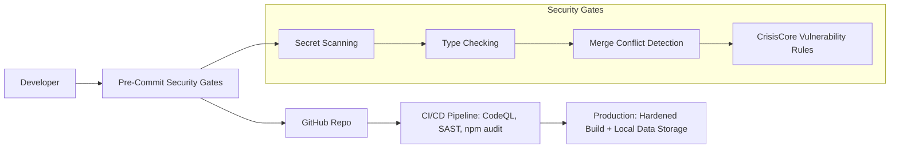

# 🩺 Pain Tracker | CrisisCore Systems  
> **A Security-Hardened Health Platform for Chronic Pain and Injury Management**  

  
  
  
  
  
  
  

---

## 🚨 Why Pain Tracker Exists  
Pain is more than a number. Most apps oversimplify—this one doesn't.  
We built **Pain Tracker** to **map pain in high resolution** for real-world recovery,  
backed by **WorkSafe BC reporting** and **security-grade engineering**.


---

### 🌟 Highlights

| Feature Domain               | What Sets It Apart                                              |
|-----------------------------|---------------------------------------------------------------|
| 📝 Pain Assessment          | 7-step multi-dimensional tracking, 25+ mapped body locations |
| 📊 Analytics & Heatmaps     | Symptom trends, recovery progression, treatment correlations  |
| 🏥 Healthcare Integration   | Automated WorkSafe BC claims, clinician-ready CSV/JSON exports|
| 💊 Treatment Tracking       | Medications, therapy logs, and outcome analysis              |
| 🧩 Quality of Life Metrics  | Mood, sleep, activity impacts                                 |
| 🚨 Emergency Panel          | Automated protocols & alert system                           |
| 🔒 Security by Design       | CSP, Zod validation, secret scanning, SAST pipelines         |


---

## 🛡️ Security Architecture  
CrisisCore Systems enforces **zero-trust design** with a military-grade development culture:  




---

## 🧩 Tech Stack

| Layer | Tech Stack |
|-------|------------|
| **Frontend** | React 18, TypeScript, Vite, Tailwind CSS, Headless UI |
| **Analytics** | Recharts, Chart.js, Custom Visualizations |
| **Validation** | Zod schemas for all inputs |
| **Testing** | Vitest, Testing Library, jsdom (128+ tests) |
| **DevOps** | GitHub Actions, Husky, CommitLint, Makefile workflows |
| **Security** | CodeQL, npm audit, CrisisCore Gates, CSP headers |

---

## Features

### 📊 Comprehensive Pain Tracking
- **Multi-dimensional Pain Assessment**: 
  - Pain intensity (0-10 scale) with visual feedback
  - 25+ specific body locations including detailed leg/foot mapping
  - 19+ symptom types including nerve-specific symptoms
- **Advanced Analytics**: Interactive charts showing pain trends, location heat maps, and pattern recognition
- **Historical Tracking**: Complete pain history with progression analysis

### 🏥 Healthcare Integration
- **WorkSafe BC Report Generation**: Automated report creation for workplace injury claims
- **Emergency Response Panel**: Emergency contacts, protocols, and real-time pain monitoring
- **Clinical Data Export**: Professional-grade CSV and JSON exports for healthcare providers

### 💼 Workplace Injury Management
- **Work Impact Assessment**: Track missed days, modified duties, and workplace limitations
- **Functional Analysis**: Monitor activities of daily living and assistance requirements
- **Return-to-Work Planning**: Document accommodations and workplace modifications

### 💊 Treatment & Medication Tracking
- **Medication Management**: Track current medications, dosages, frequency, and effectiveness
- **Treatment Logging**: Record therapies, appointments, and treatment outcomes
- **Progress Monitoring**: Analyze treatment effectiveness over time

### 🎯 Quality of Life Metrics
- **Sleep Quality Tracking**: Monitor how pain affects rest and recovery
- **Mood & Social Impact**: Track emotional and social consequences of pain
- **Activity Logging**: Record daily activities and their impact on pain levels

### 🔧 Advanced Features
- **Nerve Symptom Analysis**: Specialized tracking for neurological symptoms
- **Functional Limitations Assessment**: Detailed mobility and capability monitoring
- **Comparison Tracking**: Monitor changes since injury or diagnosis
- **Onboarding & Tutorials**: Guided setup and interactive help system

### 🛡️ Privacy & Security
- **Local Data Storage**: All data remains on your device - no cloud storage
- **Secure Architecture**: Multiple security layers and vulnerability scanning
- **Data Portability**: Easy export and backup capabilities

---

## 🧰 Quick Start

```bash
# Clone the repository
git clone https://github.com/CrisisCore-Systems/pain-tracker.git
cd pain-tracker

# Recommended setup
make setup    # Install dependencies, configure env, enable hooks
make dev      # Start development server

# Manual setup
npm install
cp .env.example .env
npm run dev
```

---

## 🔥 Dev Culture & Commit Rules

This repo enforces Conventional Commits and strong pre-commit enforcement:

```bash
feat(tracker): add pain heatmap visualization
fix(api): resolve WCB integration timeout
docs(readme): add contributing guidelines
```

**Skip tags:** `[skip lint]`, `[skip build]`, `[skip all]`

---

---

## 🔧 Detailed Documentation

<details>
<summary><strong>📋 Current Status & Implementation</strong></summary>

**Version**: 0.1.0 (Early Development)  
**Build Status**: ✅ Passing (all 128 tests)  
**Security Status**: ✅ Multiple security layers active  
**Deployment**: GitHub Pages ready  

### ✅ Implemented Features
- Multi-step pain assessment form
- Interactive data visualization and analytics  
- WorkSafe BC report generation
- Emergency response panel
- Local data storage with export capabilities
- Comprehensive testing suite
- Security scanning and validation
- Onboarding and tutorial system

### 🎯 Supported Use Cases
- **Individual Pain Management**: Personal tracking and analysis
- **Workplace Injury Claims**: WorkSafe BC integration and reporting
- **Healthcare Collaboration**: Professional data exports and reports
- **Emergency Situations**: Automated alerts and contact management

</details>

<details>
<summary><strong>⚙️ Installation & Prerequisites</strong></summary>

### Prerequisites
- Node.js 18+ (20+ recommended)
- npm 9 or higher
- Git 2.0+

### Health Check
```bash
make doctor   # Or: node scripts/doctor.js
```

### Deployment
The application is configured for automatic deployment to GitHub Pages:

1. Fork this repository
2. Enable GitHub Pages in your repository settings
3. Push changes to the main branch
4. GitHub Actions will automatically build and deploy your changes

For manual deployment:
```bash
npm run build
```
The built files will be in the `dist` directory.

</details>

<details>
<summary><strong>📊 Usage & Features</strong></summary>

### 📝 Recording Pain Entries
The application uses a comprehensive 7-step assessment process:

1. **Pain Assessment**: Set pain level (0-10), select body locations, and identify symptoms
2. **Functional Impact**: Document limited activities, assistance needs, and mobility aids
3. **Medications**: Track current medications, dosages, and effectiveness
4. **Treatments**: Record recent therapies, effectiveness, and planned treatments
5. **Quality of Life**: Assess sleep quality, mood impact, and social effects
6. **Work Impact**: Document missed work, modified duties, and workplace limitations
7. **Comparison**: Track changes since injury and new limitations

### 📊 Analytics & Visualization
- **Pain History Charts**: Interactive timeline of pain levels and trends
- **Location Heat Maps**: Visual representation of pain patterns by body region
- **Progression Analysis**: Track improvements or deterioration over time
- **Treatment Effectiveness**: Analyze correlation between treatments and pain levels

### 🏥 Healthcare Features
- **WorkSafe BC Reports**: Generate professional reports for workplace injury claims
- **Emergency Panel**: Access emergency contacts and protocols based on current pain levels
- **Clinical Exports**: Export detailed data in CSV/JSON formats for healthcare providers

### 🔄 Data Management
- **Local Storage**: All data stored securely in your browser
- **Data Export**: Complete backup capabilities for data portability
- **Sample Data**: Try the application with pre-loaded demonstration data
- **Onboarding**: Interactive tutorial for new users

</details>

<details>
<summary><strong>🔒 Data Privacy & Security</strong></summary>

**Complete Privacy**: All pain tracking data is stored locally in your browser using secure web storage APIs. No data is transmitted to external servers or cloud services.

**Data Control**: You maintain complete control over your data with:
- Local-only storage (never leaves your device)
- Secure export capabilities (CSV/JSON)  
- No account creation or login required
- No tracking cookies or analytics

**Security Features**:
- Input validation and sanitization
- Content Security Policy (CSP) headers
- Automated vulnerability scanning
- Regular security audits

</details>

<details>
<summary><strong>⚡ Developer Workflow</strong></summary>

### Available Commands

```bash
# Quick help
make help             # Show all available commands

# Development
make dev              # Start development server
make build            # Build for production
make test             # Run tests
make check            # Run all checks (lint, typecheck, test, build)

# Code Quality
make lint             # Run ESLint
make lint-fix         # Fix ESLint issues automatically
make typecheck        # Run TypeScript type checking
make format           # Format code with Prettier

# Security & Diagnostics
make doctor           # Run environment diagnostics
make scan-secrets     # Scan for hardcoded secrets
make check-security   # Run all security checks

# Git Workflow
make check-pre-commit # Test pre-commit hooks
```

### Pre-commit Hooks
This project uses modular pre-commit hooks that run:
- 🛡️ CrisisCore collapse vector detection
- 📝 TypeScript type checking
- 🔍 ESLint code quality checks
- 🏗️ Build verification
- 🔐 Secret scanning
- 🔀 Merge conflict marker detection

**Skip individual checks** by adding tags to your commit message:
```bash
git commit -m "fix: urgent hotfix [skip lint]"
git commit -m "docs: update readme [skip build]"
git commit -m "wip: experimental feature [skip all]"
```

Available skip tags: `[skip typecheck]`, `[skip lint]`, `[skip build]`, `[skip secrets]`, `[skip merge]`, `[skip collapse]`, `[skip all]`

### Commit Message Format
This project follows [Conventional Commits](https://www.conventionalcommits.org/):

```
<type>(<scope>): <description>

[optional body]

[optional footer(s)]
```

**Types:** `feat`, `fix`, `docs`, `style`, `refactor`, `perf`, `test`, `chore`, `ci`, `build`, `security`, `deps`, `config`

**Examples:**
```bash
feat(tracker): add pain intensity heatmap visualization
fix(api): resolve CORS issues with WCB integration
docs(readme): add contribution guidelines
security(auth): implement rate limiting for API endpoints
```

</details>

---

## 🤝 Contributing

We welcome security engineers, clinicians, and open-source devs.  
See [CONTRIBUTING.md](CONTRIBUTING.md) for detailed workflow.

**For security disclosures:**  
📧 security@crisiscore.systems

---

## 🏆 Acknowledgments

- **[WorkSafe BC](https://www.worksafebc.com/)**: Expertise in injury reporting and claims
- **Clinicians**: Pain assessment model refinement  
- **[OpenSSF](https://openssf.org/)**: Security best practice frameworks
- **The Chronic Pain Community**: Real-world feedback

---

## 🖤 Built with Empathy, Rigor, and Zero Compromise

**By [CrisisCore Systems](https://github.com/CrisisCore-Systems) — Security-first tools for real-world health.**

---

## License

This project is licensed under the MIT License - see the [LICENSE](LICENSE) file for details. 