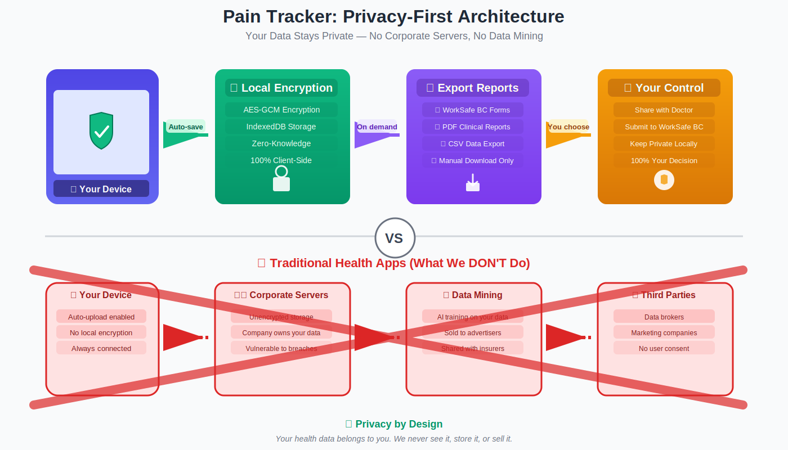
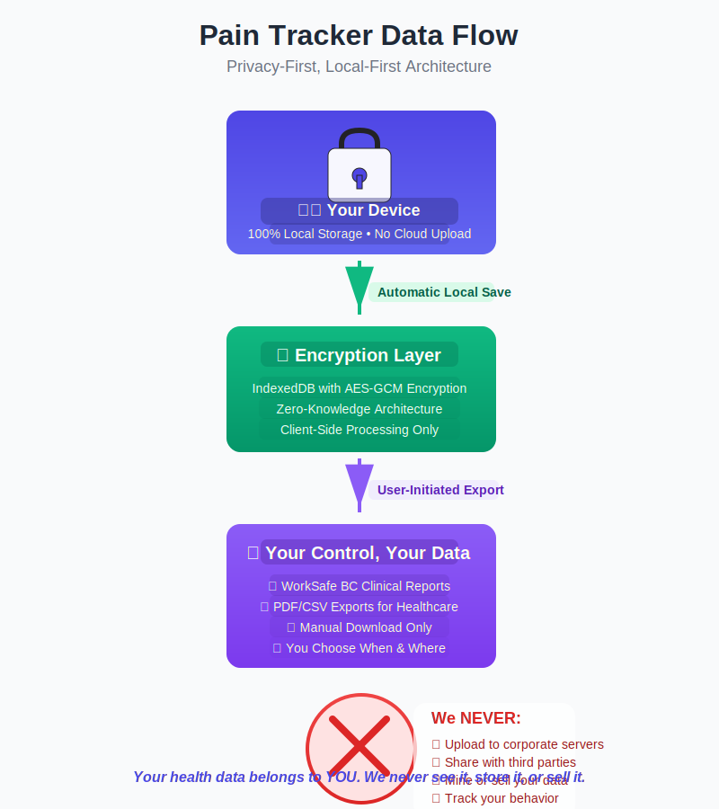
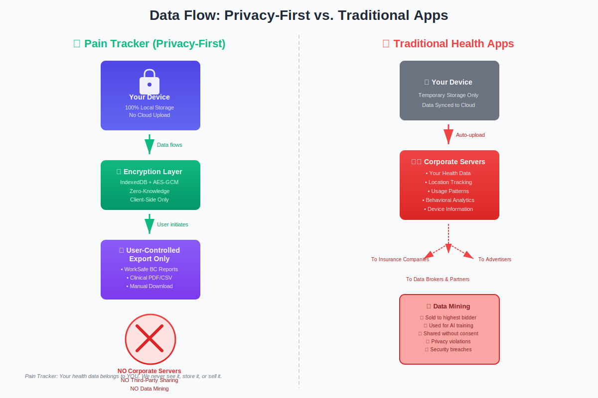

# 🩺 Pain Tracker | CrisisCore Systems

<!-- markdownlint-disable MD013 MD033 MD036 MD060 MD022 MD032 -->


[](https://github.com/CrisisCore-Systems/pain-tracker/stargazers)
[](LICENSE)

<!-- CI / Coverage Badges -->
[](https://github.com/CrisisCore-Systems/pain-tracker/actions/workflows/ci.yml)
[](https://github.com/CrisisCore-Systems/pain-tracker/actions/workflows/smoke.yml)
[](https://codecov.io/gh/CrisisCore-Systems/pain-tracker)

> **A security-first, offline-capable chronic pain tracking application built with empathy and clinical-minded design.**

Pain Tracker provides high-resolution, multidimensional pain tracking with a security-first, local-first architecture. It includes clinician-focused exports and WorkSafeBC-oriented reporting utilities.

Some integrations (for example weather correlation, clinic auth, and payments) rely on network calls and must be explicitly configured/enabled; see the implementation snapshot in `.github/copilot-instructions.md` for current status.

<p align="center">
  
</p>

*The Pain Tracker dashboard featuring the 7-step pain assessment form, customizable widgets, analytics visualizations, and trauma-informed design.*

---

## 🎯 **Vision & Mission**

**Vision:** Transform chronic pain management through technology that respects patient privacy while delivering clinically useful insights.

**Mission:** Bridge the gap between patient experience and clinical understanding through secure, accessible, and clinically useful pain tracking.

---

## 📖 **Origin Story**

> *"I wrote software from motel rooms while homeless. Checking if CI passed while warming hands over a fire behind a gas station."*

Pain Tracker wasn't built in a comfortable office. It was built through housing instability, medical trauma, and systems that failed when they should have helped. Every architectural decision—offline-first, local-first-by-default storage, trauma-informed UI—comes from lived experience.

When your data has been used against you, you build software that minimizes unnecessary exposure. Not by policy alone—by architecture and defaults.

**📖 Read the full story:** [Coding Through Collapse—Why This App Forgets You Exist](https://blog.paintracker.ca/coding-through-collapse)

⭐ **Star this repo if you've coded through your own collapse.**

---

## 📊 **Current Implementation Status**

**Version:** 1.1.3 (from `package.json`)

### ✅ **Implemented (In-Repo)**

| Feature | Status | Description |
|---------|--------|-------------|
| **Empathy Intelligence Engine** | ✅ Implemented | Heuristic-based pain pattern analysis and personalized insights |
| **Trauma-Informed UI** | ✅ Implemented | Accessibility-focused, trauma-informed design patterns |
| **7-Step Pain Assessment** | ✅ Implemented | Multi-dimensional tracking across anatomical locations |
| **Security Architecture** | ✅ Implemented | Encryption helpers, CSP, and audit/event logging primitives |
| **WorkSafe BC Export** | ✅ Implemented | CSV/JSON exports for claims and clinician reporting |
| **Customizable Dashboard** | ✅ Implemented | Widget-based layout with user preferences |
| **Trend Visualizations** | ✅ Implemented | Charts for pain history and patterns |

### 🔄 **Partially Implemented**

| Feature | Status | Next Steps |
|---------|--------|------------|
| **Validation Technology** | ✅ Integrated | Enabled by default via VITE_REACT_APP_ENABLE_VALIDATION |
| **PWA Features** | ✅ Verified | Service worker registration + cache-first utilities |
| **Advanced Visualizations** | 🟡 In Progress | Body heatmaps and correlation graphs |
| **WorkSafe BC PDF Export** | ✅ Implemented | PDF generation utilities and templates |

### 📅 **Roadmap Highlights**

- Roadmap items are directional and may change; see `docs/` and issues/PRs for the most current plan.

---

## 💜 **Fibromyalgia-Specialized Features**

Pain Tracker includes fibromyalgia-specific tracking and analytics, including WPI/SSS scoring and diagnostic-threshold helpers.

### 🎯 **ACR-Informed Assessment**
- ✅ **Widespread Pain Index (WPI)**: WPI-style region scoring support
- ✅ **Symptom Severity Scale (SSS)**: SSS-style symptom scoring support
- ✅ **Diagnostic Threshold Helpers**: Real-time feedback based on scoring thresholds

### 🧠 **Fibro-Specific Analytics**
- ✅ **Fibro Fog Tracking**: Dedicated cognitive symptom assessment (memory, concentration)
- ✅ **Flare Pattern Recognition**: Frequency, duration, and intensity tracking with trigger correlation
- ✅ **Symptom Trends**: Longitudinal analysis of fatigue, cognition, and sleep quality
- ✅ **Energy Envelope Management**: Activity pacing tools and post-exertional malaise tracking
- ✅ **Trigger Identification**: Weather, stress, sleep, activity, and food sensitivity correlation

### 🤝 **Trauma-Informed Fibro Care**
- ✅ **Medical Trauma Awareness**: Designed for those who've faced diagnostic delays and invalidation
- ✅ **Gentle Workflows**: Progressive disclosure to reduce cognitive load during "fibro fog"
- ✅ **Privacy Protection**: Local-first storage; sharing is user-controlled via exports
- ✅ **Empathy-Driven Analytics**: Validates patient experience through biopsychosocial tracking

### 📋 **Clinical & Claims Support**
- ✅ **WorkSafeBC-Oriented Exports**: Templates and exports to support claims/report workflows
- ✅ **Rheumatology-Ready Reports**: WPI/SSS summaries for specialist appointments
- ✅ **Treatment Effectiveness**: Intervention correlation analysis (medications, therapies, self-care)

**📖 [Fibromyalgia Features Guide](docs/product/FIBROMYALGIA_FEATURES.md)** | **✅ [Claims Verification Report](docs/product/FIBROMYALGIA_CLAIMS_VERIFICATION.md)**

---

## 🔒 **Privacy-First Architecture**

Pain Tracker is designed with **your privacy as the foundation**, not an afterthought. The default workflow is local-first with user-controlled exports.

<p align="center">
  
</p>

### How Your Data Stays Private

**Your Device → Local Encryption → User-Controlled Export → Your Explicit Choice**

1. **📱 Your Device with Shield**: By default, your entries are stored on your device; sharing happens through explicit export/import flows
2. **🔐 Local Encryption Layer**: AES-GCM helpers for encrypting sensitive data stored locally (IndexedDB)
3. **📤 User-Controlled Export**: Manual exports (WorkSafeBC-oriented reports, PDF clinical reports, CSV/JSON downloads)
4. **🤝 Your Explicit Choice**: YOU decide when and where to share - with your doctor, WorkSafe BC, or keep it private locally

**Note on integrations**: Some optional features require network calls (for example weather correlation, payments, or clinic workflows). These require configuration and should be treated as separate trust boundaries.

<details>
<summary><strong>📊 See Additional Privacy Architecture Diagrams</strong></summary>

**Vertical Privacy Flow:**
<p align="center">
  
</p>

**Side-by-Side Comparison:**
<p align="center">
  
</p>

**The Difference (high level):**
- **Many traditional apps**: Use accounts and server-side storage by default
- **Pain Tracker (default workflow)**: Local-first storage with user-controlled export/sharing

</details>

**[Read More About Our Security →](docs/engineering/ARCHITECTURE.md)** | **[Security Policy →](SECURITY.md)** | **[All Diagrams →](docs/diagrams/README.md)**

---

## 🌟 **Core Features**

### 📊 **Advanced Pain Analytics**
- ✅ **Multidimensional Tracking**: 7-step assessment across anatomical locations
- ✅ **Symptom Complexity**: Symptom tracking with severity gradients
- ✅ **Pattern Recognition**: Heuristic-based trend analysis and correlation detection (working)
- 🔄 **Visual Heatmaps**: Basic body mapping implemented; advanced temporal progression in development
- 🔄 **Predictive Models**: ML-based prediction models are planned (see roadmap)

### 🏥 **Clinical Integration**
- ✅ **Clinic Portal (In-Repo)**: Healthcare professional interface components and workflows (availability varies by deployment/config)
- ✅ **WorkSafeBC-Oriented Exports**: Claims/report exports (CSV/JSON/PDF) implemented in-repo
- ✅ **Healthcare Exports**: Clinician-formatted exports (PDF/CSV/JSON) implemented
- ✅ **Evidence-Based Metrics**: Evidence-based scales integrated where implemented
- ✅ **Treatment Correlation**: Outcome tracking and intervention correlation analysis

### 💰 **SaaS Subscription System**
- ✅ **Stripe Integration (In-Repo)**: Checkout session + webhook endpoints and client helpers
- ✅ **Feature Gating (In-Repo)**: Conditional rendering utilities/components for tiering
- 🔄 **Subscription Ops**: Billing workflows vary by deployment and require configuration
- 🎯 **[Complete SaaS Documentation](docs/archive/saas/SAAS_SETUP_GUIDE.md)**

### 🔒 **Security Architecture**
- ✅ **Local-First Data**: IndexedDB storage with selective encryption (AES-GCM helpers implemented)
- ✅ **Hardening Tooling**: CSP configuration + security scans/scripts (CodeQL/SAST/secret scanning)
- ✅ **Audit/Event Logging**: Minimal, non-reconstructive audit/event logging patterns
- ✅ **Compliance-Oriented Controls**: HIPAA-aligned controls (not a compliance claim)
- 🔄 **Full Encryption**: Enterprise-grade encrypted IndexedDB layer in progress

### 💊 **Tracking**
- ✅ **Medication Management**: Dosage tracking and side effect monitoring
- ✅ **Treatment Protocols**: Full therapy session logging and effectiveness analysis
- ✅ **Quality of Life**: Working mood, sleep, and activity impact correlation
- 🔄 **Emergency Protocols**: Core emergency UI and simulation dashboards implemented; external escalation pending

### 🎨 **Trauma-Informed Design**
- ✅ **Accessibility Features**: Built toward a WCAG 2.2 AA target with trauma-informed patterns and accessibility features
- ✅ **AccessiblePainSlider**: Full keyboard navigation, ARIA labels, haptic feedback, numeric input
- ✅ **FocusTrap & AccessibleModal**: Proper focus management for all modal dialogs
- ✅ **Gentle Language**: Context-sensitive, empathetic UI copy throughout
- ✅ **Progressive Disclosure**: Cognitive load management with step-by-step workflows
- ✅ **Crisis Detection**: Working simulation and testing dashboard for emergency scenarios
- ✅ **Panic Mode**: Integrated crisis support with breathing exercises and emergency resources
- ✅ **Customization**: User preferences for font sizes, contrast, touch targets, and interaction patterns

---

## 🏗️ **Technical Architecture**

### **Frontend Stack**
- **React 18** with TypeScript for type-safe development
- **Vite** for lightning-fast development and optimized builds
- **Tailwind CSS** + **Headless UI** for responsive, accessible design
- **Zustand** for predictable state management

### **Data & Validation**
- **Zod Schemas** for runtime type validation and data integrity
- **IndexedDB wrapper** for sophisticated offline-first data management
- **Event-driven sync** with conflict resolution and prioritized queues
- **Immutable updates** (e.g. Immer) and forward-compatible shims

### **Analytics & Visualization**
- **Recharts** & **Chart.js** for interactive data visualization
- **Custom Heatmap Engine** for anatomical pain mapping
- **Temporal Analysis** with trend detection algorithms
- **Export Pipelines** for clinical and insurance reporting

### **Quality Assurance**
- **Vitest** testing framework with **@testing-library/react**
- **Stryker Mutator** for mutation testing and code quality
- **ESLint** + **TypeScript** for code consistency
- **Husky** + **CommitLint** for development workflow enforcement

### **DevOps & Security**
- **GitHub Actions** CI/CD with security scanning
- **CodeQL** static analysis and vulnerability detection
- **Dynamic Badge Generation** for real-time project metrics
- **Makefile Workflows** for standardized development processes

---

## 🛡️ **Security Posture**

| Security Layer | Implementation | Status |
|----------------|----------------|--------|
| **Data Storage** | Local-first IndexedDB storage; optional network integrations exist | ✅ Active |
| **Code Analysis** | CodeQL, ESLint security rules, SAST pipeline | ✅ Active |
| **Dependency Management** | Automated scanning, SBOM generation | ✅ Active |
| **Secret Protection** | Pre-commit scanning, .env validation | ✅ Active |
| **Runtime Security** | CSP headers, input validation, XSS protection | ✅ Active |

**Current Security Status:**
- See the repo-generated npm-audit badge (`badges/security-badge.json`) for current vulnerability counts.

---

## 📁 **Project Structure**

```text
src/
├── components/          # Reusable UI components
├── containers/          # Page-level components and layouts
├── stores/             # Zustand state management
├── services/           # Data persistence and sync logic
├── hooks/              # Custom React hooks
├── types/              # TypeScript type definitions
├── validation-technology/ # Zod schemas and validation
├── lib/                # Core utilities and helpers
├── design-system/      # Design tokens and system components
├── workers/            # Web Workers for background processing
├── i18n/               # Internationalization support
└── test/               # Test utilities and fixtures
```

---


## 🚀 Getting Started

### **Prerequisites**

- **Node.js 20 (LTS)**: Standardized version for development and CI. An `.nvmrc` file is included to pin the version for local development.
- **npm 9+**: Package manager required.
- **Modern browser**: Must support IndexedDB for local storage.

> **Note**: Older LTS versions (18) may work, but CI and workflows are aligned to Node 20.

### Canvas on Windows

If you are developing on Windows or running CI on Windows runners, follow the detailed instructions in `docs/ops/CANVAS_WINDOWS_PREREQS.md` to install Visual Studio Build Tools or MSYS2 and the native `cairo` dependencies required by `canvas@3.x`.

### Badges
Badges (tests, coverage, security, LOC, issues, PRs, commit activity) are generated
by scripts in `scripts/` and stored under `badges/` for Shields.io.

Local refresh (PowerShell):

```powershell
npm run badge:all
```

Or individually:

```powershell
npm run badge:tests
npm run badge:loc
node scripts/generate-security-badge.mjs
```

The pre-push hook (`.husky/pre-push`) auto-regenerates badge JSONs when pushing
`main` to keep them current.

Note: the pre-push hook intentionally **never** creates commits. If badge JSONs
change, the hook will block the push and ask you to commit the updated badge
files explicitly.

Color thresholds:

- Coverage: 90+ `brightgreen`, 80–89 `green`, 70–79 `yellowgreen`,
  60–69 `yellow`, 50–59 `orange`, <50 `red`
- LOC thresholds favor smaller core (adjust as needed)

### Development Setup

```bash
# Clone the repository
git clone https://github.com/CrisisCore-Systems/pain-tracker.git
cd pain-tracker

# Install dependencies
npm install

# Start development server
npm run dev

# Run comprehensive tests
npm run test:coverage
```

### Contributor setup (quick)

Follow these lightweight steps when contributing or onboarding locally.

- Keep dependencies healthy:
  - Run an audit regularly: `npm audit`.
  - Attempt safe auto-fixes: `npm audit fix` (non-forcing). If nothing remains, you're good; if transitive/dev-only issues persist, update the direct dev dependency (for example `@stryker-mutator/core`) and re-run the audit.

- Database developer helpers (safe placeholders):
  - Dry-run (recommended):
    - `npm run db:migrate` — shows migration command recommendations
    - `npm run db:reset` — shows reset recommendations
    - `npm run db:seed`  — shows seeding recommendations
  - Execute (only on local/test DB and after reviewing):
    - `DRY_RUN=false npm run db:migrate`
    - `DRY_RUN=false npm run db:reset`
    - `DRY_RUN=false npm run db:seed`

- Runtime validation helpers:
  - Lightweight helpers are in `src/utils/validation.ts`:
    - `assertNumericRange(value, name, min, max)` — runtime numeric guard
    - `sanitizeNote(note, maxLength?)` — reduces accidental long-digit PHI and truncates
  - Tests for the helpers live in `src/utils/__tests__/validation.test.ts`.

- Running tests locally:
  - Single file: `npm run test -- path/to/testfile`
  - All tests: `npm run test` or `npm run test:coverage` for coverage

Notes:
- The database scripts are intentionally non-destructive by default (DRY_RUN mode). Only disable DRY_RUN when you're certain you're pointing at a local/test database.
- Dev-only vulnerabilities are lower priority than production ones, but we recommend fixing them before releases. Avoid `npm audit fix --force` unless you run the full test suite and review changes.


### Production Build

```bash
# Build for production
npm run build

# Preview production build
npm run preview

# Pre-deployment validation (recommended before deploying)
npm run deploy:precheck

# Deploy to GitHub Pages
npm run deploy
```

### Deployment Options

**Option 1: GitHub Pages** (Default - Static hosting)

```bash
npm run deploy
```

**Option 2: Ubuntu VM** (Self-hosted, always-on)
- ✅ Free tier available (Oracle Cloud)
- ✅ Full control and customization
- ✅ Automated CI/CD with GitHub Actions
- 📚 [Complete Ubuntu VM Deployment Guide](docs/ops/UBUNTU_VM_DEPLOYMENT.md)
- 📚 [Quick Reference Guide](docs/ops/UBUNTU_VM_QUICKSTART.md)

**Option 3: Other Platforms**
- Vercel, Netlify, Cloudflare Pages, AWS S3, etc.
- See [DEPLOYMENT_GUIDE.md](docs/ops/DEPLOYMENT_GUIDE.md) for platform-specific instructions

## 🧪 **Testing & Quality**

Test suite size and coverage are tracked via repo-generated badges in `badges/`.

### **Testing Strategy**
- **Unit Tests**: Component and utility function testing
- **Integration Tests**: Store and service interaction testing  
- **Mutation Testing**: Code quality and test effectiveness analysis
- **Security Testing**: Automated vulnerability and penetration testing

### **Quality Metrics**

```bash
# Run all tests with coverage
npm run test:coverage

# Generate security audit
npm run security-full

# Update project metrics
npm run badge:all

# Health check
npm run doctor
```

---

## 📋 **Standards & Alignment**

### **Healthcare Standards**
- **FHIR Export Support**: Structured export utilities (FHIR mapping/types in-repo)
- **Evidence-Based Instruments**: Includes validated-style scales where implemented in code

### **Regional Workflows**
- **WorkSafeBC Workflows**: WorkSafeBC-oriented exports and reporting utilities
- **Accessibility**: WCAG 2.2 AA target

---

## 🤝 **Contributing**

We welcome contributions that advance the mission of empathetic, secure healthcare technology.

### **Development Process**
1. **Fork** the repository
2. **Create** a feature branch (`git checkout -b feature/amazing-feature`)
3. **Commit** with conventional commits (`git commit -m 'feat: add amazing feature'`)
4. **Test** with the repo quality gates (`npm run test:coverage; npm run security-full`)
5. **Submit** a pull request

### **Code Standards**
- TypeScript strict mode required
- Aim for high test coverage for new features (target: 90%+ where practical)
- Security review for all data-handling code
- Accessibility requirements for UI components (WCAG target)

---

## 📊 **Project Metrics**

Project metrics are generated by scripts and stored under `badges/`.

- Tests: 
- Coverage: 
- Security (npm audit): 
- Bundle: 
- LOC: 

---

## 🔮 **Roadmap**

### **Phase 1: Foundation** *(Q3-Q4 2024)* - ✅ Complete

**Completed:**
- ✅ Core pain tracking functionality (7-step assessment)
- ✅ Security hardening (encryption, CSP, audit trails)
- ✅ Trauma-informed UI/UX system
- ✅ WorkSafe BC export capabilities
- ✅ Empathy intelligence engine (heuristics)
- ✅ Custom dashboard with widgets
- ✅ SaaS subscription infrastructure
- ✅ Clinic portal foundation

### **Phase 2: Intelligence** *(Q1-Q2 2026)* - In Progress
- 🔄 PWA feature testing and optimization
- 🔄 Advanced validation technology integration
- 🎯 Machine learning pain pattern recognition
- 🎯 Predictive analytics for pain episodes
- 🎯 Advanced treatment correlation analysis
- 🎯 Enhanced body heatmap visualizations
- 🎯 AI-powered insight generation

### **Phase 3: Integration** *(Q2-Q3 2026)* - Planned
- 🎯 EMR/EHR system integration (FHIR-based; planned)
- 🎯 Telehealth platform connectivity
- 🎯 Wearable device data integration
- 🎯 Healthcare provider portal
- 🎯 Bi-directional data sync

### **Phase 4: Ecosystem** *(Q3-Q4 2026)* - Planned
- 🎯 Multi-platform native applications (iOS, Android)
- 🎯 Healthcare provider dashboard
- 🎯 Research data anonymization platform
- 🎯 Clinical study export tools
- 🎯 Community features and support groups

---

## 📄 **Documentation**

- **[Documentation Index](docs/README.md)** - Start here: consolidated docs hub
- **[Architecture Deep Dive](docs/engineering/ARCHITECTURE_DEEP_DIVE.md)** - Technical implementation details
- **[Contributing Guide](CONTRIBUTING.md)** - Development and contribution guidelines
- **[Security Policy](security/)** - Security practices and vulnerability reporting
- **[PWA Implementation](docs/ops/PWA-COMPLETE.md)** - Progressive Web App features
- **[Empathy Framework](docs/product/EMPATHY_ENHANCEMENT_SUMMARY.md)** - User experience philosophy

---

## 📞 **Support & Contact**

- **Issues**: [GitHub Issues](https://github.com/CrisisCore-Systems/pain-tracker/issues)
- **Security**: See [SECURITY.md](SECURITY.md) for vulnerability reporting
- **General**: Visit [CrisisCore Systems](https://github.com/CrisisCore-Systems)

---

## 📜 **License**

This project is licensed under the MIT License - see the [LICENSE](LICENSE) file for details.

---

## 🙏 **Acknowledgments**

- **Pain Management Community**: For insights and validation
- **Healthcare Professionals**: For clinical guidance and feedback  
- **Security Community**: For vulnerability research and hardening advice
- **Open Source Contributors**: For the foundational technologies that make this possible

---

<div align="center">

**Built with ❤️ for those who need it most**

*Pain Tracker - Where Technology Meets Compassion*

</div>

---

## 🤝 Contributing and development

This repo enforces Conventional Commits and has strong pre-commit gates.

Examples:

```text
feat(tracker): add pain heatmap visualization
fix(api): resolve WCB integration timeout
docs(readme): add contributing guidelines
```

Skip tags: [skip lint], [skip build], [skip all]

---

## 📸 Screenshot Portfolio

A comprehensive screenshot portfolio system is available for marketing, social media, and documentation purposes.

### Quick Start

```bash
# Generate all screenshots
npm run screenshots:portfolio

# Generate specific phases
npm run screenshots:portfolio:phase1   # Essential (Week 1)
npm run screenshots:portfolio:phase2   # Growth (Weeks 2-3)  
npm run screenshots:portfolio:phase3   # Advanced (Month 1)

# Test demo routes locally
npm run dev
# Then visit: http://localhost:3000/pain-tracker/#demo-export
```

### Available Screenshots (18 Total)

**Phase 1 - Essential (6 screenshots):**
- Pain entry interface - Core tracking UI
- Export modal - One-click WorkSafe BC forms
- Generated Form 6/7 previews - Automated form completion
- Privacy & security settings - Local-first architecture

**Phase 2 - Growth (5 screenshots):**
- Body map interaction - Anatomical pain mapping
- Analytics dashboard - Advanced metrics
- Offline functionality - Works without internet
- Comparison grid - Feature comparison vs competitors
- Mobile responsiveness - Multi-device support

**Phase 3 - Advanced (7 screenshots):**
- Trauma-informed mode - Gentle vs clinical language
- Process flow - User journey infographic
- Architecture diagram - Technical infrastructure
- Built in BC branding - Local development
- Crisis support - Emergency features

### Documentation
- **Quick Reference:** [`docs/marketing/SCREENSHOT_QUICK_REFERENCE.md`](docs/marketing/SCREENSHOT_QUICK_REFERENCE.md)
- **Marketing Guide:** [`docs/marketing/SCREENSHOT_MARKETING_GUIDE.md`](docs/marketing/SCREENSHOT_MARKETING_GUIDE.md)
- **Manual Templates:** [`docs/marketing/MANUAL_SCREENSHOT_TEMPLATES.md`](docs/marketing/MANUAL_SCREENSHOT_TEMPLATES.md)
- **Full Details:** [`public/screenshots/README.md`](public/screenshots/README.md)

---

## 🔧 Documentation details

<details>
<summary>Expand for developer workflow and commands</summary>

Key commands (npm — recommended, especially on Windows):

```bash
npm run dev          # Start Vite dev server
npm run doctor       # Environment diagnostics
npm run check:quick  # Typecheck + lint + test (fast gate)
npm run check        # Typecheck + lint + test + build (CI gate)
npm run lint -- --fix
```

Makefile shortcuts (requires a POSIX shell / GNU Make; on Windows use WSL or Git Bash):

```bash
make help         # List commands
make dev          # Start Vite dev server
make test         # Run Vitest
make check        # Typecheck, lint, test, build
make lint-fix     # Auto-fix linting issues
make badge:all    # Regenerate dynamic badges
```

Commit convention:

- feat(scope): add new feature
- fix(api): resolve endpoint issue
- docs(readme): update installation guide
- chore(deps): upgrade dependencies

Dynamic badges are generated by scripts in /scripts and kept fresh
via the pre-push hook on main.

Version: 1.1.3 (from package.json)
Build: see CI badge at top of this README
Security: see npm-audit-derived badge in badges/security-badge.json
Deployment: GitHub Pages configured (see npm run deploy)

Current core features (implemented or partially implemented):

- Multi-step assessment (7 steps) — implemented
- Interactive analytics and charts — implemented (trend charts)
- WorkSafeBC-oriented report generation (CSV/JSON/PDF) — implemented
- Emergency response panel — partial (core UI implemented)
- Local storage import/export — implemented (selective encryption wrappers)
- Comprehensive test suite — implemented for core services; coverage targets ongoing
- Security scanning and validation — implemented for CI; dev-dependency remediation ongoing
- Onboarding and tutorial system — basic flows implemented
- Responsive, accessible UI — implemented with trauma-informed patterns
- Full TypeScript + Zod — implemented

In active development:

- Dependency remediation
- Enhanced analytics
- Mobile optimization
- Additional export formats

</details>

<details>
<summary>📋 Full feature list</summary>

- Multi-dimensional pain assessment: intensity, anatomical locations,
  symptom tracking
- Analytics: trend charts, heat maps, progression analysis
- WorkSafeBC-oriented report generation
- Emergency response panel
- Clinical data export: CSV and JSON outputs
- Work impact assessment: missed days, modified duties, limitations
- Medication and treatment logging
- Quality-of-life metrics: sleep, mood, activity
- Secure local-first storage: designed to keep sensitive data local by default
- Data portability: import, export, backups

</details>

---

## 🖤 Built with empathy, rigor, and transparency

Commitment to honest status reporting, privacy-first architecture,
layered security, and evidence-driven iteration.

By CrisisCore Systems.

---

## License

MIT License — see LICENSE.
