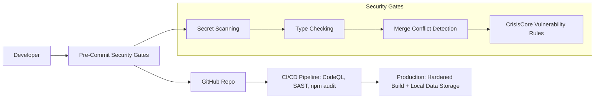

# 🩺 Pain Tracker | CrisisCore Systems  
> **A Security-Hardened Health Platform for Chronic Pain and Injury Management**  

  
  
  
  
  
  
  
  
  
  
  
  

---

## 🚨 Why Pain Tracker Exists  
Pain is more than a number. Most apps oversimplify—this one doesn't.  
We built **Pain Tracker** to **map pain in high resolution** for real-world recovery,  
backed by **WorkSafe BC reporting** and **security-focused engineering**.

> **⚠️ Current Status**: This project is in **early development** (v0.1.0-dev). While core features are functional and tested, dependency vulnerabilities are being actively addressed. See [Security Status](#-security-status) for details.


---

### 🌟 Highlights

| Feature Domain               | What Sets It Apart                                              |
|-----------------------------|---------------------------------------------------------------|
| 📝 Pain Assessment          | 7-step multi-dimensional tracking, 25+ mapped body locations |
| 📊 Analytics & Heatmaps     | Symptom trends, recovery progression, treatment correlations  |
| 🏥 Healthcare Integration   | Automated WorkSafe BC claims, clinician-ready CSV/JSON exports|
| 💊 Treatment Tracking       | Medications, therapy logs, and outcome analysis              |
| 🧩 Quality of Life Metrics  | Mood, sleep, activity impacts                                 |
| 🚨 Emergency Panel          | Automated protocols & alert system                           |
| 🔒 Security by Design       | CSP, Zod validation, secret scanning, SAST pipelines         |


---

## 🧱 Architecture Overview

For a detailed exploration of storage design, background synchronization, PWA infrastructure, extensibility paths, and roadmap, see: [ARCHITECTURE_DEEP_DIVE.md](./ARCHITECTURE_DEEP_DIVE.md).

For a focused overview of system architecture, data flow, and security gates, see: [Minimal Architecture Diagram](docs/ARCHITECTURE_MINI.md).

Key pillars: Offline-first resilience, event-driven sync, typed IndexedDB wrapper, prioritized queue processing, and forward-compatible shims (e.g., legacy `forcSync` → `forceSync`).

---

## 🛡️ Security Status  

**Current Security Posture**: CrisisCore Systems has implemented comprehensive security infrastructure, but the project currently has dependency vulnerabilities that require attention:

- ✅ **Security Infrastructure**: Complete CI/CD security pipeline with CodeQL, SAST, and secret scanning
- ✅ **Development Security**: Pre-commit hooks, vulnerability scanning, and security-focused code practices  
- ⚠️ **Dependencies**: 77 vulnerabilities in dev dependencies (73 critical, 1 high, 3 moderate)
- ✅ **Production Safety**: Vulnerabilities are in development tools, not runtime dependencies
- ✅ **Local Data Only**: No cloud storage or data transmission reduces attack surface
- ✅ **SBOM Available**: Software Bill of Materials published for transparency ([View SBOM](security/sbom-latest.json))
- ✅ **Documentation Validation**: Automated validation ensures documentation accuracy and completeness

**Secure Storage Implementation**:
- **Current Encryption**: AES-256-GCM for all sensitive data storage
- **Key Management**: Secure key rotation with fallback mechanisms
- **Encrypted Scope**: All pain assessments, personal data, and medical information
- **Fallback Behavior**: In-memory key cache when secure storage writes fail
- **Future Enhancement**: Optional IndexedDB layer for large encrypted datasets (planned)

**Security Architecture**:


**Mitigation Plan**: Dependency updates are in progress. The security framework ensures that vulnerabilities in development tools don't affect the production application.


---

## 🧩 Tech Stack

| Layer | Tech Stack |
|-------|------------|
| **Frontend** | React 18, TypeScript, Vite, Tailwind CSS, Headless UI |
| **Analytics** | Recharts, Chart.js, Custom Visualizations |
| **Validation** | Zod schemas for all inputs |
| **Testing** | Vitest, Testing Library, jsdom (128 tests) |
| **DevOps** | GitHub Actions, Husky, CommitLint, Makefile workflows |
| **Security** | CodeQL, npm audit, CrisisCore Gates, CSP headers |

---

## Features

### 📊 Comprehensive Pain Tracking
- **Multi-dimensional Pain Assessment** ([PainEntryForm.tsx](src/components/pain-tracker/PainEntryForm.tsx)): 
  - Pain intensity (0-10 scale) with visual feedback
  - 25+ specific body locations including detailed leg/foot mapping
  - 19+ symptom types including nerve-specific symptoms
- **Advanced Analytics** ([PainChart.tsx](src/components/pain-tracker/PainChart.tsx) | [analytics/heuristics.ts](src/lib/analytics/heuristics.ts)): Interactive charts showing pain trends, location heat maps, and pattern recognition
- **Historical Tracking** ([calculations.ts](src/utils/pain-tracker/calculations.ts)): Complete pain history with progression analysis

### 🏥 Healthcare Integration
- **WorkSafe BC Report Generation** ([wcb-submission.ts](src/services/wcb-submission.ts) | [Sample Report](samples/worksafebc-report-sample.csv)): Automated report creation for workplace injury claims
- **Emergency Response Panel** ([EmergencyPanel.tsx](src/components/pain-tracker/EmergencyPanel.tsx)): Emergency contacts, protocols, and real-time pain monitoring
- **Clinical Data Export** ([export.ts](src/utils/pain-tracker/export.ts)): Professional-grade CSV and JSON exports for healthcare providers

### 💼 Workplace Injury Management
- **Work Impact Assessment** ([DailyLiving.tsx](src/components/pain-tracker/DailyLiving.tsx)): Track missed days, modified duties, and workplace limitations
- **Functional Analysis**: Monitor activities of daily living and assistance requirements
- **Return-to-Work Planning**: Document accommodations and workplace modifications

### 💊 Treatment & Medication Tracking
- **Medication Management**: Track current medications, dosages, frequency, and effectiveness
- **Treatment Logging**: Record therapies, appointments, and treatment outcomes
- **Progress Monitoring** ([trending.ts](src/utils/pain-tracker/trending.ts)): Analyze treatment effectiveness over time

### 🎯 Quality of Life Metrics
- **Sleep Quality Tracking**: Monitor how pain affects rest and recovery
- **Mood & Social Impact** ([EmpathyMetricsCollector.ts](src/services/EmpathyMetricsCollector.ts)): Track emotional and social consequences of pain
- **Activity Logging**: Record daily activities and their impact on pain levels

### 🔧 Advanced Features
- **Nerve Symptom Analysis**: Specialized tracking for neurological symptoms
- **Functional Limitations Assessment**: Detailed mobility and capability monitoring
- **Comparison Tracking**: Monitor changes since injury or diagnosis
- **Onboarding & Tutorials** ([FeatureHighlights.tsx](src/components/onboarding/FeatureHighlights.tsx)): Guided setup and interactive help system

### 🛡️ Privacy & Security
- **Local Data Storage** ([storage.ts](src/utils/pain-tracker/storage.ts)): All data remains on your device - no cloud storage
- **Secure Architecture** ([EncryptionService.ts](src/services/EncryptionService.ts) | [SecurityService.ts](src/services/SecurityService.ts)): AES-256 encryption and multiple security layers
- **Data Portability**: Easy export and backup capabilities

## 📋 Feature Maturity Matrix

For a comprehensive overview of feature implementation status, see our [Feature Maturity Matrix](docs/FEATURE_MATRIX.md), which tracks 42 features across categories from "Implemented" to "Planned".

---

## 🧰 Quick Start

```bash
# Clone the repository
git clone https://github.com/CrisisCore-Systems/pain-tracker.git
cd pain-tracker

# Recommended setup
make setup    # Install dependencies, configure env, enable hooks
make dev      # Start development server

# Manual setup
npm install --legacy-peer-deps  # Note: legacy flag needed for current dependencies
cp .env.example .env
npm run dev
```

### 🔧 Known Issues & Requirements

**Current Dependencies**: Some legacy peer dependencies are required due to version conflicts in the testing ecosystem. This is being actively resolved.

**Node.js Compatibility**: 
- ✅ Node.js 18, 20, 22 supported
- ✅ npm 9+ required
- ⚠️ Use `--legacy-peer-deps` flag during installation

---

## 🔥 Dev Culture & Commit Rules

This repo enforces Conventional Commits and strong pre-commit enforcement:

```bash
feat(tracker): add pain heatmap visualization
fix(api): resolve WCB integration timeout
docs(readme): add contributing guidelines
```

**Skip tags:** `[skip lint]`, `[skip build]`, `[skip all]`

---

---

## 🔧 Detailed Documentation

<details>
<summary><strong>📋 Current Status & Implementation</strong></summary>

**Version**: 0.1.0-dev (Early Development)  
**Build Status**: ✅ Passing (128 tests, successful builds)  
**Security Status**: ⚠️ Dependency vulnerabilities present (dev tools only)  
**Deployment**: ✅ GitHub Pages configured and ready  

### ✅ Implemented Core Features
- ✅ Multi-step pain assessment form (7 comprehensive steps)
- ✅ Interactive data visualization and analytics with charts
- ✅ WorkSafe BC report generation (automated PDF/CSV export)
- ✅ Emergency response panel with contact management
- ✅ Local data storage with import/export capabilities
- ✅ Comprehensive testing suite (128 tests)
- ✅ Security scanning and input validation
- ✅ Onboarding and tutorial system
- ✅ Responsive design with accessibility features
- ✅ TypeScript implementation with Zod validation

### 🎯 Verified Use Cases
- **✅ Individual Pain Management**: Personal tracking and analysis working
- **✅ Workplace Injury Claims**: WorkSafe BC integration and reporting functional
- **✅ Healthcare Collaboration**: Professional data exports and reports implemented
- **✅ Emergency Situations**: Contact management and alert system operational

### 🔄 In Active Development
- 🔄 Dependency vulnerability remediation
- 🔄 Enhanced analytics features
- 🔄 Mobile app development
- 🔄 Advanced export formats

</details>

<details>
<summary><strong>⚙️ Installation & Prerequisites</strong></summary>

### Prerequisites
- Node.js 18+ (20+ recommended)
- npm 9 or higher
- Git 2.0+

### Health Check
```bash
make doctor   # Or: node scripts/doctor.js
```

### 🔍 Dependency Status Check
```bash
npm audit --audit-level moderate  # Check for moderate+ vulnerabilities
npm run check-security            # Run comprehensive security checks
```

### Deployment
The application has a comprehensive multi-environment deployment strategy with automated CI/CD pipelines:

**Quick Deployment Commands**:
```bash
# Check deployment status
make deploy-status

# Deploy to staging
make deploy-staging

# Create a release (auto-deploys to production)
make release-patch    # Bug fixes
make release-minor    # New features
make release-major    # Breaking changes

# Run health checks
make deploy-healthcheck

# Emergency rollback (if needed)
make deploy-rollback ENV=production VERSION=v1.2.3
```

**Environments**:
- **Production**: https://crisiscore-systems.github.io/pain-tracker/ (main branch, releases)
- **Staging**: https://crisiscore-systems.github.io/pain-tracker/staging/ (develop branch)
- **Preview**: Automatic per-PR deployments for testing

**Deployment Pipeline**:
1. **Pull Request** → Preview deployment for testing
2. **Merge to develop** → Staging deployment for QA
3. **Release creation** → Production deployment with monitoring

For detailed deployment procedures, rollback steps, and troubleshooting, see [Deployment Guide](docs/DEPLOYMENT.md).

**Security Note**: All deployments include comprehensive security scanning and will fail if critical vulnerabilities are detected.

</details>

<details>
<summary><strong>📊 Usage & Features</strong></summary>

### 📝 Recording Pain Entries
The application uses a comprehensive 7-step assessment process:

1. **Pain Assessment**: Set pain level (0-10), select body locations, and identify symptoms
2. **Functional Impact**: Document limited activities, assistance needs, and mobility aids
3. **Medications**: Track current medications, dosages, and effectiveness
4. **Treatments**: Record recent therapies, effectiveness, and planned treatments
5. **Quality of Life**: Assess sleep quality, mood impact, and social effects
6. **Work Impact**: Document missed work, modified duties, and workplace limitations
7. **Comparison**: Track changes since injury and new limitations

### 📊 Analytics & Visualization
- **Pain History Charts**: Interactive timeline of pain levels and trends
- **Location Heat Maps**: Visual representation of pain patterns by body region
- **Progression Analysis**: Track improvements or deterioration over time
- **Treatment Effectiveness**: Analyze correlation between treatments and pain levels

### 🏥 Healthcare Features
- **WorkSafe BC Reports**: Generate professional reports for workplace injury claims
- **Emergency Panel**: Access emergency contacts and protocols based on current pain levels
- **Clinical Exports**: Export detailed data in CSV/JSON formats for healthcare providers

### 🔄 Data Management
- **Local Storage**: All data stored securely in your browser
- **Data Export**: Complete backup capabilities for data portability
- **Sample Data**: Try the application with pre-loaded demonstration data
- **Onboarding**: Interactive tutorial for new users

</details>

<details>
<summary><strong>🔒 Data Privacy & Security</strong></summary>

**Complete Privacy**: All pain tracking data is stored locally in your browser using secure web storage APIs. No data is transmitted to external servers or cloud services.

**Data Control**: You maintain complete control over your data with:
- ✅ Local-only storage (never leaves your device)
- ✅ Secure export capabilities (CSV/JSON)  
- ✅ No account creation or login required
- ✅ No tracking cookies or analytics

**Security Features**:
- ✅ Input validation and sanitization with Zod schemas
- ✅ Content Security Policy (CSP) headers
- ✅ Automated vulnerability scanning in CI/CD
- ⚠️ Regular security audits (dependency vulnerabilities being addressed)

</details>

<details>
<summary><strong>⚡ Developer Workflow</strong></summary>

### Available Commands

```bash
# Quick help
make help             # Show all available commands

# Development
make dev              # Start development server
make build            # Build for production
make test             # Run tests
make check            # Run all checks (lint, typecheck, test, build)

# Code Quality
make lint             # Run ESLint
make lint-fix         # Fix ESLint issues automatically
make typecheck        # Run TypeScript type checking
make format           # Format code with Prettier

# Security & Diagnostics
make doctor           # Run environment diagnostics
make scan-secrets     # Scan for hardcoded secrets
make check-security   # Run all security checks

# Git Workflow
make check-pre-commit # Test pre-commit hooks
```

### Pre-commit Hooks
This project uses modular pre-commit hooks that run:
- 🛡️ CrisisCore collapse vector detection
- 📝 TypeScript type checking
- 🔍 ESLint code quality checks
- 🏗️ Build verification
- 🔐 Secret scanning
- 🔀 Merge conflict marker detection

**Skip individual checks** by adding tags to your commit message:
```bash
git commit -m "fix: urgent hotfix [skip lint]"
git commit -m "docs: update readme [skip build]"
git commit -m "wip: experimental feature [skip all]"
```

Available skip tags: `[skip typecheck]`, `[skip lint]`, `[skip build]`, `[skip secrets]`, `[skip merge]`, `[skip collapse]`, `[skip all]`

### Commit Message Format
This project follows [Conventional Commits](https://www.conventionalcommits.org/):

```
<type>(<scope>): <description>

[optional body]

[optional footer(s)]
```

**Types:** `feat`, `fix`, `docs`, `style`, `refactor`, `perf`, `test`, `chore`, `ci`, `build`, `security`, `deps`, `config`

**Examples:**
```bash
feat(tracker): add pain intensity heatmap visualization
fix(api): resolve CORS issues with WCB integration
docs(readme): add contribution guidelines
security(auth): implement rate limiting for API endpoints
```

</details>


## 🔐 Secure Storage Migration (LocalStorage → secureStorage)

As of v0.1.0-dev, the application is migrating all sensitive and semi-sensitive browser persistence from raw `localStorage` keys to a hardened abstraction: `secureStorage`.

### Why This Change

- Centralized key validation + namespacing (`pt:` prefix) prevents collisions
- Future-proof encryption hook (already enabled for pain entries & sensitive identifiers)
- Deterministic testing: encryption shim replaced with no-op in Vitest global setup
- Uniform quota & error handling (graceful degradation + analytics hooks planned)

### Core Pieces

- `secureStorage.get/set/remove(key, { encrypt?: boolean })`
- Migration helpers in `src/lib/storage/migrations.ts`:
  - `migrateLegacyKey({ from, to, encrypt, transform, removeLegacy })`
  - `migrateLegacyKeys([{ from, to, encrypt }], options?)`
- Enhanced React hook: `useLocalStorage(key, initialValue, { secure, encrypt, namespace })`

### Typical Migration Pattern

```ts
import { secureStorage } from '@/lib/storage/secureStorage';
import { migrateLegacyKey } from '@/lib/storage/migrations';

// 1. Run once (component mount or early bootstrap)
migrateLegacyKey({
  from: 'legacy-onboarding-complete',
  to: 'onboardingComplete',
  encrypt: false,
  removeLegacy: true,
});

// 2. Use secureStorage everywhere after
const flag = secureStorage.get('onboardingComplete');
```

### Using the Hook Securely

```ts
const [entries, setEntries] = useLocalStorage('painEntries', [], {
  secure: true,      // uses secureStorage internally
  encrypt: true,     // apply encryption layer (test shim neutralizes)
  namespace: 'pt',   // optional explicit namespace override
});
```

### Encryption Notes

- Only applied to selected keys (pain entries, device identifiers, tokens)
- Transparent to callers; failures surface as normal storage errors
- Tests swap encryption functions with no-ops for deterministic snapshots

### Legacy Fallback Strategy

During migration we temporarily support reading the legacy key if the secure key is absent. After one successful write, the new key becomes the source of truth and (optionally) the legacy key is removed.

### Adding a New Persisted Key (Checklist)

1. Define semantic key name (camelCase) – avoid user-supplied fragments
2. Decide if encryption needed (PII, health context, auth tokens = yes)
3. Add migration if replacing an old raw key
4. Use `useLocalStorage(..., { secure: true, encrypt })` or direct `secureStorage.set`
5. Write/update tests (use factories; encryption agnostic)
6. Avoid direct `window.localStorage` access outside controlled utilities

### Demo / Non-Production Scripts

Files in `public/pwa-demo.js` & `public/pwa-init.js` contain explicit comments noting they are demonstration-only and not production security models.

### Open Items

- Remaining raw usage candidate: `useWCBStorage.js` (planned evaluation)
- Future: optional IndexedDB layer for large encrypted blobs

---

## 🚀 Current Development Status

### ✅ What's Working

- **Core Pain Tracking**: Full 7-step assessment process
- **Data Visualization**: Interactive charts and analytics
- **WorkSafe BC Integration**: Automated report generation
- **Local Data Storage**: Secure browser-based storage
- **Testing Infrastructure**: 128 comprehensive tests
- **Security Framework**: Complete CI/CD security pipeline
- **Build System**: Production-ready builds with Vite

### 🔄 Active Development

- **Dependency Updates**: Resolving vulnerability issues in dev dependencies
- **Testing Coverage**: Implementing coverage reporting tools
- **Mobile Optimization**: Enhanced responsive design
- **Export Features**: Additional report formats

### 🎯 Near-term Goals

- **Security Hardening**: Complete dependency vulnerability remediation
- **Performance**: Advanced caching and optimization
- **Accessibility**: Enhanced screen reader support
- **Documentation**: Comprehensive user guides

---

## 🤝 Contributing

We welcome security engineers, clinicians, and open-source devs.  
See [CONTRIBUTING.md](CONTRIBUTING.md) for detailed workflow.

**For security disclosures:**  
📧 <security@crisiscore.systems>

---

## 🏆 Acknowledgments

- **[WorkSafe BC](https://www.worksafebc.com/)**: Expertise in injury reporting and claims
- **Clinicians**: Pain assessment model refinement  
- **[OpenSSF](https://openssf.org/)**: Security best practice frameworks
- **The Chronic Pain Community**: Real-world feedback

---

## 🖤 Built with Empathy, Rigor, and Transparency

This project represents a **commitment to honest, security-conscious development** while building meaningful tools for chronic pain management. We believe in:

- **Transparency**: Honest reporting of project status, including current challenges
- **Security**: Multiple layers of protection, even during development phases  
- **Privacy**: Your data never leaves your device
- **Quality**: Comprehensive testing and validation at every step
- **Community**: Open development with healthcare professionals and pain management experts

**By [CrisisCore Systems](https://github.com/CrisisCore-Systems) — Security-first tools for real-world health.**

---

## License

This project is licensed under the MIT License - see the [LICENSE](LICENSE) file for details.
