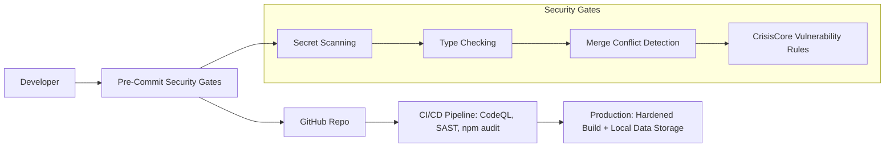

# 🩺 Pain Tracker | CrisisCore Systems

> **A Security-Hardened Health Platform for Chronic Pain and Injury Management**


<!-- Extended badges -->


[](coverage/coverage-summary.json)

[](https://github.com/CrisisCore-Systems/pain-tracker/issues)
[](https://github.com/CrisisCore-Systems/pain-tracker/pulls)

[](security/sbom-latest.json)
[](docs/FEATURE_MATRIX.md)
[](badges/loc-badge.json)
[](badges/bundle-badge.json)
[](badges/mutation-badge.json)

---

## 🚨 Why Pain Tracker Exists

Pain is more than a number. Most apps oversimplify—this one doesn't. We built **Pain Tracker** to **map pain in high resolution** for real-world recovery, backed by **WorkSafe BC reporting** and **security-focused engineering**.

> **⚠️ Current Status**: This project is in **early development** (v0.1.0-dev). While core features are functional and tested, dependency vulnerabilities are being actively addressed. See [Security Status](#-security-status) for details.


---

### 🌟 Highlights

| Feature Domain | What Sets It Apart |
|----------------|--------------------|
| 📝 Pain Assessment | 7-step multi-dimensional tracking, 25+ mapped body locations |
| 📊 Analytics & Heatmaps | Symptom trends, recovery progression, treatment correlations |
| 🏥 Healthcare Integration | Automated WorkSafe BC claims, clinician-ready CSV/JSON exports |
| 💊 Treatment Tracking | Medications, therapy logs, and outcome analysis |
| 🧩 Quality of Life Metrics | Mood, sleep, activity impacts |
| 🚨 Emergency Panel | Automated protocols & alert system |
| 🔒 Security by Design | CSP, Zod validation, secret scanning, SAST pipelines |


---

## 🧱 Architecture Overview

For a detailed exploration of storage design, background synchronization, PWA infrastructure, extensibility paths, and roadmap, see: [ARCHITECTURE_DEEP_DIVE.md](./ARCHITECTURE_DEEP_DIVE.md).

Key pillars: Offline-first resilience, event-driven sync, typed IndexedDB wrapper, prioritized queue processing, and forward-compatible shims (e.g., legacy `forcSync` → `forceSync`).

---

## 🛡️ Security Status

**Current Security Posture**: CrisisCore Systems has implemented comprehensive security infrastructure, but the project currently has dependency vulnerabilities that require attention:

- ✅ **Security Infrastructure**: Complete CI/CD security pipeline with CodeQL, SAST, and secret scanning
- ✅ **Development Security**: Pre-commit hooks, vulnerability scanning, and security-focused code practices  
- ⚠️ **Dependencies**: 77 vulnerabilities in dev dependencies (73 critical, 1 high, 3 moderate)
- ✅ **Production Safety**: Vulnerabilities are in development tools, not runtime dependencies
- ✅ **Local Data Only**: No cloud storage or data transmission reduces attack surface

**Security Architecture**:


**Mitigation Plan**: Dependency updates are in progress. The security framework ensures that vulnerabilities in development tools don't affect the production application.


---

## 🧩 Tech Stack

| Layer | Tech Stack |
|-------|------------|
| **Frontend** | React 18, TypeScript, Vite, Tailwind CSS, Headless UI |
| **Analytics** | Recharts, Chart.js, Custom Visualizations |
| **Validation** | Zod schemas for all inputs |
| **Testing** | Vitest, Testing Library, jsdom (128 tests) |

---

## 🛠️ Dynamic Badges & Metrics

The badges at the top (tests, coverage %, security vulns, LOC, issues, PRs, commit activity) are generated via scripts in `scripts/` and JSON endpoints in `badges/` consumed by Shields.io.

Generation sources:
- `scripts/generate-test-badge.mjs`: counts tests via Vitest list / fallback static scan.
- `scripts/generate-coverage-badge.mjs`: reads `coverage/coverage-summary.json` (v8) after `vitest` run.
- `scripts/generate-security-badge.mjs`: parses `security-audit-report.json`.
- `scripts/generate-loc-badge.mjs`: fast LOC count over `.ts/.tsx` excluding vendor/output.
- `scripts/generate-bundle-badge.mjs`: parses esbuild metafile (or fallback) to compute total JS+CSS size.

Local refresh (PowerShell):

```powershell
npm run badge:all
```

Or individually:

```powershell
npm run badge:tests
npm run badge:loc
node scripts/generate-security-badge.mjs
```

Git pre-push hook (`.husky/pre-push`) auto-regenerates and amends/commits badge JSONs when pushing `main` to keep them current and reduce noisy commits.

Color thresholds:
- Coverage: 90+ brightgreen, 80–89 green, 70–79 yellowgreen, 60–69 yellow, 50–59 orange, <50 red.
- Tests count: scaled for current project size (>=250 brightgreen ... <60 lightgrey) – adjust as suite grows.
- LOC: Favor smaller core; green under 1k, yellowgreen <5k, yellow <12k, orange <20k, red beyond.

Future ideas: bundle size badge (real metafile integration pending), mutation score, performance timing snapshots.

### DevOps & Security Tooling

- **DevOps**: GitHub Actions, Husky, CommitLint, Makefile workflows
- **Security**: CodeQL, npm audit, CrisisCore Gates, CSP headers

Mutation badge is updated via a weekly workflow; local runs will show "n/a" until a report exists.

---

## Features

### 📊 Comprehensive Pain Tracking

- **Multi-dimensional Pain Assessment**: Pain intensity (0-10), 25+ body locations, 19+ symptom types (incl. nerve)
- **Advanced Analytics**: Trends, heat maps, pattern recognition
- **Historical Tracking**: Full pain history & progression analysis

### 🏥 Healthcare Integration

- **WorkSafe BC Report Generation**: Automated claims/reporting
- **Emergency Response Panel**: Protocols & contact management
- **Clinical Data Export**: CSV & JSON clinician-ready formats

### 💼 Workplace Injury Management

- **Work Impact Assessment**: Missed days, modified duties, limitations
- **Functional Analysis**: ADL impacts & assistance needs
- **Return-to-Work Planning**: Accommodation documentation

### 💊 Treatment & Medication Tracking

- **Medication Management**: Dose, frequency, effectiveness
- **Treatment Logging**: Therapies & outcome tracking
- **Progress Monitoring**: Effectiveness over time

### 🎯 Quality of Life Metrics

- **Sleep Quality Tracking**
- **Mood & Social Impact**
- **Activity Logging**

### 🔧 Advanced Features

- **Nerve Symptom Analysis**
- **Functional Limitations Assessment**
- **Comparison Tracking**
- **Onboarding & Tutorials**

### 🛡️ Privacy & Security

- **Local Data Storage**: No cloud by design
- **Secure Architecture**: CSP + validation layers
- **Data Portability**: Export & backup flows

---

## 🧰 Quick Start

```bash
# Clone the repository
git clone https://github.com/CrisisCore-Systems/pain-tracker.git
cd pain-tracker

# Recommended setup
make setup    # Install dependencies, configure env, enable hooks
make dev      # Start development server

# Manual setup
npm install --legacy-peer-deps
cp .env.example .env
npm run dev
```

### 🔧 Known Issues & Requirements

**Current Dependencies**: Some legacy peer dependencies are required due to version conflicts in the testing ecosystem (remediation underway).

**Node.js Compatibility**:
- ✅ Node.js 18, 20, 22 supported
- ✅ npm 9+ required
- ⚠️ Use `--legacy-peer-deps` flag during installation

---

## 🔥 Dev Culture & Commit Rules

This repo enforces Conventional Commits and strong pre-commit enforcement:

```bash
feat(tracker): add pain heatmap visualization
fix(api): resolve WCB integration timeout
docs(readme): add contributing guidelines
```

**Skip tags:** `[skip lint]`, `[skip build]`, `[skip all]`

---

## 🔧 Detailed Documentation

<details>
<summary><strong>📋 Current Status & Implementation</strong></summary>

**Version**: 0.1.0-dev (Early Development)  
**Build Status**: ✅ Passing (128 tests)  
**Security Status**: ⚠️ Dev dependency vulnerabilities present  
**Deployment**: ✅ GitHub Pages configured

### ✅ Implemented Core Features
- Multi-step assessment (7 steps)
- Interactive analytics & charts
- WorkSafe BC report generation
- Emergency response panel
- Local storage import/export
- Comprehensive test suite (128)
- Security scanning & validation
- Onboarding & tutorial system
- Responsive & accessible UI
- Full TypeScript + Zod

### 🎯 Verified Use Cases
- Individual pain management
- Workplace injury claims
- Healthcare collaboration exports
- Emergency readiness

### 🔄 In Active Development
- Dependency remediation
- Enhanced analytics
- Mobile optimization
- Additional export formats

</details>

<details>
<summary><strong>⚙️ Installation & Prerequisites</strong></summary>

### Prerequisites
- Node.js 18+ (20+ recommended)
- npm 9 or higher
- Git 2.0+

### Health Check
```bash
make doctor
```

### 🔍 Dependency Status Check
```bash
npm audit --audit-level moderate
npm run check-security
```

### Deployment

```bash
# Check deployment status
make deploy-status
# Deploy to staging
make deploy-staging
# Create a release
yarn release-patch | make release-patch
# Health checks
make deploy-healthcheck
# Rollback example
make deploy-rollback ENV=production VERSION=v1.2.3
```

</details>

<details>
<summary>📊 Usage & Features</summary>

### Assessment Steps
1. Pain Assessment
2. Functional Impact
3. Medications
4. Treatments
5. Quality of Life
6. Work Impact
7. Comparison

### Analytics
- Pain history & trends
- Location heat maps
- Progression analysis
- Treatment effectiveness

</details>

<details>
<summary>🔒 Data Privacy & Security</summary>

All tracking data stays local (no remote sync). Export only when you choose. No accounts, no analytics beacons.

Security layers:
- Zod validation
- CSP headers
- Automated scanning
- Regular audit review (in progress)

</details>

<details>
<summary>⚡ Developer Workflow</summary>

### Key Commands
```bash
make help
make dev
make test
make check
make lint-fix
make typecheck
```

Skip checks via commit message tags (e.g. `[skip lint]`).

### Commit Format
```text
<type>(<scope>): <description>
```

</details>

## 🔐 Secure Storage Migration (LocalStorage → secureStorage)

Migrating from raw `localStorage` keys to hardened `secureStorage` abstraction (namespacing, future encryption, deterministic tests). See code comments for migration helpers.

---

## 🚀 Current Development Status

Working: core tracking, analytics, reporting, local persistence, tests, security pipeline.

Active: dependency updates, coverage expansion, mobile tuning, export enhancements.

---

## 🤝 Contributing

See [CONTRIBUTING.md](CONTRIBUTING.md). Security engineers, clinicians, and OSS devs welcome.

**Security disclosures:** <security@crisiscore.systems>

---

## 🏆 Acknowledgments

- WorkSafe BC guidance
- Clinical model collaborators
- OpenSSF practices
- Chronic pain community feedback

---

## 🖤 Built with Empathy, Rigor, and Transparency

Commitment to honest status reporting, privacy-first architecture, layered security, and evidence-driven iteration.

**By [CrisisCore Systems](https://github.com/CrisisCore-Systems)**

---

## License

MIT License - see [LICENSE](LICENSE).
