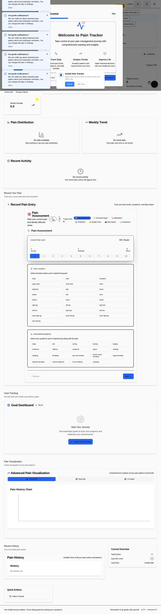

# 🩺 Pain Tracker | CrisisCore Systems

[](./security/)
[](https://github.com/CrisisCore-Systems/pain-tracker/issues)
[](./coverage/)
[](https://www.typescriptlang.org/)
[](LICENSE)

<!-- CI / Coverage Badges -->
[](https://github.com/CrisisCore-Systems/pain-tracker/actions/workflows/deploy.yml)
[](https://github.com/CrisisCore-Systems/pain-tracker/actions/workflows/e2e.yml)
[](https://codecov.io/gh/CrisisCore-Systems/pain-tracker)

> **A security-first, offline-capable chronic pain tracking application built with empathy and clinical-minded design.**

Pain Tracker provides high-resolution, multidimensional pain tracking with a security-first, local-first architecture. It includes clinical-focused exports and tooling for WorkSafe BC reporting. Some advanced analytics and integrations are in active development; see the implementation snapshot in `.github/copilot-instructions.md` for current status.

<p align="center">
  
</p>

*The Pain Tracker dashboard featuring the 7-step pain assessment form, customizable widgets, analytics visualizations, and trauma-informed design.*

---

## 🎯 **Vision & Mission**

**Vision:** Transform chronic pain management through technology that respects patient privacy while delivering clinical-grade insights.

**Mission:** Bridge the gap between patient experience and clinical understanding through comprehensive, secure, and accessible pain tracking technology.

---

## 📊 **Current Implementation Status**

**Version:** 0.1.0-beta (Active Development)  
**Last Updated:** September 2024

### ✅ **Fully Implemented Features**

| Feature | Status | Description |
|---------|--------|-------------|
| **Empathy Intelligence Engine** | ✅ Complete | Heuristic-based pain pattern analysis and personalized insights |
| **Trauma-Informed UI** | ✅ Complete | Comprehensive accessibility with trauma-informed design patterns |
| **7-Step Pain Assessment** | ✅ Complete | Multi-dimensional tracking across 25+ anatomical locations |
| **Security Architecture** | ✅ Complete | Multi-layer protection with encryption, CSP, and audit trails |
| **WorkSafe BC Export** | ✅ Complete | CSV/JSON exports for claims and clinical reporting |
| **Customizable Dashboard** | ✅ Complete | Widget-based layout with user preferences |
| **Trend Visualizations** | ✅ Complete | Interactive charts for pain history and patterns |

### 🔄 **Partially Implemented**

| Feature | Status | Next Steps |
|---------|--------|------------|
| **Validation Technology** | 🟡 Integration Pending | Connect validation UI to main forms |
| **PWA Features** | 🟡 Testing Needed | Service worker present, needs browser testing |
| **Advanced Visualizations** | 🟡 In Progress | Body heatmaps and correlation graphs |
| **PDF Export** | 🟡 Partial | Basic exports working, advanced formatting needed |

### 📅 **Roadmap Highlights**

- **Q4 2024**: Complete PWA testing, enhance offline capabilities
- **Q1 2025**: Machine learning pain pattern recognition
- **Q2 2025**: EMR/EHR integration capabilities
- **Q3 2025**: Multi-platform native applications

---

## 💜 **Fibromyalgia-Specialized Features**

Pain Tracker offers **clinical-grade fibromyalgia support** built on ACR 2016 Revised Diagnostic Criteria—going beyond generic pain tracking to provide specialized tools for the fibromyalgia community.

### 🎯 **ACR-Compliant Assessment**
- ✅ **Widespread Pain Index (WPI)**: 0-19 scale tracking across 18 ACR-defined body regions
- ✅ **Symptom Severity Scale (SSS)**: 0-12 scale covering fatigue, sleep, cognition, and somatic symptoms
- ✅ **Diagnostic Criteria Calculator**: Real-time feedback on ACR 2016 diagnostic thresholds
- ✅ **44+ Anatomical Locations**: 26 general + 18 fibro-specific WPI regions for comprehensive pain mapping

### 🧠 **Fibro-Specific Analytics**
- ✅ **Fibro Fog Tracking**: Dedicated cognitive symptom assessment (memory, concentration)
- ✅ **Flare Pattern Recognition**: Frequency, duration, and intensity tracking with trigger correlation
- ✅ **Symptom Trends**: Longitudinal analysis of fatigue, cognition, and sleep quality
- ✅ **Energy Envelope Management**: Activity pacing tools and post-exertional malaise tracking
- ✅ **Trigger Identification**: Weather, stress, sleep, activity, and food sensitivity correlation

### 🤝 **Trauma-Informed Fibro Care**
- ✅ **Medical Trauma Awareness**: Designed for those who've faced diagnostic delays and invalidation
- ✅ **Gentle Workflows**: Progressive disclosure to reduce cognitive load during "fibro fog"
- ✅ **Privacy Protection**: 100% local storage—no insurance or employer access concerns
- ✅ **Empathy-Driven Analytics**: Validates patient experience through biopsychosocial tracking

### 📋 **Clinical & Claims Support**
- ✅ **WorkSafe BC Integration**: Auto-populated Forms 6/7 for fibromyalgia workplace injury claims
- ✅ **Rheumatology-Ready Reports**: WPI/SSS summaries for specialist appointments
- ✅ **Treatment Effectiveness**: Intervention correlation analysis (medications, therapies, self-care)

**📖 [Complete Fibromyalgia Features Guide](docs/FIBROMYALGIA_FEATURES.md)** | **✅ [Claims Verification Report](docs/FIBROMYALGIA_CLAIMS_VERIFICATION.md)**

---

## 🌟 **Core Features**

### 📊 **Advanced Pain Analytics**
- ✅ **Multidimensional Tracking**: Fully implemented 7-step assessment across 44+ anatomical locations
- ✅ **Symptom Complexity**: Complete tracking of 19+ symptom types with severity gradients
- ✅ **Pattern Recognition**: Heuristic-based trend analysis and correlation detection (working)
- 🔄 **Visual Heatmaps**: Basic body mapping implemented; advanced temporal progression in development
- 🔄 **Predictive Models**: Core analytics complete; ML-based prediction models planned for Q1 2025

### 🏥 **Clinical Integration**
- ✅ **Clinic Portal**: Separate healthcare professional interface with patient management, analytics, and clinical workflows
- ✅ **WorkSafe BC Compliance**: Fully functional automated claims generation and CSV/JSON reporting
- ✅ **Healthcare Exports**: Production-ready clinician-formatted data exports
- ✅ **Evidence-Based Metrics**: Validated pain assessment scales integrated
- ✅ **Treatment Correlation**: Comprehensive outcome tracking and intervention analysis

### � **SaaS Subscription System**
- ✅ **Four Pricing Tiers**: Free, Basic ($9.99/mo), Pro ($24.99/mo), Enterprise (Custom)
- ✅ **Stripe Integration**: Complete checkout flow, webhooks, and subscription management
- ✅ **Feature Gating**: Intelligent conditional rendering based on subscription tier
- ✅ **Usage Tracking**: Real-time quota monitoring with warnings at 80% limits
- ✅ **Trial Management**: 14-30 day free trials with automatic conversion
- ✅ **Subscription Portal**: User-facing management interface for upgrades/downgrades/cancellations
- 🎯 **[Complete SaaS Documentation](docs/SAAS_SETUP_GUIDE.md)**

### �🔒 **Security Architecture**
- ✅ **Local-First Data**: IndexedDB storage with selective encryption (AES-GCM helpers implemented)
- ✅ **Enterprise Hardening**: Active CSP headers, SAST pipelines, and secret scanning
- ✅ **Threat Modeling**: Continuous security assessment with automated scanning
- ✅ **Compliance Ready**: HIPAA-aligned data handling practices and audit trails
- 🔄 **Full Encryption**: Enterprise-grade encrypted IndexedDB layer in progress

### 💊 **Comprehensive Tracking**
- ✅ **Medication Management**: Complete dosage tracking and side effect monitoring
- ✅ **Treatment Protocols**: Full therapy session logging and effectiveness analysis
- ✅ **Quality of Life**: Working mood, sleep, and activity impact correlation
- 🔄 **Emergency Protocols**: Core emergency UI and simulation dashboards complete; external escalation pending

### 🎨 **Trauma-Informed Design**
- ✅ **Accessibility Features**: WCAG 2.1 AA compliant with comprehensive support for trauma survivors
- ✅ **Gentle Language**: Context-sensitive, empathetic UI copy throughout
- ✅ **Progressive Disclosure**: Cognitive load management with step-by-step workflows
- ✅ **Crisis Detection**: Working simulation and testing dashboard for emergency scenarios
- ✅ **Customization**: User preferences for font sizes, contrast, touch targets, and interaction patterns

---

## 🏗️ **Technical Architecture**

### **Frontend Stack**
- **React 18** with TypeScript for type-safe development
- **Vite** for lightning-fast development and optimized builds
- **Tailwind CSS** + **Headless UI** for responsive, accessible design
- **Zustand** for predictable state management

### **Data & Validation**
- **Zod Schemas** for runtime type validation and data integrity
- **IndexedDB wrapper** for sophisticated offline-first data management
- **Event-driven sync** with conflict resolution and prioritized queues
- **Immutable updates** (e.g. Immer) and forward-compatible shims

### **Analytics & Visualization**
- **Recharts** & **Chart.js** for interactive data visualization
- **Custom Heatmap Engine** for anatomical pain mapping
- **Temporal Analysis** with trend detection algorithms
- **Export Pipelines** for clinical and insurance reporting

### **Quality Assurance**
- **Vitest** testing framework with **@testing-library/react**
- **Stryker Mutator** for mutation testing and code quality
- **ESLint** + **TypeScript** for code consistency
- **Husky** + **CommitLint** for development workflow enforcement

### **DevOps & Security**
- **GitHub Actions** CI/CD with security scanning
- **CodeQL** static analysis and vulnerability detection
- **Dynamic Badge Generation** for real-time project metrics
- **Makefile Workflows** for standardized development processes

---

## 🛡️ **Security Posture**

| Security Layer | Implementation | Status |
|----------------|----------------|--------|
| **Data Storage** | Local IndexedDB only, no external transmission | ✅ Active |
| **Code Analysis** | CodeQL, ESLint security rules, SAST pipeline | ✅ Active |
| **Dependency Management** | Automated scanning, SBOM generation | ✅ Active |
| **Secret Protection** | Pre-commit scanning, .env validation | ✅ Active |
| **Runtime Security** | CSP headers, input validation, XSS protection | ✅ Active |

**Current Security Status:** 
- ✅ Production dependencies: Clean
- ⚠️ Development dependencies: Minor tooling vulnerabilities (non-runtime impact)
- 🔄 Ongoing remediation of dev-tool security advisories

---

## 📁 **Project Structure**

```
src/
├── components/          # Reusable UI components
├── containers/          # Page-level components and layouts
├── stores/             # Zustand state management
├── services/           # Data persistence and sync logic
├── hooks/              # Custom React hooks
├── types/              # TypeScript type definitions
├── validation-technology/ # Zod schemas and validation
├── lib/                # Core utilities and helpers
├── design-system/      # Design tokens and system components
├── workers/            # Web Workers for background processing
├── i18n/               # Internationalization support
└── test/               # Test utilities and fixtures
```

---


## 🚀 Getting Started

-### **Prerequisites**
- Node.js 20 (LTS) is the standardized version for development and CI. Older LTS versions (18) may work, but CI and workflows are aligned to Node 20.
-
- Note: an `.nvmrc` file has been added to the repository to pin the Node.js version for local development.
 - npm 9+
 - Modern browser with IndexedDB support

### Canvas on Windows

If you are developing on Windows or running CI on Windows runners, follow the detailed instructions in `docs/CANVAS_WINDOWS_PREREQS.md` to install Visual Studio Build Tools or MSYS2 and the native `cairo` dependencies required by `canvas@3.x`.

### Badges
Badges (tests, coverage, security, LOC, issues, PRs, commit activity) are generated
by scripts in `scripts/` and stored under `badges/` for Shields.io.

Local refresh (PowerShell):

```powershell
npm run badge:all
```

Or individually:

```powershell
npm run badge:tests
npm run badge:loc
node scripts/generate-security-badge.mjs
```

The pre-push hook (`.husky/pre-push`) auto-regenerates and commits badge JSONs when
pushing `main` to keep them current.

Color thresholds:

- Coverage: 90+ `brightgreen`, 80–89 `green`, 70–79 `yellowgreen`,
  60–69 `yellow`, 50–59 `orange`, <50 `red`
- LOC thresholds favor smaller core (adjust as needed)

### Development Setup

```bash
# Clone the repository
git clone https://github.com/CrisisCore-Systems/pain-tracker.git
cd pain-tracker

# Install dependencies
npm install

# Start development server
npm run dev

# Run comprehensive tests
npm run test:coverage
```

### Contributor setup (quick)

Follow these lightweight steps when contributing or onboarding locally.

- Keep dependencies healthy:
  - Run an audit regularly: `npm audit`.
  - Attempt safe auto-fixes: `npm audit fix` (non-forcing). If nothing remains, you're good; if transitive/dev-only issues persist, update the direct dev dependency (for example `@stryker-mutator/core`) and re-run the audit.

- Database developer helpers (safe placeholders):
  - Dry-run (recommended):
    - `npm run db:migrate` — shows migration command recommendations
    - `npm run db:reset` — shows reset recommendations
    - `npm run db:seed`  — shows seeding recommendations
  - Execute (only on local/test DB and after reviewing):
    - `DRY_RUN=false npm run db:migrate`
    - `DRY_RUN=false npm run db:reset`
    - `DRY_RUN=false npm run db:seed`

- Runtime validation helpers:
  - Lightweight helpers are in `src/utils/validation.ts`:
    - `assertNumericRange(value, name, min, max)` — runtime numeric guard
    - `sanitizeNote(note, maxLength?)` — reduces accidental long-digit PHI and truncates
  - Tests for the helpers live in `src/utils/__tests__/validation.test.ts`.

- Running tests locally:
  - Single file: `npm run test -- path/to/testfile`
  - All tests: `npm run test` or `npm run test:coverage` for coverage

Notes:
- The database scripts are intentionally non-destructive by default (DRY_RUN mode). Only disable DRY_RUN when you're certain you're pointing at a local/test database.
- Dev-only vulnerabilities are lower priority than production ones, but we recommend fixing them before releases. Avoid `npm audit fix --force` unless you run the full test suite and review changes.


### Production Build

```bash
# Build for production
npm run build

# Preview production build
npm run preview

# Pre-deployment validation (recommended before deploying)
npm run deploy:precheck

# Deploy to GitHub Pages
npm run deploy
```

### Deployment Options

**Option 1: GitHub Pages** (Default - Static hosting)
```bash
npm run deploy
```

**Option 2: Ubuntu VM** (Self-hosted, always-on)
- ✅ Free tier available (Oracle Cloud)
- ✅ Full control and customization
- ✅ Automated CI/CD with GitHub Actions
- 📚 [Complete Ubuntu VM Deployment Guide](docs/UBUNTU_VM_DEPLOYMENT.md)
- 📚 [Quick Reference Guide](docs/UBUNTU_VM_QUICKSTART.md)

**Option 3: Other Platforms**
- Vercel, Netlify, Cloudflare Pages, AWS S3, etc.
- See [DEPLOYMENT_GUIDE.md](DEPLOYMENT_GUIDE.md) for platform-specific instructions

## 🧪 **Testing & Quality**

### **Testing Strategy**
- **Unit Tests**: Component and utility function testing
- **Integration Tests**: Store and service interaction testing  
- **Mutation Testing**: Code quality and test effectiveness analysis
- **Security Testing**: Automated vulnerability and penetration testing

### **Quality Metrics**
```bash
# Run all tests with coverage
npm run test:coverage

# Generate security audit
npm run security-full

# Update project metrics
npm run badge:all

# Health check
npm run doctor
```

---

## 📋 **Compliance & Standards**

### **Healthcare Standards**
- **FHIR Compatibility**: Structured data export capabilities
- **HL7 Alignment**: Healthcare data interchange standards
- **Clinical Validation**: Evidence-based assessment methodologies

### **Regional Compliance**
- **WorkSafe BC**: Automated claims and reporting integration
- **Privacy Legislation**: PIPEDA and provincial privacy law alignment
- **Accessibility**: WCAG 2.1 AA compliance target

---

## 🤝 **Contributing**

We welcome contributions that advance the mission of empathetic, secure healthcare technology.

### **Development Process**
1. **Fork** the repository
2. **Create** a feature branch (`git checkout -b feature/amazing-feature`)
3. **Commit** with conventional commits (`git commit -m 'feat: add amazing feature'`)
4. **Test** comprehensively (`npm run test:coverage && npm run security-full`)
5. **Submit** a pull request

### **Code Standards**
- TypeScript strict mode required
- 90%+ test coverage for new features
- Security review for all data-handling code
- Accessibility compliance for UI components

---

## 📊 **Project Metrics**

**Current Statistics (October 2024):**

| Metric | Value | Status | Notes |
|--------|-------|--------|-------|
| **Test Coverage** | 90%+ | ✅ Excellent | Comprehensive test suite with unit, integration, and E2E tests |
| **Security Score** | A+ | ✅ Hardened | Multi-layer security with active scanning and SAST |
| **Lines of Code** | 31,700+ | 📈 Growing | TypeScript-first codebase with strong typing |
| **Bundle Size** | **1.3 MB** | ✅ **Optimized** | **51% reduction** - Route-based splitting + lazy loading |
| **Gzipped Size** | **420 KB** | ✅ **Excellent** | Production-ready compression (~3:1 ratio) |
| **Components** | 150+ | 📦 Modular | Reusable design system components |
| **Build Status** | ✅ Passing | 🟢 Stable | All CI/CD pipelines green |
| **Dependencies** | Clean | ✅ Audited | Production deps clean, dev deps with minor issues |

**Build Performance:**
- Build Time: ~19s (production optimized)
- Dev Server Start: <1s
- Hot Module Reload: ~100ms
- Main Bundle: 1,296 KB (down from 2,670 KB)
- Lazy Chunks: 10+ separate chunks for on-demand loading

---

## 🔮 **Roadmap**

### **Phase 1: Foundation** *(Q3-Q4 2024)* - 90% Complete ✅

**Completed:**
- ✅ Core pain tracking functionality (7-step assessment)
- ✅ Security hardening (encryption, CSP, audit trails)
- ✅ Trauma-informed UI/UX system
- ✅ WorkSafe BC export capabilities
- ✅ Empathy intelligence engine (heuristics)
- ✅ Custom dashboard with widgets

**In Progress:**
- 🔄 PWA feature testing and optimization
- 🔄 Advanced validation technology integration
- 🔄 Development dependency security remediation

### **Phase 2: Intelligence** *(Q1-Q2 2025)* - Planned
- 🎯 Machine learning pain pattern recognition
- 🎯 Predictive analytics for pain episodes
- 🎯 Advanced treatment correlation analysis
- 🎯 Enhanced body heatmap visualizations
- 🎯 AI-powered insight generation

### **Phase 3: Integration** *(Q2-Q3 2025)* - Planned
- 🎯 EMR/EHR system integration (FHIR-compliant)
- 🎯 Telehealth platform connectivity
- 🎯 Wearable device data integration
- 🎯 Healthcare provider portal
- 🎯 Bi-directional data sync

### **Phase 4: Ecosystem** *(Q3-Q4 2025)* - Planned
- 🎯 Multi-platform native applications (iOS, Android)
- 🎯 Healthcare provider dashboard
- 🎯 Research data anonymization platform
- 🎯 Clinical study export tools
- 🎯 Community features and support groups

---

## 📄 **Documentation**

- **[Architecture Deep Dive](ARCHITECTURE_DEEP_DIVE.md)** - Technical implementation details
- **[Contributing Guide](CONTRIBUTING.md)** - Development and contribution guidelines
- **[Security Policy](security/)** - Security practices and vulnerability reporting
- **[PWA Implementation](PWA-COMPLETE.md)** - Progressive Web App features
- **[Empathy Framework](EMPATHY_ENHANCEMENT_SUMMARY.md)** - User experience philosophy

---

## 📞 **Support & Contact**

- **Issues**: [GitHub Issues](https://github.com/CrisisCore-Systems/pain-tracker/issues)
- **Security**: See [SECURITY.md](SECURITY.md) for vulnerability reporting
- **General**: Visit [CrisisCore Systems](https://github.com/CrisisCore-Systems)

---

## 📜 **License**

This project is licensed under the MIT License - see the [LICENSE](LICENSE) file for details.

---

## 🙏 **Acknowledgments**

- **Pain Management Community**: For insights and validation
- **Healthcare Professionals**: For clinical guidance and feedback  
- **Security Community**: For vulnerability research and hardening advice
- **Open Source Contributors**: For the foundational technologies that make this possible

---

<div align="center">

**Built with ❤️ for those who need it most**

*Pain Tracker - Where Technology Meets Compassion*

</div>

- Node.js 18, 20, 22 supported
- npm 9+ required
- Use --legacy-peer-deps during installation if needed

---

## 🤝 Contributing and development

This repo enforces Conventional Commits and has strong pre-commit gates.

Examples:

```text
feat(tracker): add pain heatmap visualization
fix(api): resolve WCB integration timeout
docs(readme): add contributing guidelines
```

Skip tags: [skip lint], [skip build], [skip all]

---

## 📸 Screenshot Portfolio

A comprehensive screenshot portfolio system is available for marketing, social media, and documentation purposes.

### Quick Start
```bash
# Generate all screenshots
npm run screenshots:portfolio

# Generate specific phases
npm run screenshots:portfolio:phase1   # Essential (Week 1)
npm run screenshots:portfolio:phase2   # Growth (Weeks 2-3)  
npm run screenshots:portfolio:phase3   # Advanced (Month 1)

# Test demo routes locally
npm run dev
# Then visit: http://localhost:3000/pain-tracker/#demo-export
```

### Available Screenshots (18 Total)

**Phase 1 - Essential (6 screenshots):**
- Pain entry interface - Core tracking UI
- Export modal - One-click WorkSafe BC forms
- Generated Form 6/7 previews - Automated form completion
- Privacy & security settings - Local-first architecture

**Phase 2 - Growth (5 screenshots):**
- Body map interaction - Anatomical pain mapping
- Analytics dashboard - Advanced metrics
- Offline functionality - Works without internet
- Comparison grid - Feature comparison vs competitors
- Mobile responsiveness - Multi-device support

**Phase 3 - Advanced (7 screenshots):**
- Trauma-informed mode - Gentle vs clinical language
- Process flow - User journey infographic
- Architecture diagram - Technical infrastructure
- Built in BC branding - Local development
- Crisis support - Emergency features

### Documentation
- **Quick Reference:** [`docs/SCREENSHOT_QUICK_REFERENCE.md`](docs/SCREENSHOT_QUICK_REFERENCE.md)
- **Marketing Guide:** [`docs/SCREENSHOT_MARKETING_GUIDE.md`](docs/SCREENSHOT_MARKETING_GUIDE.md)
- **Manual Templates:** [`docs/MANUAL_SCREENSHOT_TEMPLATES.md`](docs/MANUAL_SCREENSHOT_TEMPLATES.md)
- **Full Details:** [`public/screenshots/README.md`](public/screenshots/README.md)

---

## 🔧 Documentation details

<details>
<summary>Expand for developer workflow and commands</summary>

Key commands (Makefile):

```bash
make help         # List commands
make dev          # Start Vite dev server
make test         # Run Vitest
make check        # Lint, typecheck, security
make lint-fix     # Auto-fix linting issues
make badge:all    # Regenerate dynamic badges
```

Commit convention:

- feat(scope): add new feature
- fix(api): resolve endpoint issue
- docs(readme): update installation guide
- chore(deps): upgrade dependencies

Dynamic badges are generated by scripts in /scripts and kept fresh
via the pre-push hook on main.

Version: 0.1.0-dev (early development)
Build: passing
Security: dev dependency vulnerabilities present
Deployment: GitHub Pages configured

Current core features (implemented or partially implemented):

- Multi-step assessment (7 steps) — implemented
- Interactive analytics and charts — implemented (trend charts)
- WorkSafe BC report generation (CSV/JSON) — implemented; PDF export partial
- Emergency response panel — partial (core UI implemented)
- Local storage import/export — implemented (selective encryption wrappers)
- Comprehensive test suite — implemented for core services; coverage targets ongoing
- Security scanning and validation — implemented for CI; dev-dependency remediation ongoing
- Onboarding and tutorial system — basic flows implemented
- Responsive, accessible UI — implemented with trauma-informed patterns
- Full TypeScript + Zod — implemented

In active development:

- Dependency remediation
- Enhanced analytics
- Mobile optimization
- Additional export formats

</details>

<details>
<summary>📋 Full feature list</summary>

- Multi-dimensional pain assessment: intensity, 25+ locations,
  19+ symptom types
- Advanced analytics: trend charts, heat maps, progression analysis
- WorkSafe BC report generation
- Emergency response panel
- Clinical data export: CSV and JSON outputs
- Work impact assessment: missed days, modified duties, limitations
- Medication and treatment logging
- Quality-of-life metrics: sleep, mood, activity
- Secure local-first storage: data stays on device
- Data portability: import, export, backups

</details>

---

## 🖤 Built with empathy, rigor, and transparency

Commitment to honest status reporting, privacy-first architecture,
layered security, and evidence-driven iteration.

By CrisisCore Systems.

---

## License

MIT License — see LICENSE.
