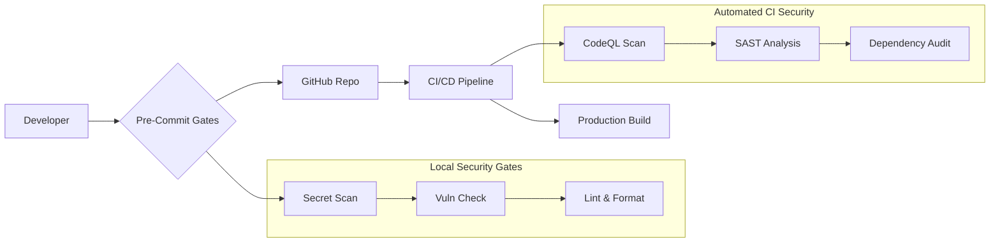

# 🩺 Pain Tracker | CrisisCore Systems

> **A Security-Hardened, Offline-First Health Platform for High-Resolution Chronic Pain and Injury Management.**

<!-- Main Badges: Status & Health -->


<!-- Metrics Badges: Generated & Dynamic -->

[](coverage/coverage-summary.json)

[](badges/loc-badge.json)
[](badges/bundle-badge.json)
[](badges/mutation-badge.json)

<!-- Community & Repo Activity Badges -->
[](https://github.com/CrisisCore-Systems/pain-tracker/issues)
[](https://github.com/CrisisCore-Systems/pain-tracker/pulls)

[](security/sbom-latest.json)

---

## 🚨 The Mission

Standard pain apps often reduce complex experiences to a single number. This project is different. We built **Pain Tracker** to **map pain in high resolution**, providing the detailed insights needed for real-world recovery, **WorkSafe BC reporting**, and effective clinical collaboration.

> **⚠️ Current Status**: This project is in **early development** (v0.1.0-dev). The core feature set is functional, tested, and secure. We are now actively resolving vulnerabilities in development dependencies. See the [Security Status](#-security-status) for more details.


---

## 🌟 Key Features

| Feature Domain | What Sets It Apart |
|----------------|--------------------|
| 📝 **Pain Assessment** | 7-step multi-dimensional tracking, 25+ mapped body locations, 19+ symptom types. |
| 📊 **Analytics & Heatmaps** | Uncover symptom trends, recovery progression, and treatment correlations. |
| 🏥 **Healthcare Integration**| Automated WorkSafe BC claims and clinician-ready CSV/JSON exports. |
| 💊 **Treatment Tracking** | Log medications and therapies to analyze outcome effectiveness. |
| ❤️ **Quality of Life** | Monitor mood, sleep, and activity levels to see the bigger picture. |
| 🔒 **Security by Design** | Privacy-first architecture with local-only data, CSP, and robust validation. |

---

## 🧱 Tech Stack & Architecture

This project is built on a modern, resilient, and secure foundation. For a complete technical breakdown, see the [**ARCHITECTURE_DEEP_DIVE.md**](./ARCHITECTURE_DEEP_DIVE.md).

| Layer | Tech Stack |
|-------|------------|
| **Frontend** | React 18, TypeScript, Vite, Tailwind CSS, Headless UI |
| **State & Validation** | Zod for type-safe schemas across the application. |
| **Data Persistence** | Offline-first IndexedDB with a secure wrapper for local storage. |
| **Analytics** | Recharts & Chart.js for interactive visualizations. |
| **Testing** | Vitest, Testing Library, and jsdom for a comprehensive test suite. |
| **DevOps** | GitHub Actions, Makefile, Husky, and CommitLint for a streamlined, secure workflow. |

---

## 🛡️ Security Status

Security is a core principle, not an afterthought. We've implemented a comprehensive, multi-layered security strategy.

- ✅ **Complete CI/CD Pipeline**: Integrated CodeQL, SAST, secret scanning, and dependency audits.
- ✅ **Hardened Development**: Pre-commit hooks enforce security rules before code ever reaches the repository.
- ⚠️ **Dependency Vulnerabilities**: We are actively remediating 77 vulnerabilities found in **development dependencies**.
- ✅ **Production Safety**: These vulnerabilities are confined to our dev tooling and **do not affect the production build** or runtime environment.
- ✅ **Zero Attack Surface**: With all data stored locally, the application has no cloud footprint to attack.

**Security Architecture:**


---

## 🧰 Getting Started

### Prerequisites
- **Node.js**: `v18` or higher
- **npm**: `v9` or higher
- **make**: For using the streamlined command aliases.

### Installation
```bash
# 1. Clone the repository
git clone https://github.com/CrisisCore-Systems/pain-tracker.git
cd pain-tracker

# 2. Run the setup script (recommended)
# This installs dependencies, sets up .env, and enables Git hooks.
make setup

# 3. Start the development server
make dev
```
Your application will be running at `http://localhost:5173`.

---

## 🤝 Contributing & Development

We welcome contributions from security engineers, clinicians, and open-source developers. Please read our [**CONTRIBUTING.md**](CONTRIBUTING.md) for detailed guidelines.

<details>
<summary><strong>Expand for Developer Workflow & Commands</strong></summary>

### Key Commands

Our `Makefile` provides aliases for all common development tasks.

```bash
make help         # Display all available commands
make dev          # Start the Vite development server
make test         # Run the full test suite with Vitest
make check        # Run all checks (lint, type, format, security)
make lint-fix     # Automatically fix linting issues
make badge:all    # Regenerate all dynamic badges
```

### Commit Convention

This repository enforces [Conventional Commits](https://www.conventionalcommits.org/). Commits that do not follow this format will be rejected.

- `feat(scope): add new feature`
- `fix(api): resolve endpoint issue`
- `docs(readme): update installation guide`
- `chore(deps): upgrade dependencies`

### Dynamic Badges

The metrics badges in the header are dynamically generated by scripts in the `/scripts` directory and are updated automatically on pre-push hooks to `main`. This ensures they always reflect the current state of the repository.

</details>

<details>
<summary><strong>📋 Full Feature List</strong></summary>

- **Multi-dimensional Pain Assessment**: Intensity, 25+ body locations, 19+ symptom types.
- **Advanced Analytics**: Trend charts, location heat maps, and progression analysis.
- **WorkSafe BC Report Generation**: Automate claim and reporting documentation.
- **Emergency Response Panel**: Centralize emergency protocols and contacts.
- **Clinical Data Export**: Generate clinician-ready data in CSV & JSON formats.
- **Work Impact Assessment**: Track missed days, modified duties, and limitations.
- **Medication & Treatment Logging**: Monitor dosage, frequency, and effectiveness over time.
- **Quality of Life Metrics**: Track sleep, mood, and activity levels.
- **Secure Local-First Storage**: All data remains on your device by design.
- **Data Portability**: Full import/export and backup functionality.

</details>

---

## 🖤 Built with Empathy, Rigor, and Transparency

This project is a commitment to honest status reporting, privacy-first architecture, and evidence-driven iteration.

**By [CrisisCore Systems](https://github.com/CrisisCore-Systems)**

---

## License

This project is licensed under the MIT License. See [LICENSE](LICENSE) for details.
