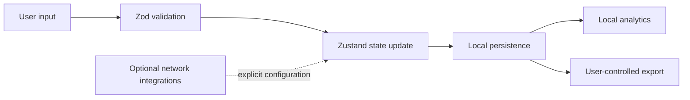

# Pain Tracker | CrisisCore Systems

<!-- markdownlint-disable MD013 MD033 -->

[](https://github.com/CrisisCore-Systems/pain-tracker/actions/workflows/ci.yml)
[](https://github.com/CrisisCore-Systems/pain-tracker/actions/workflows/smoke.yml)
[](https://github.com/CrisisCore-Systems/pain-tracker/actions)
[](https://github.com/CrisisCore-Systems/pain-tracker/security)
[](LICENSE)
[](https://doi.org/10.5281/zenodo.18887610)

> Privacy-first, offline-capable pain documentation for people living with chronic pain.

Pain Tracker helps people record pain, symptoms, treatments, and work impact, then export structured summaries for appointments, claim-related discussions, and personal records. The core app is local-first by default. Optional network, clinic, weather, publishing, and payment paths are treated as explicit trust boundaries rather than baseline requirements.

Current source coverage includes 242 source test files under `src/`. Additional Playwright and publishing tests live under `e2e/` and `test/`.

<p align="center">
  
</p>

<p align="center">
  <a href="https://paintracker.ca"><strong>Private Offline Pain Tracker</strong></a> | <a href="https://paintracker.ca/case-study"><strong>Case Study</strong></a> | <a href="https://paintracker.ca/proof"><strong>Proof</strong></a> | <a href="docs/user-guide/INSTALL.md"><strong>Install</strong></a> | <a href="PRIVACY.md"><strong>Privacy</strong></a> | <a href="docs/user-guide/EXPORT_DATA.md"><strong>Export Guide</strong></a> | <a href="docs/README.md"><strong>Docs</strong></a>
</p>

## Key Resource Paths

These are the primary product and resource paths used in external references.

- [Private offline pain tracking app](https://paintracker.ca)
- [Download a private pain tracker](https://paintracker.ca/download)
- [Chronic pain tracking resources](https://paintracker.ca/resources)
- [PainTracker pricing and upgrades](https://paintracker.ca/pricing)
- [Free pain journal templates](https://paintracker.ca/resources/daily-pain-tracker-printable)
- [What to include in a pain journal](https://paintracker.ca/resources/what-to-include-in-pain-journal)
- [Pain journal for appointments](https://paintracker.ca/resources/doctor-visit-pain-summary-template)
- [WorkSafeBC pain documentation tool](https://paintracker.ca/resources/worksafebc-pain-journal-template)

## Why This Exists

Pain Tracker exists because standard health software often assumes stable housing, reliable internet, cognitive surplus, safe disclosure conditions, and uninterrupted sessions. This project is built around Protective Computing: a design discipline for systems that must remain legible and useful under pain, fatigue, interruption, weak infrastructure, and coercive conditions.

That posture shapes the architecture: local-first storage, user-controlled export, plain recovery paths, and explicit trust boundaries for anything that reaches beyond the device.

- Full origin story: [Coding Through Collapse - Why This App Forgets You Exist](https://blog.paintracker.ca/coding-through-collapse)
- Protective Computing introduction: [Architecting for Vulnerability: Introducing Protective Computing Core v1.0](https://dev.to/crisiscoresystems/architecting-for-vulnerability-introducing-protective-computing-core-v10)
- Canonical paper: Overton, K. (2026). Protective Computing Canon v1.0. DOI: [10.5281/zenodo.18887610](https://doi.org/10.5281/zenodo.18887610)

## Core Features

| Area | Current capability |
| --- | --- |
| Pain tracking | Multi-step assessment, body-location capture, symptom severity tracking |
| Reporting | WorkSafeBC-related CSV, JSON, and PDF exports; appointment-ready summaries |
| Analytics | Local trend analysis, correlations, and pattern-aware heuristics |
| Accessibility | Keyboard support, focus management, configurable display options, gentle language |
| Security posture | Local-first storage, selective AES-GCM helpers, CSP, redacted audit/event logging patterns |
| Specialized workflows | Fibromyalgia-oriented scoring helpers, treatment tracking, work-impact documentation |

Deeper product detail lives in [docs/product](docs/product) and the broader docs index at [docs/README.md](docs/README.md).

## Trust Boundaries

Pain Tracker is local-first by default.

The canonical PainTracker implementation artifact is the PainTracker Protective Computing Reference Packet v1.0. Legacy mappings are retained only as historical drafts until rewritten against the current repository, CI evidence, and claim badge taxonomy.

Protective Computing Specification v1.0 is a founder-authored normative design specification. Current implementation claims are conformance claims, not certification. PainTracker is a candidate reference implementation with a public reference packet, explicit limitations, and bounded evidence anchors. It is not certified. Its current posture is Level 2 to Level 3 alignment where evidence exists, with unresolved gaps in active-coercion resistance, accessibility-complete degraded mode, and external review.

| Boundary | Default | Notes |
| --- | --- | --- |
| Pain entries and symptom history | Local device storage | Sharing happens through explicit export flows |
| Analytics | Local-first | No surveillance analytics required for core use |
| Weather correlation | Optional network call | Must be explicitly configured and treated as an external dependency |
| Clinic workflows | Deployment-specific | Optional backend paths are not required for core tracking |
| Payments | Optional upgrade path | Stripe endpoints and pricing routes exist; core local tracking must not depend on payment service availability |
| Publishing and SEO automation | Maintainer-only tooling | Scripts read markdown from `docs/notes` and may call third-party publishing APIs when explicitly run |
| Compliance posture | No compliance claim | Privacy-aligned architecture and controls only |

For trust and reversibility framing, see [docs/trust/paintracker-protective-computing-reference-packet-v1.0.md](docs/trust/paintracker-protective-computing-reference-packet-v1.0.md), [docs/trust/README.md](docs/trust/README.md), and [SECURITY_INVARIANTS.md](SECURITY_INVARIANTS.md).

## Repository Map

| Path | Purpose |
| --- | --- |
| `src/` | Main React/Vite PWA, components, stores, services, tests, and local app routes |
| `packages/blog/` | Next.js public site/blog build used by the Vercel web build |
| `api/` and `api-lib/` | Optional Vercel-style endpoints and shared server helpers |
| `docs/` | User, engineering, trust, product, accessibility, SEO, and planning docs |
| `docs/notes/` | Active publishing markdown sources used by Hashnode and related scripts |
| `docs/archive/` and `archive/` | Historical drafts, disabled APIs, old reports, and traceability artifacts |
| `e2e/` | Playwright smoke, degraded-mode, PWA, and accessibility tests |
| `scripts/` | Build, validation, privacy, badge, screenshot, publishing, and deployment utilities |
| `database/` and `deployment/` | Optional backend schema, migrations, and deployment support files |
| `desktop/` | Electron desktop wrapper assets |
| `starter-kit/` | Protective Computing claim and evidence templates |

Generated local outputs such as `accessibility-reports/`, `test-results/`, `coverage/`, `dist/`, `.vite/`, `artifacts/`, and `evidence/` are ignored. Commit reusable source, curated docs, or explicit archive summaries instead of raw generated runs.

## Architecture

Pain Tracker is a React and TypeScript PWA using Vite, Zustand, Zod, IndexedDB-oriented storage, local analytics, and export pipelines designed around local durability and auditability. The public web/blog surface is built separately from `packages/blog`.


```mermaid
flowchart LR
    A[User input] --> B[Zod validation]
    B --> C[Zustand state update]
    C --> D[Local persistence]
    D --> E[Local analytics]
    D --> F[User-controlled export]
    G[Optional network integrations] -. explicit configuration .-> C
```

- Architecture overview: [docs/engineering/ARCHITECTURE.md](docs/engineering/ARCHITECTURE.md)
- Deep dive: [docs/engineering/ARCHITECTURE_DEEP_DIVE.md](docs/engineering/ARCHITECTURE_DEEP_DIVE.md)
- Data flow diagrams: [docs/diagrams/README.md](docs/diagrams/README.md)

## Getting Started

Pain Tracker is developed primarily on Windows with PowerShell. The repo expects Node `>=22.12.0 <23` and npm `>=9`.

```powershell
git clone https://github.com/CrisisCore-Systems/pain-tracker.git
Set-Location .\pain-tracker
npm ci
npm run dev
```

Open the local app at the Vite URL shown in the terminal.

Core verification commands:

```powershell
npm run docs:validate
npm run check:quick
npm run build
```

For a fuller setup path, see [docs/user-guide/INSTALL.md](docs/user-guide/INSTALL.md), [QUICKSTART.md](QUICKSTART.md), and [docs/engineering/DEVELOPER_COMMANDS.md](docs/engineering/DEVELOPER_COMMANDS.md).

## Configuration

- Validation UI flags: `VITE_REACT_APP_ENABLE_VALIDATION` and `VITE_ENABLE_VALIDATION_TECH`
- Analytics subsystem: `VITE_ENABLE_ANALYTICS` defaults to disabled unless explicitly set to `true`
- Local API server: `npm run dev:api` runs optional Vercel-style API functions for local testing
- Full Vercel build: `npm run build:vercel` builds packages, the PWA app, copies the app bundle, then builds `packages/blog`
- Optional clinic, weather, payment, and publishing paths require explicit environment configuration

Use [.env.example](.env.example) for non-secret configuration shape. Do not commit `.env`, `.env.local`, tokens, webhooks, API keys, or user data.

## Testing and Quality

Primary quality gates:

```powershell
npm run docs:validate
npm run claims:validate
npm run check:quick
npm run check
npm run security-full
```

Focused commands and workflows live in [docs/engineering/DEVELOPER_COMMANDS.md](docs/engineering/DEVELOPER_COMMANDS.md). Current automated metrics are published through the badges at the top of this README.

## Security

- Local-first storage and selective encryption helpers for sensitive data
- CSP, security scans, secret scanning, and trust-claims validation in repo workflows
- Audit/event logging patterns designed to avoid reconstructing sensitive user content
- Private vulnerability reporting guidance in [SECURITY.md](SECURITY.md)

Start with [SECURITY.md](SECURITY.md), [SECURITY_INVARIANTS.md](SECURITY_INVARIANTS.md), and [docs/trust/threat-model.md](docs/trust/threat-model.md).

## Roadmap

Current 2026 priorities:

1. Strengthen local-only analytics and visualizations without adding surveillance surfaces.
2. Expand export and reporting defensibility for appointment and WorkSafeBC-related workflows.
3. Improve degraded-mode resilience, especially around persistence, recovery, and PWA behavior.
4. Tighten trust-boundary documentation for optional integrations and deployment-specific backend paths.
5. Continue accessibility and trauma-informed UX hardening against the WCAG 2.2 AA target.

Longer-form planning lives under [docs/planning](docs/planning) and [docs/index](docs/index).

## Documentation

Use the docs hub for longform material: [docs/README.md](docs/README.md)

- User docs: [docs/user-guide/INSTALL.md](docs/user-guide/INSTALL.md), [docs/user-guide/FAQ.md](docs/user-guide/FAQ.md), [docs/user-guide/EXPORT_DATA.md](docs/user-guide/EXPORT_DATA.md)
- Engineering docs: [docs/engineering/ARCHITECTURE.md](docs/engineering/ARCHITECTURE.md), [docs/engineering/DEVELOPER_COMMANDS.md](docs/engineering/DEVELOPER_COMMANDS.md)
- Trust and security docs: [docs/trust/README.md](docs/trust/README.md), [SECURITY.md](SECURITY.md), [SECURITY_INVARIANTS.md](SECURITY_INVARIANTS.md)
- Product and research docs: [docs/product](docs/product), [docs/papers](docs/papers)
- Screenshot and marketing references: [docs/marketing/SCREENSHOT_PORTFOLIO.md](docs/marketing/SCREENSHOT_PORTFOLIO.md), [docs/screenshots/light-mode/README.md](docs/screenshots/light-mode/README.md)

## Contributing

Contributions should preserve local authority, exposure minimization, reversibility, degraded-mode resilience, coercion resistance, and truthful documentation.

- Contribution guide: [CONTRIBUTING.md](CONTRIBUTING.md)
- Repo operating rules for agents and reviewers: [AGENTS.md](AGENTS.md)
- Commit conventions and developer workflows: [docs/engineering/DEVELOPER_COMMANDS.md](docs/engineering/DEVELOPER_COMMANDS.md)

## License

This project is licensed under the MIT License. See [LICENSE](LICENSE).
