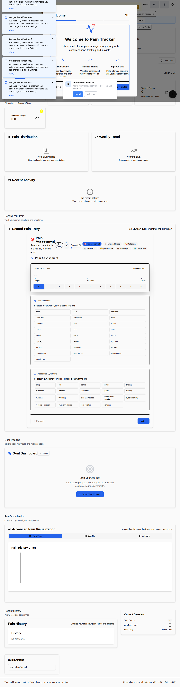
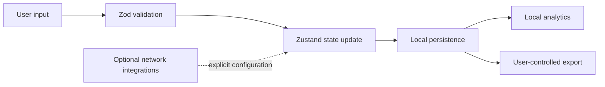

# Pain Tracker | CrisisCore Systems

<!-- markdownlint-disable MD013 MD033 -->

[](https://github.com/CrisisCore-Systems/pain-tracker/actions/workflows/ci.yml)
[](https://github.com/CrisisCore-Systems/pain-tracker/actions/workflows/smoke.yml)
[](https://github.com/CrisisCore-Systems/pain-tracker/actions)
[](https://github.com/CrisisCore-Systems/pain-tracker/security)
[](LICENSE)
[](https://doi.org/10.5281/zenodo.18887610)

> Privacy-first, offline-capable pain documentation for people living with chronic pain.

Pain Tracker helps people record pain, symptoms, treatments, and work impact, then export structured reports for clinicians, claims, and personal records. The app is local-first by default, with optional network integrations treated as explicit trust boundaries rather than the baseline architecture.

Current automated coverage includes 223 tests across the repository's tracked test files.

<p align="center">
  
</p>

<p align="center">
  <a href="https://paintracker.ca"><strong>Try It</strong></a> · <a href="docs/user-guide/INSTALL.md"><strong>Install</strong></a> · <a href="PRIVACY.md"><strong>Privacy</strong></a> · <a href="docs/user-guide/EXPORT_DATA.md"><strong>Export Guide</strong></a> · <a href="docs/README.md"><strong>Docs</strong></a>
</p>

## Table of Contents

- [Why this exists](#why-this-exists)
- [Core features](#core-features)
- [Trust boundaries](#trust-boundaries)
- [Privacy model](#privacy-model)
- [Architecture](#architecture)
- [Getting started](#getting-started)
- [Configuration](#configuration)
- [Testing and quality](#testing-and-quality)
- [Security](#security)
- [Roadmap](#roadmap)
- [Documentation](#documentation)
- [Contributing](#contributing)
- [License](#license)

## Why this exists

Pain Tracker exists because standard health software often assumes stability: reliable housing, reliable internet, cognitive surplus, and safe disclosure conditions. This project is built around Protective Computing, a design discipline for systems that must remain legible and useful under pain, fatigue, interruption, and coercive conditions.

> "I wrote software from motel rooms while homeless. Checking if CI passed while warming hands over a fire behind a gas station."

That experience shaped the architecture: local-first storage, user-controlled export, trauma-informed interaction design, and explicit trust boundaries for anything that reaches beyond the device.

- Full origin story: [Coding Through Collapse—Why This App Forgets You Exist](https://blog.paintracker.ca/coding-through-collapse)
- Protective Computing introduction: [Architecting for Vulnerability: Introducing Protective Computing Core v1.0](https://dev.to/crisiscoresystems/architecting-for-vulnerability-introducing-protective-computing-core-v10)
- Canonical paper: Overton, K. (2026). Protective Computing Canon v1.0. DOI: [10.5281/zenodo.18887610](https://doi.org/10.5281/zenodo.18887610)

## Core features

| Area | Current capability |
| --- | --- |
| Pain tracking | 7-step assessment, body-location capture, symptom severity tracking |
| Reporting | WorkSafeBC-oriented CSV, JSON, and PDF exports; clinician-ready summaries |
| Analytics | Local trend analysis, correlations, and pattern-aware heuristics |
| Accessibility | Trauma-informed UI patterns, keyboard support, focus management, gentle language |
| Security posture | Local-first storage, selective AES-GCM helpers, CSP, audit/event logging patterns |
| Specialized workflows | Fibromyalgia-oriented scoring helpers, treatment tracking, work-impact documentation |

Deeper product detail lives in [docs/product](docs/product) and the broader docs index at [docs/README.md](docs/README.md).

## Trust boundaries

Pain Tracker is local-first by default.

| Boundary | Default | Notes |
| --- | --- | --- |
| Pain entries and symptom history | Local device storage | Sharing happens through explicit export flows |
| Analytics | Local-first | No surveillance analytics required for core use |
| Weather correlation | Optional network call | Must be explicitly configured and treated as an external dependency |
| Clinic workflows | Deployment-specific | Optional backend paths are not required for core tracking |
| Payments | Not supported production path | GitHub Sponsors is the current funding path; historical Stripe or SaaS references are archived experiments |
| Compliance posture | No compliance claim | Privacy-aligned architecture and controls only |

For trust and reversibility framing, see [docs/trust/README.md](docs/trust/README.md) and [SECURITY_INVARIANTS.md](SECURITY_INVARIANTS.md).

## Privacy model

- Local-first by default: entries stay on the device unless the user explicitly exports them.
- User-controlled exports: reports are generated on demand for clinicians, claims, or personal records.
- Optional integrations require configuration: network-dependent features are separate trust boundaries, not baseline requirements.
- No compliance claims: the project documents privacy-aligned controls and limits without overstating legal or regulatory guarantees.

Start with [PRIVACY.md](PRIVACY.md), [SECURITY.md](SECURITY.md), and [docs/SAFETY_PLAN.md](docs/SAFETY_PLAN.md).

## Architecture

Pain Tracker is a React and TypeScript application using Zustand, Zod, IndexedDB, and export pipelines designed around local durability and auditability.


```mermaid
flowchart LR
    A[User input] --> B[Zod validation]
    B --> C[Zustand state update]
    C --> D[Local persistence]
    D --> E[Local analytics]
    D --> F[User-controlled export]
    G[Optional network integrations] -. explicit configuration .-> C
```

- Architecture overview: [docs/engineering/ARCHITECTURE.md](docs/engineering/ARCHITECTURE.md)
- Deep dive: [docs/engineering/ARCHITECTURE_DEEP_DIVE.md](docs/engineering/ARCHITECTURE_DEEP_DIVE.md)
- Data flow diagrams: [docs/diagrams/README.md](docs/diagrams/README.md)

## Getting started

Pain Tracker is developed primarily on Windows with PowerShell.

```powershell
git clone https://github.com/CrisisCore-Systems/pain-tracker.git
Set-Location .\pain-tracker
npm install
npm run dev
```

Open the local app at the Vite URL shown in the terminal.

Core verification commands:

```powershell
npm run test:coverage
npm run build
npm run preview
```

For a fuller setup path, see [docs/user-guide/INSTALL.md](docs/user-guide/INSTALL.md), [QUICKSTART.md](QUICKSTART.md), and [docs/engineering/DEVELOPER_COMMANDS.md](docs/engineering/DEVELOPER_COMMANDS.md).

## Configuration

- Validation UI flags: `VITE_REACT_APP_ENABLE_VALIDATION` and `VITE_ENABLE_VALIDATION_TECH`
- Analytics subsystem: `VITE_ENABLE_ANALYTICS` defaults to disabled unless explicitly set to `true`
- Optional local API and clinic paths: see [QUICKSTART.md](QUICKSTART.md) and [docs/engineering/INTEGRATION_GUIDE.md](docs/engineering/INTEGRATION_GUIDE.md)
- Historical billing docs: archived under [docs/archive/saas](docs/archive/saas) and not part of the supported production path today

## Testing and quality

Primary quality gates:

```powershell
npm run check:quick
npm run check
npm run security-full
```

Focused commands and workflows live in [docs/engineering/DEVELOPER_COMMANDS.md](docs/engineering/DEVELOPER_COMMANDS.md). Current automated metrics are published through the badges at the top of this README.

## Security

- Local-first storage and selective encryption helpers for sensitive data
- CSP, security scans, secret scanning, and trust-claims validation in repo workflows
- Audit/event logging patterns designed to avoid reconstructing sensitive user content
- Private vulnerability reporting guidance in [SECURITY.md](SECURITY.md)

Start with [SECURITY.md](SECURITY.md), [SECURITY_INVARIANTS.md](SECURITY_INVARIANTS.md), and [docs/trust/threat-model.md](docs/trust/threat-model.md).

## Roadmap

Current 2026 priorities:

1. Strengthen local-only analytics and visualizations without adding surveillance surfaces.
2. Expand export and reporting defensibility for clinician and WorkSafeBC workflows.
3. Improve degraded-mode resilience, especially around persistence, recovery, and PWA behavior.
4. Tighten trust-boundary documentation for optional integrations and deployment-specific backend paths.
5. Continue accessibility and trauma-informed UX hardening against the WCAG 2.2 AA target.

Longer-form planning lives under [docs/planning](docs/planning) and [docs/index](docs/index).

## Documentation

Use the docs hub for longform material: [docs/README.md](docs/README.md)

- User docs: [docs/user-guide/INSTALL.md](docs/user-guide/INSTALL.md), [docs/user-guide/FAQ.md](docs/user-guide/FAQ.md), [docs/user-guide/EXPORT_DATA.md](docs/user-guide/EXPORT_DATA.md)
- Engineering docs: [docs/engineering/ARCHITECTURE.md](docs/engineering/ARCHITECTURE.md), [docs/engineering/DEVELOPER_COMMANDS.md](docs/engineering/DEVELOPER_COMMANDS.md)
- Trust and security docs: [docs/trust/README.md](docs/trust/README.md), [SECURITY.md](SECURITY.md), [SECURITY_INVARIANTS.md](SECURITY_INVARIANTS.md)
- Product and research docs: [docs/product](docs/product), [docs/papers](docs/papers)
- Screenshot and marketing references: [docs/marketing/SCREENSHOT_PORTFOLIO.md](docs/marketing/SCREENSHOT_PORTFOLIO.md)

## Contributing

Contributions should preserve local authority, exposure minimization, reversibility, degraded-mode resilience, and truthful documentation.

- Contribution guide: [CONTRIBUTING.md](CONTRIBUTING.md)
- Repo operating rules for agents and reviewers: [AGENTS.md](AGENTS.md)
- Commit conventions and developer workflows: [docs/engineering/DEVELOPER_COMMANDS.md](docs/engineering/DEVELOPER_COMMANDS.md)

## License

This project is licensed under the MIT License. See [LICENSE](LICENSE).
