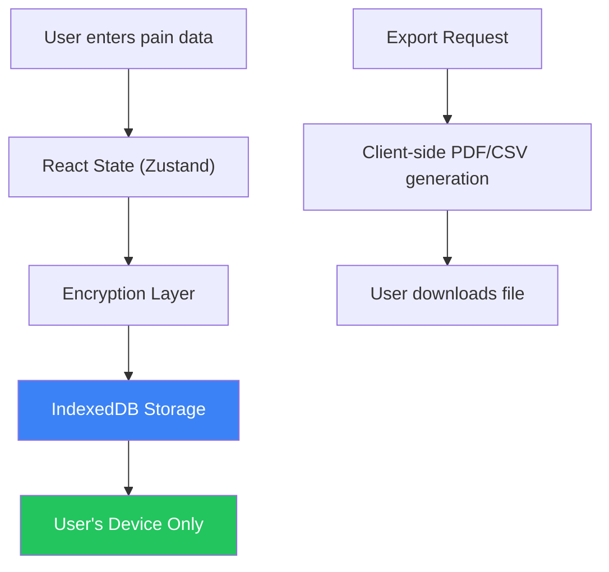

# Why My Pain App Has No Backend: Lessons from Building 100% Local-First Healthcare Software

"Where's the backend?" is the first question I get from every developer who reviews [Pain Tracker](https://paintracker.ca). 

The answer surprises them: **There isn't one.**

No database server. No API endpoints for user data. No authentication service. No cloud infrastructure to maintain. Just a React PWA that runs entirely in your browser, stores everything in encrypted IndexedDB, and works offline by default.

This wasn't laziness or budget constraints. It was a deliberate architectural decision that took months to get right. Here's why I made it, how it works, and what I learned building healthcare software with zero server dependencies.

---

## The Problem: Healthcare Data is Too Sensitive for "Just Trust Us"

When I started building Pain Tracker—a tool for people with chronic pain conditions to document their symptoms for disability claims and clinical visits—I quickly realized something uncomfortable:

**Every architectural decision in healthcare software is an ethical decision.**

The default playbook for health apps is:
1. Collect user data on your servers
2. Promise you'll protect it
3. Hope nothing goes wrong

But "nothing going wrong" is a fantasy. Data breaches in healthcare cost an average of $10.9 million per incident (IBM, 2023). More importantly, for someone documenting their chronic pain journey—often including mental health struggles, medication histories, and deeply personal notes—a breach isn't just expensive. It's devastating.

The question I kept asking myself: **What if the most secure backend is no backend at all?**

---

## The Architecture: Everything Runs Client-Side

Pain Tracker is built with React 18, TypeScript, and Vite. But the interesting part is what it *doesn't* use:

```
❌ No authentication service (no accounts to hack)
❌ No database server (no data to breach)
❌ No API endpoints for user data (no network to intercept)
❌ No cloud storage (no third-party access)
✅ 100% client-side processing
✅ IndexedDB for persistence
✅ XChaCha20-Poly1305 encryption
✅ Service Worker for offline capability
```

Here's the flow:



Your data enters through the UI, gets encrypted immediately, and lands in IndexedDB. **It never touches a network.** When you need to share data with a doctor or WorkSafe BC, you explicitly export it—generating PDFs or CSVs entirely in the browser.

---

## How the Storage Layer Actually Works

The persistence strategy uses a dual-layer approach for resilience and performance:

### IndexedDB as the Source of Truth

```typescript
// From src/lib/offline-storage.ts
export class OfflineStorageService {
  private dbName = 'pain-tracker-offline';
  private stores = {
    data: 'offline-data',
    syncQueue: 'sync-queue',
    cache: 'cache-metadata',
  };

  async storeData(type: string, data: StoredDataPayload): Promise<number> {
    const entry: StoredData = {
      timestamp: new Date().toISOString(),
      type: type as StoredData['type'],
      data,
      synced: false,
      lastModified: new Date().toISOString(),
    };
    
    // All writes go to IndexedDB
    return this.addToStore(this.stores.data, entry);
  }
}
```

IndexedDB handles all structured data—pain entries, settings, and background queues. It's asynchronous, robust, and survives browser crashes.

### localStorage as a Write-Through Cache

For frequently accessed data (like user preferences), we also write to localStorage for synchronous reads:

```typescript
async setItem(key: string, value: unknown): Promise<void> {
  try {
    // Fast path: localStorage for immediate reads
    localStorage.setItem(key, JSON.stringify(value));
  } catch {
    // Storage quota exceeded? Continue anyway.
  }
  // Durable path: IndexedDB as backup
  await this.storeData('settings', { key, value });
}
```

This gives us sub-100ms reads for UI preferences while maintaining durability through IndexedDB.

---

## The Encryption Story: XChaCha20-Poly1305 on Every Entry

"Local-first" doesn't mean "secure by default." If someone gets physical access to a user's device, I don't want their pain journal readable in plain text.

Every pain entry gets encrypted before it touches IndexedDB:

```typescript
// From src/lib/storage/encryptedIndexedDB.ts
export interface VaultIndexedDBRecord {
  v: 'xchacha20-poly1305';  // algorithm version
  n: string;                 // nonce (base64)
  c: string;                 // ciphertext (base64)
  createdAt: string;
  keyVersion: string;
  metadata?: Record<string, unknown>;
}

export async function encryptAndStore(
  dbName: string,
  storeName: string,
  entryKey: string,
  value: string,
  metadata?: Record<string, unknown>
): Promise<void> {
  if (!vaultService.isUnlocked()) {
    throw new Error('Vault must be unlocked before storing encrypted data.');
  }

  const encoder = new TextEncoder();
  const payload = encoder.encode(value);
  const { nonce, cipher } = vaultService.encryptBytes(payload);
  
  const record: VaultIndexedDBRecord = {
    v: 'xchacha20-poly1305',
    n: nonce,
    c: cipher,
    createdAt: new Date().toISOString(),
    keyVersion: vaultService.getStatus().metadata?.version ?? 'unknown',
    metadata,
  };
  
  // Store encrypted record in IndexedDB
  const db = await openDb(dbName, storeName);
  const tx = db.transaction(storeName, 'readwrite');
  tx.objectStore(storeName).put(record, entryKey);
}
```

Why XChaCha20-Poly1305 instead of AES-GCM?

1. **Extended nonce (192-bit)**: Safe to generate randomly without collision concerns
2. **No IV reuse disasters**: AES-GCM catastrophically fails if you reuse an IV. XChaCha20's larger nonce space makes this effectively impossible.
3. **libsodium availability**: We use the excellent libsodium-wrappers package, which makes this trivial to implement correctly

The encryption key derives from a user passphrase using Argon2id—the current recommendation for password hashing. The key never leaves the device.

---

## The Trade-offs: What You Give Up Without a Backend

Let's be honest about the costs:

### ❌ No Cross-Device Sync (Yet)

Your data lives on one device. Switch phones? You need to export and import manually. This is the biggest UX sacrifice.

**Mitigation**: Encrypted export/import flows let users transfer data. A future optional sync feature could use end-to-end encryption with user-controlled keys.

### ❌ No Account Recovery

Forgot your passphrase? Your data is gone. There's no "reset password" email because there's no account.

**Mitigation**: Clear onboarding explaining this. Optional backup export prompts. The trade-off is intentional—true zero-knowledge means *we* can't recover your data either.

### ❌ No Server-Side Analytics

I can't tell you how many users I have, which features they use, or where they drop off. 

**Mitigation**: Privacy-preserving analytics through optional, anonymized telemetry (not implemented yet). For now, I rely on GitHub issues and direct user feedback.

**Update**: Optional anonymous usage analytics exists behind a build/deploy flag (for example, `VITE_ENABLE_ANALYTICS`).

### ❌ No Real-Time Collaboration

A doctor can't see your pain journal in real-time. You have to export and share.

**Mitigation**: This is actually a feature for many users. Explicit sharing beats ambient surveillance. Future clinic portal features could use time-limited, encrypted share links.

---

## The Surprising Benefits

### ✅ Zero Infrastructure Costs

No servers = no hosting bills. The entire app runs on GitHub Pages (free) with a custom domain. My monthly infrastructure cost is literally $0.

### ✅ Infinite Scalability (Sort Of)

Each user's device is their own "server." A million users doesn't mean a million database rows—it means a million independent IndexedDB instances I don't have to manage.

### ✅ Regulatory Simplicity

HIPAA compliance for a backend requires:
- Business Associate Agreements
- Access controls and audit logging
- Breach notification procedures
- Regular security assessments

For a local-first app where I *never have access to the data*? The compliance story is dramatically simpler. I can't breach what I don't have.

### ✅ Offline-First is Free

When there's no backend to call, offline support isn't a feature—it's the default. The PWA works identically with or without an internet connection.

### ✅ Trust Through Verifiability

The entire codebase is open source. Users can verify that data stays local by reading the source. No "trust us" required.

---

## Implementation Lessons

### Lesson 1: IndexedDB is Weird but Powerful

IndexedDB has a notoriously awkward API. I used a "virtual table" pattern with key prefixing to avoid schema migrations:

```typescript
// Instead of multiple object stores, use prefixed keys
const key = `table:${tableName}:${recordId}`;
store.put(data, key);

// Query by prefix using key ranges
const range = IDBKeyRange.bound(
  `table:${tableName}:`,
  `table:${tableName}:\uffff`
);
```

This makes schema evolution trivial—just add new prefixes.

### Lesson 2: Encryption UX is Hard

Users don't understand passphrases vs. passwords. They expect "forgot password" to work. Clear onboarding and repeated warnings about data loss are essential.

We implemented a "vault" metaphor: your data is in a locked vault, and only you have the key. Lose the key, lose the vault.

### Lesson 3: PWA Installation Matters

For chronic pain patients, having the app on their home screen—accessible in seconds during a flare—is critical. We invested heavily in the PWA experience:

```typescript
// From src/lib/pwa-utils.ts
export async function checkInstallability(): Promise<boolean> {
  if (!('BeforeInstallPromptEvent' in window)) return false;
  
  return new Promise(resolve => {
    window.addEventListener('beforeinstallprompt', () => {
      resolve(true);
    }, { once: true });
    
    // If no event fires within 3s, we're probably already installed
    setTimeout(() => resolve(false), 3000);
  });
}
```

### Lesson 4: Export Formats Are Your API

Without a backend, data portability becomes critical. We support:

- **CSV**: For spreadsheets and basic analysis
- **JSON**: For interoperability and backups
- **PDF**: For clinical visits (formatted pain reports)
- **WorkSafe BC format**: For disability claims (specific form requirements)

Each export is generated entirely client-side using libraries like `jspdf` and `papaparse`.

---

## Would I Do It Again?

**Absolutely.** The local-first architecture isn't right for every app, but for healthcare data with high sensitivity and low collaboration needs, it's been a perfect fit.

The model works best when:
- Privacy is paramount
- Data is personal (not shared/collaborative)
- Offline capability matters
- You can accept cross-device sync limitations
- Users are willing to manage their own data

If I were building a real-time collaborative diagnosis tool or a hospital EMR system, I'd need a backend. But for a personal pain journal? The best backend is no backend.

---

## Try It Yourself

Pain Tracker is open source and live at [paintracker.ca](https://paintracker.ca). The entire codebase is on [GitHub](https://github.com/CrisisCore-Systems/pain-tracker).

Key files if you want to understand the architecture:
- `src/lib/offline-storage.ts` - Dual-persistence strategy
- `src/lib/storage/encryptedIndexedDB.ts` - Encryption layer
- `src/services/VaultService.ts` - Key management
- `docs/ARCHITECTURE_DEEP_DIVE.md` - Full architecture docs

Questions? Find me on [GitHub](https://github.com/CrisisCore-Systems) or open an issue. I'm always happy to discuss local-first architecture with fellow developers who think "just add a database" isn't always the answer.

---

*Building healthcare software? The most secure data is data you never collect. Sometimes the best architecture is the one with the fewest moving parts.*
