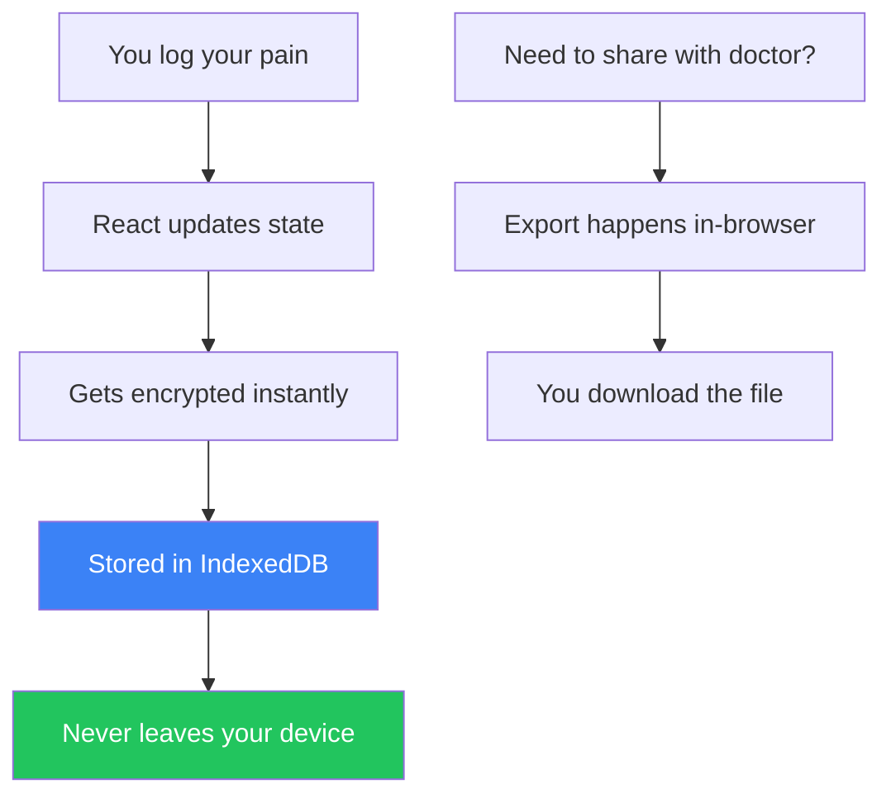

> **Try Pain Tracker →** [Start Tracking (Free & Private)](https://paintracker.ca)

# "So... where's your backend?"

That's literally the first thing every developer asks when they peek under the hood of [Pain Tracker](https://paintracker.ca). Their confusion is genuine—and honestly, I get it.

The answer always catches them off guard: **There isn't one.**

No database humming away in some data center. No API routes handling user requests. No authentication servers to maintain. No cloud bills piling up each month. Just a React app that runs completely in your browser, keeps everything locked away in encrypted local storage, and works perfectly fine when you're offline in the middle of nowhere.

This wasn't me being lazy or trying to save a few bucks. It was a very deliberate choice that took me months to figure out—and even longer to get right. Here's the story of why I built it this way, how the whole thing actually works, and what I discovered along the journey of creating healthcare software that doesn't need the internet to function.

---

## The Uncomfortable Truth: Healthcare Data is Way Too Personal for "Trust Me, Bro"

When I first started sketching out Pain Tracker—this tool I wanted to build for people dealing with chronic pain who needed to document their daily reality for doctors and disability claims—something kept nagging at me.

**Every single technical decision you make when building healthcare software is actually a moral choice.**

You know the usual playbook, right?

1. Suck up all that juicy user data onto your servers
    
2. Cross your heart and promise you'll keep it safe
    
3. Cross your fingers and pray nothing goes sideways
    

But here's the thing—stuff *always* goes sideways eventually. Healthcare data breaches now cost companies around $10.9 million on average (thanks for that cheerful statistic, IBM). But here's what really kept me up at night: for someone pouring their soul into documenting their chronic pain journey—their worst days, their mental health struggles, their medication trials and failures, their most vulnerable moments—a data breach isn't just expensive. It's absolutely crushing.

So I kept coming back to this wild idea: **What if the most bulletproof server is actually no server at all?**

---

## How It Actually Works: Everything Happens on Your Device

Pain Tracker runs on React 18 with TypeScript and gets built with Vite. But the really interesting part is what it *doesn't* have:

```plaintext
❌ No user accounts (nothing to compromise)
❌ No database servers (nothing to hack)
❌ No data APIs (nothing to intercept)
❌ No cloud anything (no third parties poking around)
✅ Everything runs in your browser
✅ Data lives in IndexedDB on your device
✅ Military-grade encryption (XChaCha20-Poly1305)
✅ Works offline without missing a beat
```

The flow is beautifully simple:



Your pain data flows through the interface, gets locked up with encryption immediately, and settles into IndexedDB storage. **It literally never touches a network.** When you need to show your doctor or send something to WorkSafe BC, you hit export—and the browser generates those PDFs or CSV files right there on your machine.

---

## The Storage Magic: How We Keep Your Data Safe and Fast

I ended up building a two-layer storage system that's both rock-solid and lightning-quick:

### IndexedDB Does the Heavy Lifting

```typescript
// From the guts of src/lib/offline-storage.ts
export class OfflineStorageService {
  private dbName = 'pain-tracker-offline';
  private stores = {
    data: 'offline-data',
    syncQueue: 'sync-queue',
    cache: 'cache-metadata',
  };

  async storeData(type: string, data: StoredDataPayload): Promise<number> {
    const entry: StoredData = {
      timestamp: new Date().toISOString(),
      type: type as StoredData['type'],
      data,
      synced: false,
      lastModified: new Date().toISOString(),
    };
    
    // Everything goes to IndexedDB first
    return this.addToStore(this.stores.data, entry);
  }
}
```

IndexedDB handles all your actual pain logs, settings, and a queue for potential future sync features. It's built to handle crashes gracefully and keeps everything organized even when things get messy.

### localStorage for the Quick Stuff

For things you access constantly (like app preferences), we also write to localStorage so the UI stays snappy:

```typescript
async setItem(key: string, value: unknown): Promise<void> {
  try {
    // Fast lane: localStorage for instant access
    localStorage.setItem(key, JSON.stringify(value));
  } catch {
    // Storage full? No big deal, keep going
  }
  // Safety net: IndexedDB keeps the real copy
  await this.storeData('settings', { key, value });
}
```

This gives us those buttery-smooth sub-100ms response times for UI stuff while making sure nothing important gets lost if your browser decides to have a moment.

---

## Lock It Down: Why We Use Military-Grade Encryption

Just because your data lives locally doesn't mean it's automatically safe. If someone gets their hands on your device, I definitely don't want your pain journal sitting there in plain text.

Every single entry gets encrypted before it even thinks about touching IndexedDB:

```typescript
// From the security layer in src/lib/storage/encryptedIndexedDB.ts
export interface VaultIndexedDBRecord {
  v: 'xchacha20-poly1305';  // which encryption we're using
  n: string;                 // the nonce (base64)
  c: string;                 // your encrypted data (base64)
  createdAt: string;
  keyVersion: string;
  metadata?: Record<string, unknown>;
}

export async function encryptAndStore(
  dbName: string,
  storeName: string,
  entryKey: string,
  value: string,
  metadata?: Record<string, unknown>
): Promise<void> {
  if (!vaultService.isUnlocked()) {
    throw new Error('Gotta unlock your vault first!');
  }

  const encoder = new TextEncoder();
  const payload = encoder.encode(value);
  const { nonce, cipher } = vaultService.encryptBytes(payload);
  
  const record: VaultIndexedDBRecord = {
    v: 'xchacha20-poly1305',
    n: nonce,
    c: cipher,
    createdAt: new Date().toISOString(),
    keyVersion: vaultService.getStatus().metadata?.version ?? 'unknown',
    metadata,
  };
  
  // Tuck it away safely in IndexedDB
  const db = await openDb(dbName, storeName);
  const tx = db.transaction(storeName, 'readwrite');
  tx.objectStore(storeName).put(record, entryKey);
}
```

You might wonder why XChaCha20-Poly1305 instead of the more common AES-GCM. Three big reasons:

1. **Huge nonce space (192 bits)**: We can generate random nonces all day without worrying about collisions
    
2. **No catastrophic failures**: AES-GCM completely breaks if you accidentally reuse a nonce. XChaCha20's massive nonce space makes this basically impossible.
    
3. **Battle-tested implementation**: We're using libsodium-wrappers, which handles all the crypto correctly so I don't have to
    

Your encryption key comes from your passphrase using Argon2id—currently the gold standard for turning passwords into keys. And that key? It never, ever leaves your device.

---

## The Real Talk: What You're Giving Up

Look, I'm not gonna sugarcoat this. Going serverless means making some tough choices:

### ❌ Your Data Lives in One Place

No cross-device sync yet. Your phone breaks? You'll need to export everything and import it on your new device manually. This is honestly the biggest UX sacrifice.

**How we handle it**: Really solid export/import flows that let you move your data around. Plus, I'm planning an optional end-to-end encrypted sync feature where *you* control the keys.

### ❌ Forget Your Password? You're Out of Luck

There's no "forgot password" email because there's no account to begin with. Lose your passphrase, lose your data.

**How we handle it**: Crystal-clear warnings during setup, plus we bug you about making backup exports. It's intentional—true zero-knowledge means even *I* can't get your data back.

### ❌ I Have No Idea How Many People Use This Thing

Can't track user counts, feature usage, or where people get stuck without compromising privacy.

**How we handle it**: Right now I depend on GitHub issues and people reaching out directly. Eventually, I might add completely anonymous, opt-in telemetry.

### ❌ No Real-Time Sharing

Your doctor can't peek at your pain logs in real-time. You gotta export and send files.

**How we handle it**: Honestly? Most users see this as a feature. Explicit sharing beats constant surveillance. Future plans include time-limited encrypted share links for clinics.

---

## The Plot Twist: What We Gain is Pretty Amazing

### ✅ Zero Infrastructure Headaches

No servers means no hosting bills, period. The whole app runs on GitHub Pages with a custom domain. My monthly server costs are literally zero dollars.

### ✅ Scales Like Crazy (In a Weird Way)

Every user basically becomes their own server. A million users doesn't mean managing a million database records—it means a million completely independent IndexedDB instances I don't have to babysit.

### ✅ Regulatory Compliance Gets Way Simpler

HIPAA compliance with a traditional backend involves:

* Business Associate Agreements everywhere
    
* Complex access controls and audit trails
    
* Breach notification procedures
    
* Regular expensive security audits
    

With local-first where I *never touch the data*? The compliance story becomes dramatically simpler. Can't breach what you don't have access to.

### ✅ Offline Just... Works

When there's no backend to call, offline support isn't some fancy feature you bolt on later—it's just how the app works. Internet or no internet, the experience is identical.

### ✅ Trust Through Transparency

The entire codebase is open source on GitHub. Users can literally verify that their data stays put by reading the code themselves. No "just trust us" required.

---

## Lessons Learned the Hard Way

### IndexedDB is Quirky but Worth It

IndexedDB has this famously awkward API that makes developers want to cry. I ended up using a "virtual table" approach with key prefixes to dodge schema migration nightmares:

```typescript
// Instead of juggling multiple object stores, just prefix your keys
const key = `table:${tableName}:${recordId}`;
store.put(data, key);

// Query by prefix using key ranges
const range = IDBKeyRange.bound(
  `table:${tableName}:`,
  `table:${tableName}:\uffff`
);
```

This makes evolving your data structure trivial—just add new prefixes when you need them.

### Users Don't Get Encryption UX

People expect passwords to work like they do everywhere else—with a reset option. They don't understand that passphrases are fundamentally different. You need really clear onboarding and probably annoying warnings about data loss.

We went with a "vault" metaphor: your data lives in a locked vault, and you're the only one with the key. Lose the key, lose everything inside.

### PWA Installation is Critical

For people dealing with chronic pain, being able to tap an app icon during a flare-up and have it open instantly—no loading, no internet required—is absolutely crucial. We put serious effort into the PWA experience:

```typescript
// From src/lib/pwa-utils.ts
export async function checkInstallability(): Promise<boolean> {
  if (!('BeforeInstallPromptEvent' in window)) return false;
  
  return new Promise(resolve => {
    window.addEventListener('beforeinstallprompt', () => {
      resolve(true);
    }, { once: true });
    
    // Give it 3 seconds, then assume we're already installed
    setTimeout(() => resolve(false), 3000);
  });
}
```

### Export Formats Become Your API

Without a backend, being able to get your data out becomes absolutely critical. We support:

* **CSV**: For Excel nerds and basic analysis
    
* **JSON**: For tech-savvy users and complete backups
    
* **PDF**: For doctor visits (nicely formatted pain reports)
    
* **WorkSafe BC format**: For disability claims (matches their exact requirements)
    

Everything gets generated right in the browser using libraries like `jspdf` and `papaparse`.

---

## Would I Build It This Way Again?

**Hell yes.** Look, the local-first approach isn't gonna work for every app out there, but for healthcare data that's deeply personal and doesn't need constant collaboration, it's been absolutely perfect.

This architecture really shines when:

* Privacy isn't just nice-to-have, it's everything
    
* The data is personal rather than shared
    
* Offline capability actually matters to users
    
* You can live with some cross-device sync limitations
    
* Your users are willing to take ownership of their own data
    

If I were building something like a real-time collaborative diagnostic tool or a full hospital EMR system, yeah, I'd need servers. But for a personal pain journal where trust is paramount? The best backend really is no backend at all.

---

## Want to Check It Out?

Pain Tracker is completely open source and running live at [paintracker.ca](http://paintracker.ca). The whole codebase lives on [GitHub](https://github.com/CrisisCore-Systems/pain-tracker) if you want to see how it all fits together.

Key files if you're curious about the architecture:

* `src/lib/offline-storage.ts` - The dual-storage magic
    
* `src/lib/storage/encryptedIndexedDB.ts` - Where encryption happens
    
* `src/services/VaultService.ts` - Key management and security
    
* `docs/ARCHITECTURE_DEEP_`[`DIVE.md`](http://DIVE.md) - All the nitty-gritty details
    

Got questions? Hit me up on [GitHub](https://github.com/CrisisCore-Systems) or open an issue. I love talking shop with other developers who think "just throw a database at it" isn't always the right answer.

---

*Building something for healthcare? Sometimes the most secure data is the data you never collect in the first place. And sometimes the best architecture is the one with the fewest ways to break.*

---

### 💬 Discussion
**What health app has failed you in crisis? Share below.**

### 🛠️ Contribute
See something to improve? [Open an issue →](https://github.com/CrisisCore-Systems/pain-tracker/issues)

### 📬 Stay Updated
[Get notified when I publish technical deep-dives](https://blog.paintracker.ca/newsletter)
