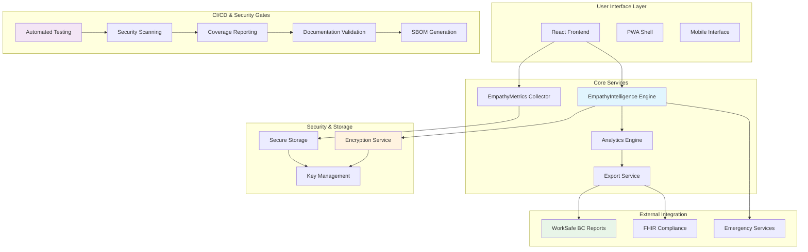
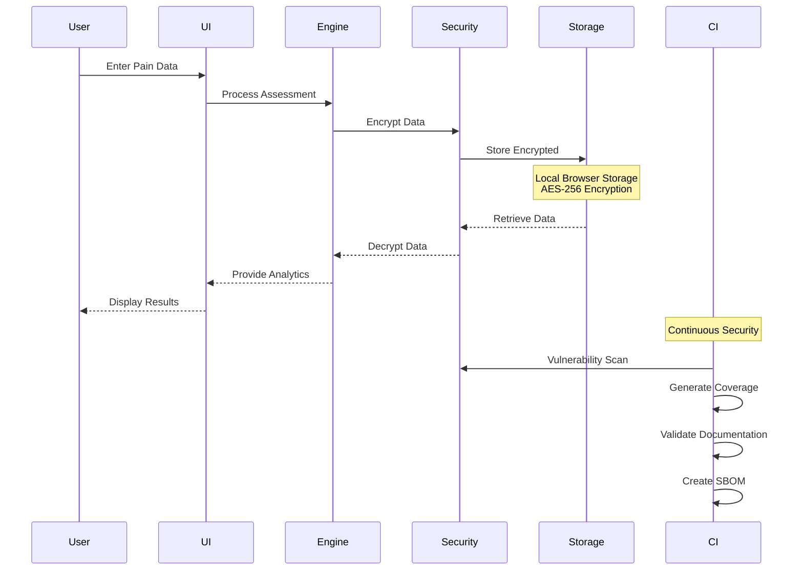

# Minimal Architecture Overview

## System Architecture & Data Flow



## Data Flow & Security Gates



## Security Architecture

### Encryption & Key Management
- **Algorithm**: AES-256-GCM for data encryption
- **Key Storage**: Browser secure storage with rotation
- **Scope**: All sensitive pain data and personal information
- **Fallback**: In-memory key cache for storage failures

### Data Classification
- **Sensitive**: Pain assessments, personal identifiers
- **Internal**: Analytics results, usage metrics  
- **Public**: Non-identifying statistical data

### Access Controls
- **Local-only**: No cloud storage by default
- **Encryption**: End-to-end encryption for all data
- **Isolation**: Browser sandbox security model

## Technology Stack Integration

### Frontend Architecture
```
React 18 + TypeScript
├── Design System (Tailwind CSS)
├── State Management (Zustand)
├── Validation Layer (Zod)
└── Testing (Vitest + Testing Library)
```

### Security Layer
```
Security Framework
├── Encryption Service (AES-256)
├── Key Management (Rotation + Storage)
├── Data Validation (Input Sanitization)
└── Audit Logging (Security Events)
```

### CI/CD Pipeline
```
GitHub Actions
├── Code Quality (ESLint + TypeScript)
├── Security Scanning (CodeQL + npm audit)
├── Test Coverage (Vitest + c8)
├── Documentation (Validation + SBOM)
└── Deployment (Multi-environment)
```

---

*Architecture Version: 1.0*
*Last Updated: 2024-09-18*