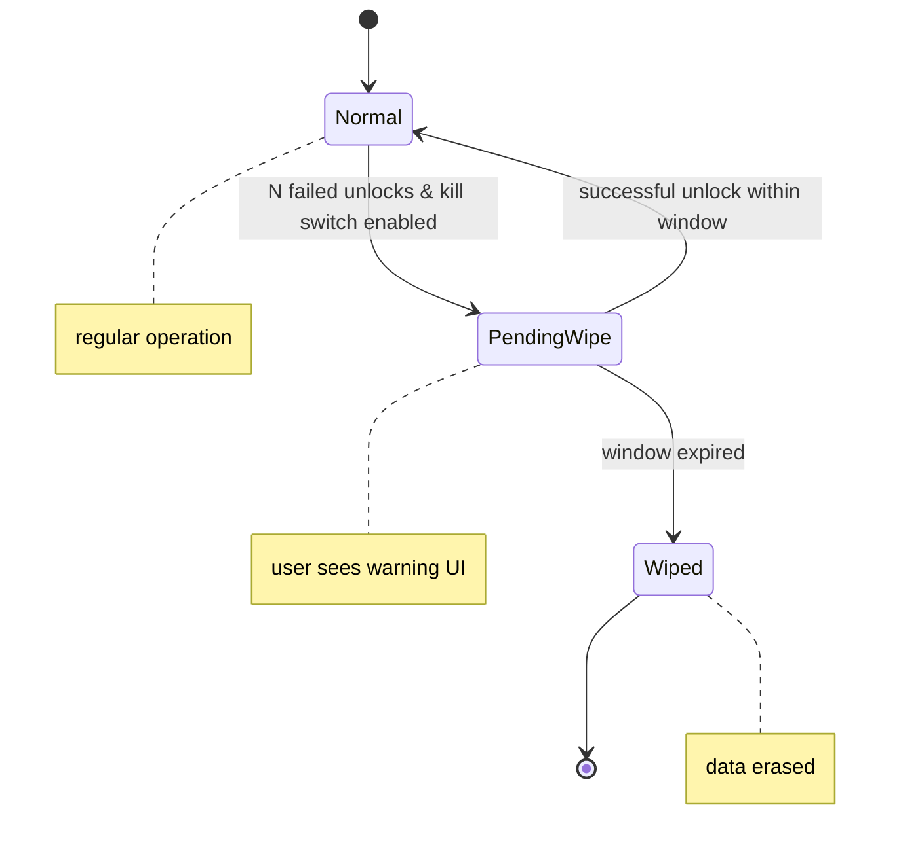

Most software is built on a dangerous premise: the Stability Assumption.

We assume the user has a stable network, stable cognitive capacity, a secure physical environment, and institutional trust. When those conditions hold, modern cloud native architecture works beautifully.

But when people enter a vulnerability state, the Stability Assumption collapses. Cloud dependent apps lock people out of their own data. Helpful auto sync features broadcast metadata from compromised networks. Irreversible actions happen when someone does not have the attention or time to read a modal carefully.

Here is the part we do not say out loud enough. In a crisis, software does not just fail. It can become coercive. You get logged out, you cannot recover the account, your data is suddenly somewhere else, and the only path forward is to comply with whatever the system demands.

We need a systems engineering discipline for designing software under conditions of human vulnerability.

Today, I am open sourcing Protective Computing Core v1.0.

The formal structural paper for the discipline is now published as the Protective Computing Canon v1.0.

Overton, K. (2026). _Protective Computing Canon v1.0: A Structural Map of the Discipline._  
Protective Computing Community.  
DOI: https://doi.org/10.5281/zenodo.18887610

## Boundary notes, because truth matters

- This is not medical advice.
- This is not a regulatory compliance claim.
- This is not a claim of perfect security.

## What is Protective Computing?

Protective Computing is not a privacy manifesto. It is a strict, testable engineering discipline.

It provides a formal vocabulary and a pattern library for building systems that:
- degrade safely
- contain failures locally
- defend user agency under asymmetric power conditions

The v1.0 Core introduces a normative specification (MUST, SHOULD, MUST NOT), plus a conformance model you can actually review.

Read the spec here:  
https://protective-computing.github.io/docs/spec/v1.0.html

## The core pillars

Protective Computing Core is built around four pillars. Each one exists because a specific failure pattern keeps hurting people.

### 1) Local Authority Pattern

The system MUST preserve user authority over locally stored critical data in the absence of network connectivity. Network transport is treated as an optional enhancement, not a dependency for essential utility.

What this prevents: the classic offline lie where the app looks usable, but the moment the network drops the user loses access to their own records.

### 2) Exposure Surface Minimization

The system MUST NOT increase its exposure surface during crisis state escalation. Analytics, third party telemetry, and remote logging are default off and hard gated.

What this prevents: silent data exhaust during the exact window when a user is least able to notice, consent, or defend themselves.

### 3) Reversible State Pattern

The system MUST NOT introduce irreversible state transitions during declared vulnerability states unless explicitly confirmed. High impact destructive actions require bounded restoration windows where security invariants allow.

What this prevents: permanent harm caused by a single misclick, mistype, or foggy moment.

### 4) Explicit Degradation Modes

The system cannot just go offline. It MUST define explicit degradation modes (Connectivity Degradation, Cognitive Degradation, Institutional Latency) and map how essential utility is preserved in each state.

What this prevents: ambiguous failure where nobody knows what is safe, what is unavailable, and what the system is doing behind the scenes.

## The reference implementation: PainTracker

To prove these patterns are implementable in standard web technologies, I built a reference implementation:  
https://paintracker.ca

PainTracker is an offline first PWA designed for users tracking chronic health data, a highly sensitive payload often logged during high cognitive or physical distress.

Instead of a traditional SaaS architecture, PainTracker implements Protective Computing through:
- Encrypted IndexedDB persistence (primary database lives on device)
- Zero knowledge vault gating (local security boundary, no remote auth dependency)
- Unlock only bounded reversibility (pending wipe window that only a successful unlock can abort)
- Hard telemetry gating (verifiable kill switch for outbound requests not explicitly initiated by the user)

Repo:  
https://github.com/CrisisCore-Systems/pain-tracker

## Example: bounded reversibility without weakening security

Standard security dictates that after N failed unlock attempts, a local vault should wipe.

But under cognitive overload, people mistype passwords. An immediate wipe causes irreversible loss. A generic cancel button weakens brute force resistance.

Protective Computing requires a bounded restoration window that does not weaken the security invariant.

Here is the shape of the solution:

```ts
// Bounded reversibility under asymmetric power defense
async function handleFailedUnlock() {
  failedAttempts++;

  if (failedAttempts >= MAX_FAILED_UNLOCK_ATTEMPTS && privacySettings.vaultKillSwitchEnabled) {
    // 1) Enter a bounded degradation state
    // 2) Disclose the pending irreversible action
    // 3) Only a successful cryptographic unlock can abort the timer

    await enterPendingWipeState({
      windowMs: 10_000,
      reason: "failed_unlock_threshold",
      onExpire: () => executeEmergencyWipe()
    });

    UI.showWarning("Vault will wipe in 10s. Enter correct passphrase to abort.");
  }
}
```

Notice the constraint. There is no cancelWipe() function exposed to the UI. The only path to reversibility is proving local authority.



## Measuring posture: the Protective Legitimacy Score (PLS)

In this space, marketing claims like military grade encryption or secure by design are useless. Engineers and regulators need auditable transparency.

Alongside the Core spec, I am publishing a measurement instrument called the Protective Legitimacy Score (PLS). PLS is not a certification. It is a structured disclosure format that forces maintainers to state:
- what vulnerability conditions they assume
- what compliance level they claim
- what they do not claim
- where they deviate, and why

PLS rubric (PDF):
[https://protective-computing.github.io/PLS_RUBRIC_v1_0_rc1.pdf](https://protective-computing.github.io/PLS_RUBRIC_v1_0_rc1.pdf)

Audit evidence index:
[https://github.com/protective-computing/protective-computing.github.io/blob/main/AUDIT_EVIDENCE.md](https://github.com/protective-computing/protective-computing.github.io/blob/main/AUDIT_EVIDENCE.md)

Compliance audit matrix:
[https://github.com/protective-computing/protective-computing.github.io/blob/main/COMPLIANCE_AUDIT_MATRIX.md](https://github.com/protective-computing/protective-computing.github.io/blob/main/COMPLIANCE_AUDIT_MATRIX.md)

The goal is simple: replace vibes with checkable posture.

## The call for Reference Implementation B

PainTracker proves the discipline works for localized health telemetry. But Protective Computing is domain agnostic.

These patterns are exactly what is needed for:
- disaster response cache applications
- coercion resistant messaging interfaces
- offline first journalistic tooling
- legal aid and housing workflows under institutional delay

If you want to contribute, here is the most useful path:
1. Read the spec v1.0: [https://protective-computing.github.io/docs/spec/v1.0.html](https://protective-computing.github.io/docs/spec/v1.0.html)
2. Pick one requirement you think is wrong, too vague, or unbuildable.
3. Submit a review with a concrete counterexample and a better verification procedure.

Review invitation:
[https://protective-computing.github.io/docs/independent-review.html](https://protective-computing.github.io/docs/independent-review.html)

Independent review checklist:
[https://github.com/protective-computing/protective-computing.github.io/blob/main/INDEPENDENT_REVIEW_CHECKLIST.md](https://github.com/protective-computing/protective-computing.github.io/blob/main/INDEPENDENT_REVIEW_CHECKLIST.md)

I do not need agreement. I need pressure testing.

## Canonical archive (Zenodo)

If you want the citable artifacts and stable versions, Protective Computing is archived as a Zenodo community. This is the cleanest place to reference exact releases without link rot.

Community:
[https://zenodo.org/communities/protective-computing/records](https://zenodo.org/communities/protective-computing/records)

Canonical paper (Protective Computing Canon v1.0):
[https://doi.org/10.5281/zenodo.18887610](https://doi.org/10.5281/zenodo.18887610)

Field Guide v0.1:
[https://doi.org/10.5281/zenodo.18782339](https://doi.org/10.5281/zenodo.18782339)
Part of the Protective Computing corpus. Canonical paper:
[https://doi.org/10.5281/zenodo.18887610](https://doi.org/10.5281/zenodo.18887610)

PLS rubric DOI:
[https://doi.org/10.5281/zenodo.18783432](https://doi.org/10.5281/zenodo.18783432)
Layer-3 document; canonical paper:
[https://doi.org/10.5281/zenodo.18887610](https://doi.org/10.5281/zenodo.18887610)

## Start here, and support the work if it helped

Fastest route through the catalog (series index):
[https://dev.to/crisiscoresystems/start-here-paintracker-crisiscore-build-log-privacy-first-offline-first-no-surveillance-3h0k](https://dev.to/crisiscoresystems/start-here-paintracker-crisiscore-build-log-privacy-first-offline-first-no-surveillance-3h0k)

Sponsor the build (keeps it independent of surveillance funding):
[https://github.com/sponsors/CrisisCore-Systems](https://github.com/sponsors/CrisisCore-Systems)

Star the repo:
[https://github.com/CrisisCore-Systems/pain-tracker](https://github.com/CrisisCore-Systems/pain-tracker)

If we change the architectural defaults, we can stop building software that breaks exactly when people need it most.
