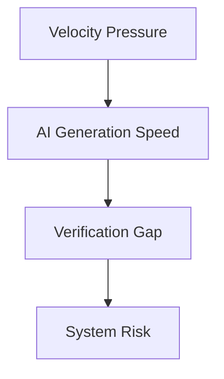
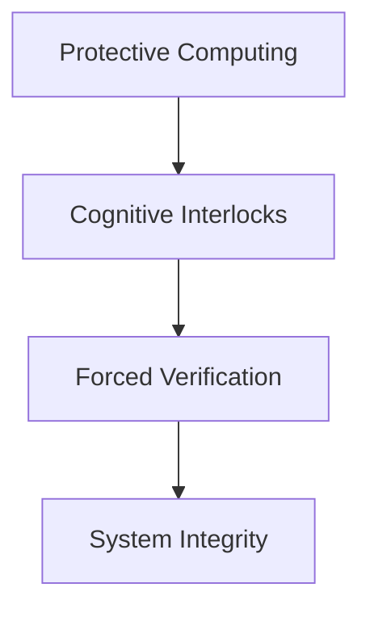

Modern software tools promise a simple future: remove friction, increase velocity, ship faster.

Autocomplete, AI copilots, instant scaffolding—everything is designed to reduce the distance between thought and execution.

On the surface this feels like progress.

But something subtle is happening inside that optimization.

When tools remove all friction, they do not just make developers faster.

They **shift the burden of verification**.

And that shift creates a form of micro-coercion.

If you want the short reading path that connects this piece to the doctrine and
the concrete agent workflow pattern, start with
[AI Agents Under Protective Computing: Start Here](https://github.com/CrisisCore-Systems/pain-tracker/blob/main/docs/content/blog/blog-ai-agents-protective-computing-start-here.md).

---

## The Illusion of Velocity

Most engineering environments optimize for the **fast path**: generating working code as quickly as possible.

Tools like GitHub Copilot and Cursor collapse the time between an idea and implementation to almost zero.

At first this feels empowering.

But software development is not a single step called writing code.

It is two cognitive processes:

1. **Generation** — producing possible solutions  
2. **Verification** — proving those solutions are correct

AI tooling accelerates generation dramatically.

Verification, the process that protects system integrity, remains slow.

Under fatigue, deadlines, or cognitive overload, the brain takes the easier path: if the code looks polished and confident, we assume it works.

The tool stops being an assistant.

It becomes an **unverified authority**.

This is the micro-coercion of speed.

Not an explicit demand, but a subtle pressure: accept the output, move forward, ship.

---

## The Cognitive Bypass

Human cognition operates through two modes of reasoning:

- fast, intuitive pattern recognition  
- slow, deliberate verification  

Autocomplete systems are optimized to feed the first.

When a block of code appears instantly—formatted, structured, seemingly coherent—it triggers a shortcut. The brain interprets polish as correctness.

The burden of proof quietly moves.

Instead of the tool proving the code is correct, the developer must prove that it is wrong.

But proving something wrong requires effort: reading line by line, checking assumptions, tracing data flow, testing edge cases.

When the system continuously offers new solutions faster than they can be verified, verification begins to collapse.

The developer becomes less of an engineer and more of a **passenger in their own system**.

---

## The Physical World Standard

Software engineering is unusual among engineering disciplines in one critical way: it often assumes the operator will behave perfectly.

Mechanical, electrical, and industrial systems assume the opposite.

They assume operators will be tired.  
They assume shortcuts will be attempted.  
They assume speed pressure will override caution.

So they design systems where certain mistakes are **physically impossible**.

In industrial maintenance this appears in practices such as lockout and
tagout, formalized in standards like OSHA 29 CFR 1910.147. Machines must be
physically isolated from power before service begins.

The point is not trust.

The point is eliminating the possibility of catastrophic error.

Technicians know exactly what happens when speed overrides safeguards.

Consider a pressure safety switch in a commercial refrigeration system. If pressure exceeds safe limits, the switch shuts the compressor down.

A rushed technician can bypass that switch with a jumper wire. The compressor starts running again. The problem appears solved.

For a moment.

But the triggering pressure is still present. The compressor runs outside its
safe envelope. Bearings overheat. Oil degrades. Failure arrives later.

The shortcut did not remove the problem.

It **deferred the failure**.

Physical engineering disciplines treat this pattern as dangerous enough to
embed prevention directly into system design: safety interlocks, pressure
relief, thermal cutoffs, and keyed disconnects.

Speed cannot bypass them.

The system refuses to run until the safety model is satisfied.

Software environments rarely enforce equivalent boundaries.

Generated code can be accepted without verification. Critical assumptions can pass silently into production.

The system runs.

Just like the bypassed compressor.

And failure appears later: under scale, unusual inputs, or the 3 AM incident where hidden assumptions collide with reality.

In physical engineering this is **operating outside the design envelope**.

Software often calls it **technical debt**.

---

## The Systemic Failure Pattern

The pattern created by velocity-optimized tooling can be visualized as a simple risk pipeline.

When tools remove all cognitive friction, they do not just make developers faster.

They subtly coerce them into accepting logic they have not fully verified because verifying it requires more effort than generating it.

This is the **micro-coercion of speed**.

A UX pattern that prioritizes output over agency.

When generation outruns verification, the developer stops being an engineer and becomes a **passenger in their own system**.

---

## Designing Active Friction

If physical engineering survives by enforcing interlocks, software must engineer **cognitive interlocks**.

We cannot rely on developers always being rested, skeptical, and careful. Systems must introduce friction at the architectural level.

Within the Overton Framework these mechanisms are called
**Protective Controls**. If you want the doctrine-level framing behind that
term, start with
[Protective Computing Is Not Privacy Theater](https://dev.to/crisiscoresystems/protective-computing-is-not-privacy-theater-2job).

They are not intended to slow development.

They protect system integrity from velocity pressure.

---

### IDE Boundary Interlocks

The development environment itself must enforce safety boundaries.

Example: database queries require mandatory parameterization gates.

If generated code attempts direct string interpolation, the IDE marks a red-zone violation and the build fails.

Speed cannot bypass the safety model.

The environment acts as an **interlock**.

---

### Generation–Verification Separation

In manufacturing, a new program does not run directly on production equipment.

It is tested, simulated, and verified.

AI-generated code should follow the same principle.

Generation occurs in a sandbox.

Integration requires explicit human checkpoints.

The tool can propose solutions, but it cannot merge high-impact paths without deliberate approval.

For a concrete implementation pattern, see
[Preview Mode First: Agent Plans as PRs (Plan Diff + Invariants)](https://dev.to/crisiscoresystems/preview-mode-first-agent-plans-as-prs-plan-diff-invariants-4ikd),
which applies friction to AI agent pipelines through plan-diff review and
invariant checks.

Before code enters the system, the developer must demonstrate understanding.

---

### Cognitive Slow Paths

Autocomplete amplifies fast intuition.

Protective computing introduces **slow paths** that deliberately engage analytical reasoning:

- visual diff emphasis for generated blocks  
- commit gates requiring explanation of generated logic  
- contextual highlighting of sensitive data flows  

Before code enters the system, the developer demonstrates ownership of the logic.

Not because the tool is malicious.

Because responsibility for the system belongs to the human operator.

---

## The Systemic Risk Model

---

## The Practitioner vs the Passenger

Speed is not the enemy.

But speed without understanding changes the role of the developer.

When tools generate logic faster than it can be verified, ownership erodes. The codebase becomes something operated rather than understood.

The developer becomes a passenger.

Real engineering requires something else:

- a mental model of the system
- a clear understanding of boundaries
- discipline to verify those boundaries hold

Friction is not a flaw in that process.

It is what protects it.
