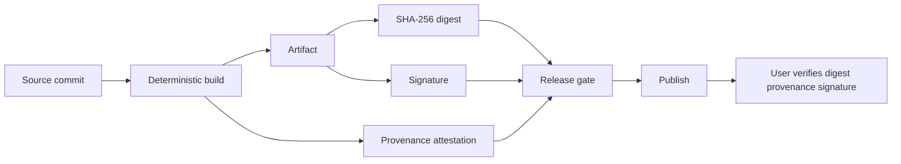
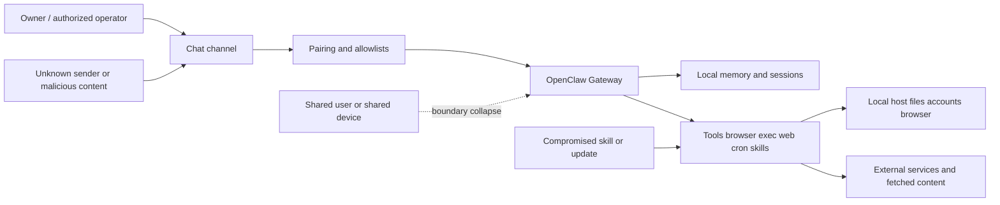

*This is a submission for the [OpenClaw Writing Challenge](https://dev.to/challenges/openclaw-2026-04-16).*

Personal AI is usually sold as convenience.

That is the wrong frame.

The real question is not how much the assistant can do. It is what
boundary the person is forced to trust when they let it do those
things.

That is why OpenClaw is interesting.

Not because it is another chatbot with better branding. Because it makes the boundary visible.

The docs describe a self-hosted gateway you run on your own machine or
server, wired into the chat apps you already use, with sessions,
memory, browser automation, exec, cron, skills, plugins, and support
for local-only models when you want data to stay on-device. That is
not just a product surface. It is an architecture decision about where
authority lives.

OpenClaw also says the quiet part out loud.

Its security model is a personal-assistant model, not a hostile
multi-tenant one. One gateway is one trusted operator boundary. If you
want mixed-trust use, the docs tell you to split gateways or at least
split OS users and hosts. That matters, because a lot of personal AI
talk falls apart the minute one runtime starts mixing personal
identity, company identity, shared chat surfaces, and tool access. At
that point the assistant is not personal. It is just convenient.

That is the boundary problem.

A personal AI system owes the person using it a few things.

It owes them local-first behavior when possible. OpenClaw runs on your
hardware, and its memory is stored in plain files in the workspace.
The docs are explicit: there is no hidden memory state beyond what
gets written to disk. If a system is going to remember things about
me, I should be able to inspect where that memory lives.

It owes them explicit consent. OpenClaw pairing is an owner approval
step for new DM senders and for device nodes. Unknown senders do not
just get to start steering the assistant. Good. A personal AI should
not silently widen its social surface.

It owes them restraint.

This is where most products start lying.

The FTC's Alexa case was about keeping voice and geolocation data for
years and undermining deletion requests. The BetterHelp case was about
disclosing sensitive mental health data for advertising after
promising privacy. Personal AI does not get a moral exemption just
because the interface feels helpful.

It also owes them protection against exfiltration and tool abuse.

OpenClaw's own trust docs are useful here because they are not
pretending the risk is academic. The agent can execute shell commands,
send messages, read and write files, fetch URLs, and access connected
services. The public threat model names prompt injection, indirect
injection, credential theft, transcript exfiltration, malicious
skills, and unauthorized command execution. That means the system has
to be designed on the assumption that the model can be manipulated.

That last part is where people get confused.

They think the fix is a better prompt.

It is not.

OpenClaw's own security docs say access control before intelligence.
Decide who can talk to the bot. Decide where it can act. Decide what
it can touch. Then assume the model can still be manipulated and keep
the blast radius small. That is the right order. Personal AI fails
when teams reverse it and try to get trust out of model behavior
instead of system boundaries.

And this is where release discipline stops being a side concern.

If a personal AI product claims local-first privacy, visible state,
reversible exports, or safe supply chain behavior, those claims should
survive shipping. Docs are not proof. The artifact has to match the
story. That means deterministic packaging where possible, published
digests, signed artifacts, provenance, and release gates that block
unverifiable builds. OpenClaw's ClawHub skill flow already points in
that direction with deterministic ZIP packaging and SHA-256 hashing.
The broader supply chain ecosystem has already spelled out the rest
through provenance, signature, and transparency practices. If the
product says trust matters, the pipeline should treat verification as a
gate, not a garnish.

## OpenClaw in context

The exact OpenClaw version was unspecified, so the argument here uses
the current official docs, trust site, and official blog pages
available at the time of writing. Those sources describe OpenClaw as a
self-hosted gateway that runs on your hardware, connects built-in and
plugin chat channels, and becomes the system of record for sessions,
routing, and channel connections. The docs emphasize that it is aimed
at developers and power users who want a personal assistant without
giving up control of their data or relying on a hosted service.

That claim is backed by concrete architecture.

OpenClaw supports built-in channels such as Discord, Signal, Slack,
Telegram, WhatsApp, WebChat, Google Chat, and legacy iMessage, plus
bundled or external plugin channels. It supports tool streaming,
isolated sessions per workspace or sender, custom and self-hosted
providers including Ollama and vLLM, browser automation, exec,
sandboxing, cron jobs, skills, plugins, and workflow pipelines. The
managed browser profile is explicitly separated from the user's
personal browser by default, and the docs frame it as an agent-only
browser rather than a silent extension of the user's everyday profile.

It also exposes unusually inspectable local state.

Memory is stored as plain files in the workspace, including
`MEMORY.md`, daily note files, and optionally `DREAMS.md`, and the
docs state flatly that the model only remembers what gets saved to
disk. The memory-wiki companion plugin adds deterministic page
structure, structured claims and evidence, contradiction and freshness
tracking, dashboards, and a provenance-rich knowledge layer. There is
also a local-first QMD sidecar option for memory indexing.

Just as important, the docs do not pretend this somehow dissolves risk.

OpenClaw's trust site is explicit that agents can execute shell
commands, send messages, read and write files, fetch arbitrary URLs,
schedule tasks, and access connected services. It also names prompt
injection, indirect injection, tool abuse, and identity risks as core
issues. The threat model formalizes those risks into concrete attack
paths including malicious skill installs, compromised skill updates,
direct and indirect prompt injection, transcript exfiltration,
unauthorized command execution, and financial-fraud chains.

That honesty matters.

It means the right essay is not OpenClaw is private because it runs
locally. The right essay is OpenClaw is interesting because it exposes
the real obligations of personal AI in a way most hosted assistants
hide.

## Boundary principles

The first principle is local first, and OpenClaw is closest to the mark
when it keeps the assistant inside the user's hardware boundary. The
docs repeatedly frame the gateway as something you run on your own
machine or server, and the FAQ explicitly notes that local-only models
can keep data on-device. That matches the broader direction seen in
Apple's on-device-first positioning for Apple Intelligence, where the
system first determines whether a task can be completed on-device and
only uses Private Cloud Compute for tasks that need a larger model.

The second principle is export control in the literal sense: the person
using the system should control when state leaves the device, when it
is backed up, and how it is verified. OpenClaw's CLI already includes
`backup create` and `backup verify` for local backup archives of
OpenClaw state, which is exactly the right shape because it treats
export as an explicit user action paired with verification rather than
as an invisible synchronization side effect.

The third principle is provenance.

Provenance is not only a release issue. It is also a state-legibility
issue. OpenClaw's memory-wiki language around evidence, contradiction
tracking, freshness, and provenance-rich knowledge is a product-level
example of this: if memory is going to become durable enough to
influence future behavior, people need to know what the claim is,
where it came from, and whether it is stale. At the configuration
layer, OpenClaw's strict schema validation and machine-readable config
schema do the same thing for system state: unknown keys and invalid
values cause the gateway to refuse startup, and the schema is treated
as the canonical contract for `openclaw.json`.

The fourth principle is visibility.

Pairing is an explicit owner approval step. The security audit exists
specifically to surface common footguns. The audit warns when likely
shared-user ingress exists, when open groups expose runtime or
filesystem tools, when permissive exec approvals exist, and when
people are drifting outside the intended personal-assistant trust
model. Visibility is not a marketing promise here; it is an
operational affordance. Cloud systems that take privacy seriously are
converging on the same logic. Apple's Private Cloud Compute says
privacy guarantees for cloud AI are hard to verify, so it publishes
software images, uses cryptographic attestation, and makes verifiable
transparency a core requirement. Apple also exposes an Apple
Intelligence report users can enable to see off-device processing.

The fifth principle is consent.

OpenClaw's pairing flow makes first contact explicit. Microsoft's
current Recall design moved toward the same idea by making snapshot
saving opt-in, requiring Windows Hello, and keeping local analysis and
snapshots under user control; admins can make Recall available, but
they cannot force snapshots to begin on a user's behalf. OpenAI's
memory and Temporary Chat controls offer another version of the same
norm: users can turn memory off, inspect and delete memories, or use
Temporary Chat for no-history, no-memory, no-training conversations,
though third-party actions remain outside that safe lane.

The sixth principle is minimal analytics.

NIST's AI RMF for generative AI ties trustworthy practice to
transparency, consent, and purpose specification, and Apple's current
Apple Intelligence privacy disclosure is a concrete implementation
example: only relevant request data is sent to Private Cloud Compute
when needed, request content is not stored, limited operational
metadata is collected, and additional analytics are opt-in and
privacy-preserving. That is a much better default than content-rich
telemetry or hash it and call it anonymous, which the FTC has
explicitly warned is not anonymity.

## Failure modes and trade-offs

The cleanest way to see the boundary problem is to look at failures that happened when systems treated intimacy as data exhaust.

Surveillance creep is the obvious one.

The FTC's Amazon Alexa case alleged that Amazon kept sensitive voice
and geolocation data for years, undermined deletion requests, and used
unlawfully retained data to improve its algorithms. The BetterHelp
action alleged that consumers' sensitive mental-health data, including
questionnaire data and identifiers, was disclosed to advertising
platforms despite promises of confidentiality and without affirmative
express consent. Those are not edge cases. They are what happens when
a company decides that vulnerability is also product input.

Data exfiltration is the next failure mode, and personal agents expand
the blast radius because they already sit next to the things people
care about. OpenClaw's trust site and threat model explicitly list
malicious skills, credential harvesting, transcript exfiltration,
unauthorized message sending, and data theft via web fetch as real
risks in its ecosystem. The official VirusTotal partnership post makes
the same point even more bluntly: skills run in the agent's context
and can exfiltrate sensitive information, execute unauthorized
commands, send messages on the user's behalf, or download and run
external payloads.

Opaque automation is subtler and, in practice, just as dangerous.

If an agent can send messages as you, act across apps, execute shell
commands, or follow arbitrary web content, then it handled it for me
is not enough. OpenClaw's own guidance says access control before
intelligence: decide who can talk to the bot, where it is allowed to
act, and what it can touch, then assume the model can still be
manipulated. That advice aligns with OWASP's current LLM guidance on
prompt injection and excessive agency, and with OpenAI's own agent
documentation, which warns that connected apps, email, browsing, and
actions on a user's behalf create privacy risks including prompt
injection.

Shared-device and shared-runtime risks are where personal AI quietly becomes ambient multi-user risk.

OpenClaw's security docs go out of their way to say a single gateway is
not a supported hostile boundary for mutually untrusted users, that
session identifiers are routing selectors rather than authorization
tokens, and that if several people can message one tool-enabled agent
they can all steer the same permission set. The CLI audit repeats this
and tells intentional shared-user setups to sandbox sessions, scope
filesystem access to the workspace, and keep personal identities and
credentials off that runtime. Even products designed to be local first
still have to contend with this: Microsoft's current Recall docs
repeatedly emphasize that each user on the device must make their own
opt-in choice and that other signed-in users cannot access saved
snapshots.

A recent arXiv preprint makes the same architectural point in OpenClaw-specific terms.

The paper evaluates 12 attacks on a live OpenClaw instance and reports
that poisoning a single Capability, Identity, or Knowledge dimension
raised average attack success from 24.6 percent to 64 to 74 percent,
with the authors arguing that the vulnerabilities are inherent to the
agent architecture and require systematic safeguards. It is a
preprint, not peer-reviewed, so it should be treated as emerging
evidence rather than settled consensus. But it still matches what the
official docs already say: if the agent has real authority and
persistent state, the boundary is the product.

The trade-off is not mysterious.

| Dimension | Local-first personal AI | Cloud-first personal AI |
| --- | --- | --- |
| Privacy posture | Better default containment because raw state can remain on-device and off centralized servers | Higher exposure to retention, repurposing, subpoena, insider, and breach risks unless unusually strong safeguards exist |
| UX | Strong offline and low-latency paths for local tasks, but harder setup, backup, and remote access | Easier onboarding, syncing, and always-on reach, but more invisible movement of data |
| Cost model | Shifts cost to user hardware, ops, and power | Shifts cost to provider infrastructure and usage billing |
| Verification | Easier to inspect local files, sessions, logs, and backup artifacts | Requires attestations, transparency logs, signatures, and external trust in service claims |
| Common failure mode | Shared-device leakage, bad local opsec, weak backup discipline | Surveillance creep, silent retention drift, opaque automation, and model or provider policy changes |

This is a synthesis of OpenClaw's self-hosted and trust-boundary docs,
Apple's on-device and Private Cloud Compute design, Microsoft's current
local Recall controls, FTC enforcement on retention and ad-tech
repurposing, and release-verification guidance from SLSA and Sigstore.

## Practical design and release discipline

The strongest technical move in this whole argument is release gating, because it turns moral language into system behavior.

OpenClaw's own ecosystem already contains the right primitives.

The ClawHub security flow packages skills deterministically, computes a
SHA-256 over the bundle, scans it, and surfaces status transparently.
The public trust program also explicitly includes build and release
pipeline integrity, signed releases, skills verification, dependency
auditing, and public security-roadmap goals. That mirrors what secure
software guidance has been saying more generally: NIST's SSDF and its
AI-specific profile frame secure development as a lifecycle
discipline, SLSA defines provenance verification around artifact
digest and signature checks, and Sigstore ties signatures to identity
and transparency logs in a way that can be enforced by policy
controllers.

### Release chain

This is the operational version of trust, but verify: deterministic
packaging, a stable digest, provenance that binds build inputs to
outputs, signatures that bind artifacts to an expected identity, and a
release gate that refuses to ship when those claims do not line up.

### Threat model sketch

That sketch matches OpenClaw's documented attack surfaces: channel access, pairing and allowlists, session isolation, tool execution, external content, malicious skills, and shared-user boundary collapse.

### Implementable checklist

**Product decisions**

- Treat one runtime as one trust boundary. If a deployment mixes personal, team, or adversarial users, split gateways or at minimum OS users and hosts.
- Default to local-first operation when possible: local gateway mode, local memory, and local-only model options for sensitive use cases.
- Make first contact explicit. Unknown senders should not silently get tool access; require pairing or equivalent owner approval.
- Keep state legible. Prefer human-readable memory and state, and publish a machine-readable config schema with strict validation.
- Provide explicit backup and export controls, and let users verify those artifacts.
- Keep analytics content-thin, off by default where feasible, and documented in plain language. Apple's current model of limited non-content metrics plus optional analytics is closer to the right shape than behavioral exhaust.
- Give users an obvious what happened? surface: audits, status pages, transparency reports, memory review, and visible logs for off-device or high-impact actions.

**Engineering decisions**

- Make builds deterministic where possible, publish SHA-256 digests, and verify them in CI and on the client side.
- Publish provenance attestations and sign artifacts against an expected identity.
- Gate releases on checksum, provenance, signature, threat-review status, and doc-artifact parity. If those checks fail, the release should not ship.
- Treat plugin and skill ecosystems as supply-chain surfaces, not community magic. Require scanning, version history, warnings, and revocation paths.
- Design prompt-injection limits outside the model: keep permissions narrow, isolate execution, and require confirmation for high-impact actions.

### Visual sources worth embedding

These are strong official pages to link or screenshot in the DEV post because they make the boundary visible rather than theoretical:

- OpenClaw's threat-model page, especially the trust-boundary and attack-chain sections.
- OpenClaw's pairing page, which clearly shows explicit owner approval for DMs and device nodes.
- Apple's Private Cloud Compute technical overview, especially the sections on stateless processing and verifiable transparency.
- Microsoft's updated Recall privacy and consent documentation, which is a useful counterexample of how even local analysis must still be opt-in, encrypted, and identity-gated.

## DEV post package

The DEV Community Wealth of Knowledge prompt explicitly rewards posts
that educate, inspire, or spark curiosity, and it specifically invites
opinion pieces that argue what OpenClaw gets right and what it teaches
about where personal AI is headed. This topic fits that lane cleanly.

### Concise outline in your voice

- **Hook:** Personal AI is not mainly a feature race. It is a boundary problem.
- **What OpenClaw gets right:** self-hosted gateway, your machine, your channels, explicit trust model, plain-file memory, pairing, audits.
- **The hard truth:** OpenClaw's own docs say one gateway is one trusted operator boundary. Share the runtime and you collapse the promise.
- **What the person is owed:** local-first defaults, explicit approval for ingress and off-device actions, inspectable memory, narrow analytics, reversible exports, visible automation.
- **What goes wrong otherwise:** surveillance creep, exfiltration through tools and skills, prompt-injected automation, shared-device leakage.
- **Operational payoff:** checksums, provenance, signing, and release gating are how you prove the system still matches the promise after shipping.
- **Close:** if the boundary cannot be proved, the product is selling convenience and calling it trust.

### Full draft essay for DEV

**OpenClaw and the Boundary Problem: What Personal AI Owes the Person Using It**

Personal AI is usually sold as convenience.

That is the wrong frame.

The real question is not how much the assistant can do. It is what boundary the person is forced to trust when they let it do those things.

That is why OpenClaw is interesting.

Not because it is another chatbot with better branding. Because it
makes the boundary visible. The docs describe a self-hosted gateway you
run on your own machine or server, wired into the chat apps you
already use, with sessions, memory, browser automation, exec, cron,
skills, plugins, and support for local-only models when you want data
to stay on-device. That is not just a product surface. It is an
architecture decision about where authority lives.

OpenClaw also says the quiet part out loud. Its security model is a
personal-assistant model, not a hostile multi-tenant one. One gateway
is one trusted operator boundary. If you want mixed-trust use, the
docs tell you to split gateways or at least split OS users and hosts.
That matters, because a lot of personal AI talk falls apart the minute
one runtime starts mixing personal identity, company identity, shared
chat surfaces, and tool access. At that point the assistant is not
personal. It is just convenient.

This is the boundary problem.

A personal AI system owes the person using it a few things.

It owes them local-first behavior when possible. OpenClaw runs on your
hardware, and its memory is stored in plain files in the workspace.
The docs are explicit: there is no hidden memory state beyond what
gets written to disk. That is the right instinct. If a system is going
to remember things about me, I should be able to inspect where that
memory lives.

It owes them explicit consent. OpenClaw pairing is an owner approval
step for new DM senders and for device nodes. Unknown senders do not
just get to start steering the assistant. Good. A personal AI should
not silently widen its social surface. The same principle shows up
elsewhere in the industry whenever teams are forced to take trust
seriously. Microsoft had to move Recall toward opt-in setup, Windows
Hello gating, and explicit controls. OpenAI's memory features now come
with on or off controls, memory management, and Temporary Chat for
no-history, no-memory sessions. The pattern is the same because the
obligation is the same: if the system is going to retain, infer, or
act, the person has to be able to see and stop it.

It owes them restraint.

This is where most products start lying.

The FTC's Alexa case was about keeping voice and geolocation data for
years and undermining deletion requests. The BetterHelp case was about
disclosing sensitive mental-health data for advertising after
promising privacy. Mozilla's chatbot privacy reporting keeps finding
the same pattern in a different outfit: intimate products that collect
too much, explain too little, and assume that vague privacy language
counts as consent. Personal AI does not get a moral exemption just
because the interface feels helpful.

It also owes them protection against exfiltration and tool abuse.

OpenClaw's own trust docs are useful here because they are not
pretending the risk is academic. The agent can execute shell commands,
send messages, read and write files, fetch URLs, and access connected
services. The public threat model names prompt injection, indirect
injection, credential theft, transcript exfiltration, malicious
skills, and unauthorized command execution. The VirusTotal partnership
post says the same thing in plainer language: skills run in the
agent's context, with access to your tools and your data. That means
the system has to be designed on the assumption that the model can be
manipulated.

That last part is where people get confused.

They think the fix is a better prompt.

It is not.

OpenClaw's own security docs say access control before intelligence.
Decide who can talk to the bot. Decide where it can act. Decide what
it can touch. Then assume the model can still be manipulated and keep
the blast radius small. That is the right order. Personal AI fails
when teams reverse it and try to get trust out of model behavior
instead of system boundaries.

And this is where release discipline stops being a side concern.

If a personal AI product claims local-first privacy, visible state,
reversible exports, or safe supply-chain behavior, those claims should
survive shipping. Docs are not proof. The artifact has to match the
story. That means deterministic packaging where possible, published
digests, signed artifacts, provenance, and release gates that block
unverifiable builds. OpenClaw's ClawHub skill flow already points in
that direction with deterministic ZIP packaging and SHA-256 hashing,
and the broader supply-chain ecosystem has already spelled out the
rest through SLSA and Sigstore. If the product says trust matters, the
pipeline should treat verification as a gate, not a garnish.

That is the real lesson.

Personal AI is not defined by whether it can send an email, check a calendar, or browse a page. It is defined by whether the person using it can answer a few unforgiving questions.

Where does it run?

Who can reach it?

What can it touch?

What leaves the device?

What gets remembered?

How do I inspect it?

How do I revoke it?

How do I verify that the thing you shipped is still the thing you promised?

OpenClaw matters because it pulls those questions back into the
architecture instead of burying them under product copy. And that is
what personal AI owes the person using it: not intimacy, not vibes,
not a polished privacy page, but a boundary that can be seen, checked,
and enforced. If it cannot prove the boundary, it is not discipline.
It is marketing with root access.

### Suggested title variants

- OpenClaw and the Boundary Problem
- What Personal AI Owes the Person Using It
- Personal AI Needs Boundaries Before Features
- Your Assistant, Your Machine, Your Rules
- If Personal AI Cannot Prove Its Boundary, It Is Not Personal

### One-line pitch for contest submission

A blunt architecture-first essay on why OpenClaw's self-hosted design exposes the real question in personal AI: not what the assistant can do, but what boundary it can actually prove.

## Prioritized sources

**OpenClaw official sources first.** Start with the docs home, feature
list, security model, pairing, memory overview, CLI backup reference,
trust page, threat model, and the official VirusTotal partnership
post. Those are the load-bearing sources for any claim about
OpenClaw's current design, threat model, and statefulness.

**Standards and verification sources next.** Use NIST AI RMF and SSDF
or SP 800-218 or SP 800-218A for the policy and lifecycle frame, SLSA
for provenance verification logic, and Sigstore for identity-bound
signing and enforceable admission policy. These are the best anchors
for the release-artifact and gating part of the argument.

**Recent implementation examples after that.** Apple Private Cloud
Compute is the strongest official example of a cloud AI vendor arguing
that privacy claims require verifiable transparency and inspectable
releases. Microsoft Recall is useful because it shows how even local
AI features still need opt-in consent, encryption, per-user controls,
and identity checks. OpenAI's memory, Temporary Chat, and agent docs
are useful for showing how state, retention, third-party actions, and
prompt injection risks surface in mainstream personal-assistant
workflows.

**Regulatory and commentary sources last.** FTC enforcement materials
on Alexa, BetterHelp, misleading consent, and pseudonymous identifiers
are the cleanest official record for surveillance creep and retention
abuse. Mozilla's privacy reporting is useful as recent commentary on
consumer AI intimacy products. EFF is useful for the broader
data-minimization argument, though the FTC and NIST sources carry more
direct weight for this specific essay. The recent OpenClaw safety
preprint is worth citing as emerging evidence, but it should be
labeled as a preprint rather than treated as settled doctrine.
