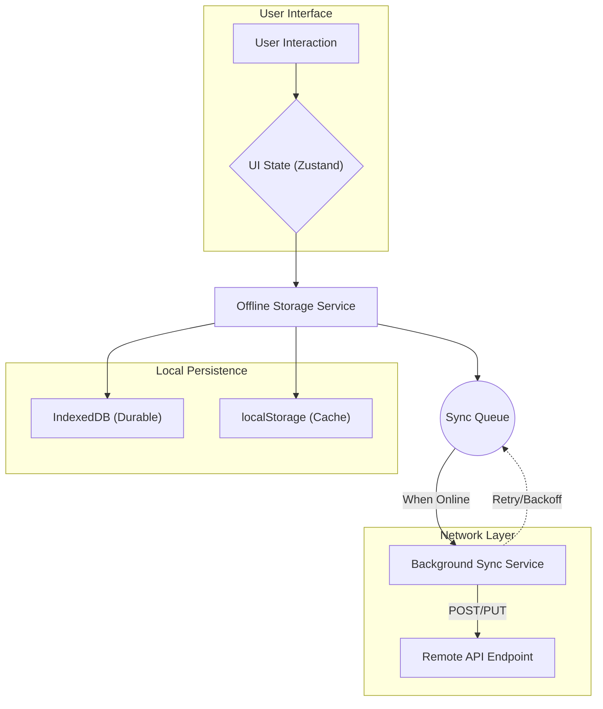
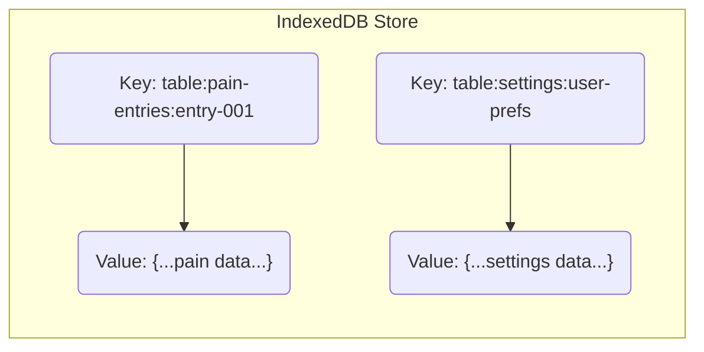

# Architecture Deep Dive: Pain Tracker

This document provides a technical exploration of the Pain Tracker application's architecture. It is intended for developers who are contributing to the codebase or seeking to understand its internal design.

## 1. Guiding Principles

The architecture is built on four foundational principles that ensure a resilient, secure, and maintainable application.

| Principle | Description | Key Implementations |
| :--- | :--- | :--- |
| 🛡️ **Security & Privacy by Design** | The system's primary goal is to protect user data. All data is stored locally by default, with no cloud dependency. | Local-first storage, Content Security Policy (CSP), CI security gates. |
| 🌐 **Offline-First Resilience**| The application must be fully functional without a network connection. All operations are persisted locally and synchronized when possible. | IndexedDB, Service Workers, background sync queue. |
| 🧩 **Modular & Extensible** | The codebase is designed to be extended with new features (e.g., data types, sync providers) without requiring major refactoring. | Typed storage layers, event-driven communication, plugin-ready hooks. |
| 🩺 **Observability & Health** | The system provides clear insights into its operational status, including sync state, storage usage, and performance metrics. | Custom DOM events, health diagnostics hooks (`pwa-utils.ts`). |

---

## 2. System Data Flow

The data flow is designed for an optimistic UI, ensuring a responsive user experience even when offline.



1.  **User Interaction**: An action is performed in the UI.
2.  **Optimistic UI Update**: The UI state is updated immediately via Zustand.
3.  **Local Persistence**: The data is written to the `Offline Storage Service`, which uses IndexedDB for durability and `localStorage` for fast reads.
4.  **Queue for Sync**: If the operation requires remote synchronization, it is added to a prioritized queue in IndexedDB.
5.  **Background Sync**: When the device is online, the `Background Sync Service` processes the queue, sending data to the remote endpoint with retry and backoff logic.

---

## 3. Storage Layer

The storage layer is a critical component of the offline-first strategy, combining two browser storage mechanisms for speed and reliability.

### 3.1 Dual Persistence Strategy

-   **IndexedDB**: The source of truth for all structured data, including pain entries, settings, and the sync queue. It is asynchronous and robust.
-   **localStorage**: Used as a write-through cache for frequently accessed data. This allows for synchronous, low-latency reads, improving UI performance. Reads always fall back to IndexedDB if data is not in `localStorage`.

### 3.2 "Virtual Table" Abstraction

To avoid complex IndexedDB schema migrations, we use a key prefixing strategy in a single object store to simulate tables.



-   **Benefits**: Simplifies data model evolution, provides namespace isolation, and makes import/export operations straightforward.
-   **Implementation**: Helper functions like `getAllFromTable`, `addToTable`, and `replaceTable` abstract this logic away.

---

## 4. Background Synchronization

The `background-sync.ts` module manages the queue of pending network operations, ensuring data eventually reaches a remote server if one is configured.

### 4.1 Sync Queue Model

Each item in the sync queue is a structured object with metadata for prioritization and retries.

```json
{
  "id": 1,
  "url": "/api/pain-entry",
  "method": "POST",
  "body": "{...}",
  "priority": "high",
  "retryCount": 0,
  "lastAttempt": "2025-09-19T02:07:04Z"
}
```

-   **Prioritization**: `high` -> `medium` -> `low`, then FIFO.
-   **Retry Logic**: A capped exponential backoff strategy prevents server overload. Failed items are logged after a maximum number of retries.

### 4.2 Sync Lifecycle Triggers

Synchronization is initiated by:
-   The browser firing an `online` event.
-   The application tab becoming visible.
-   A periodic timer (as a fallback).
-   A manual user action (`forceSync()`).

---

## 5. PWA & Service Worker

The Progressive Web App infrastructure, managed by `pwa-utils.ts` and the service worker (`/public/sw.js`), is responsible for the application's resilience and native-like capabilities.

### 5.1 Key Responsibilities

-   **Service Worker Lifecycle**: Manages registration, updates, and cache invalidation.
-   **Installability**: Handles the "Add to Home Screen" prompt.
-   **Network Monitoring**: Uses the Network Information API to detect connection changes.
-   **Data Management**: Provides functions for exporting, importing, and clearing all user data.
-   **Health Diagnostics**: Exposes metrics like storage usage and pending sync items.

### 5.2 Observability via Custom Events

The PWA utilities dispatch custom DOM events, allowing other parts of the application to react without tight coupling.

-   `pwa-online` / `pwa-offline`
-   `pwa-update-available`
-   `pwa-data-imported`
-   `pwa-sync-status-changed`

---

## 6. Extensibility and Roadmap

The architecture is designed to evolve. Future enhancements will integrate into the existing modular structure.

| Future Feature | Integration Point |
| :--- | :--- |
| **FHIR Export** | Add a data transformation layer that converts internal records to FHIR Observations before they enter the sync queue. |
| **Encryption at Rest** | Wrap the `storeData` methods in the storage service with a cryptographic layer (e.g., using `SubtleCrypto`). |
| **Multi-Device Sync** | Introduce a dedicated backend service and enhance the sync protocol to handle conflicts and merging. |
| **Wearable Data Ingestion**| Create a new "virtual table" for wearable metrics and a corresponding service to poll or receive data. |

This architecture provides a solid foundation for building a secure, reliable, and feature-rich health application while prioritizing user privacy and data ownership.
