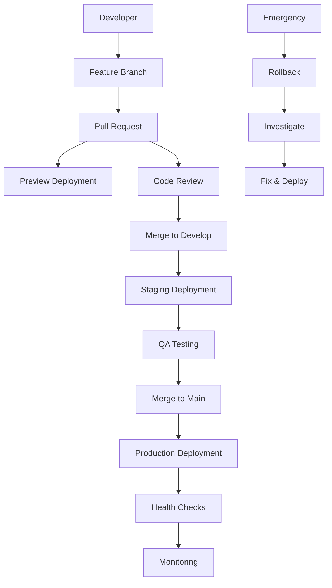

# 🚀 Deployment Guide

This guide covers the complete deployment and promotion strategy for the Pain Tracker application.

## 📋 Table of Contents

- [Overview](#overview)
- [Environments](#environments)
- [Deployment Workflows](#deployment-workflows)
- [Release Management](#release-management)
- [Rollback Procedures](#rollback-procedures)
- [Health Checks](#health-checks)
- [Troubleshooting](#troubleshooting)

## 🌐 Overview

The Pain Tracker application uses a multi-environment deployment strategy with automated CI/CD pipelines to ensure safe and reliable software delivery.

### Architecture



## 🏗️ Environments

### 1. Preview (Pull Request)
- **Purpose**: Feature testing and review
- **Trigger**: Pull request creation/update
- **Status**: Currently a simulated job that stops after building and uploading preview artifacts/logs (no live URL yet)
- **URL**: `https://crisiscore-systems.github.io/pain-tracker/preview/pr-{number}/`
- **Lifespan**: Duration of PR + 7 days

 
### 2. Staging
- **Purpose**: Integration testing and QA
- **Trigger**: Push to `develop` branch
- **URL**: `https://crisiscore-systems.github.io/pain-tracker/staging/`
- **Environment**: `staging`

 
### 3. Production
- **Purpose**: Live application for end users
- **Trigger**: Release workflow on `main` branch
- **URL**: `https://crisiscore-systems.github.io/pain-tracker/`
- **Environment**: `production`

## 🔄 Deployment Workflows

### Automatic Deployments

#### Preview Deployment

```bash
# Triggered automatically on PR creation/update
# No manual intervention required

# To check preview status:
npm run deploy:status
```

> ℹ️ **Current limitation**: The preview workflow runs through build/test stages and uploads the generated site bundle as an artifact with accompanying logs, but it does not publish those artifacts to GitHub Pages yet.

> Next step: To graduate the preview simulation into a real deployment we need to provision a GitHub token with `pages` and `contents` write scopes, decide on a persistent preview branch or PR-specific Pages environments, and update the workflow to push the built assets (or call `actions/deploy-pages`) instead of stopping at the artifact upload stage.

#### Staging Deployment

```bash
# Triggered automatically on push to develop
git checkout develop
git push origin develop

# Manual trigger:
npm run deploy:staging
```

#### Production Deployment

```bash
# Triggered via release workflow
npm run release:patch  # or minor/major
```

### Manual Deployments

#### Using npm scripts

```bash
# Pre-deployment validation (recommended before any deployment)
npm run deploy:precheck

# Check deployment status
npm run deploy:status

# Deploy to staging
npm run deploy:staging

# Deploy to production (requires release)
npm run deploy:production

# Run health checks
npm run deploy:healthcheck

# Validate configuration
npm run deploy:validate
```

#### Using Make commands

```bash
# Pre-deployment validation
make deploy-precheck

# Show deployment status
make deploy-status

# Deploy to staging
make deploy-staging

# Create releases
make release-patch
make release-minor
make release-major

# Health checks
make deploy-healthcheck
```

### Pre-Deployment Checklist

Before deploying to any environment, run the comprehensive pre-deployment validation:

```bash
npm run deploy:precheck
```

This script validates:
- Environment configuration
- Asset availability (manifest, icons, favicons)
- Security scanning (no hardcoded secrets)
- TypeScript compilation
- Production build success
- Deployment configuration

See `docs/ops/DEPLOYMENT_CHECKLIST.md` for the complete checklist.

## 📦 Release Management

### Semantic Versioning

We follow [Semantic Versioning](https://semver.org/):
- **MAJOR** (X.0.0): Breaking changes
- **MINOR** (0.X.0): New features, backward compatible
- **PATCH** (0.0.X): Bug fixes, backward compatible

### Release Types

#### Patch Release (Bug Fixes)

```bash
npm run release:patch
# or
make release-patch
```

#### Minor Release (New Features)

```bash
npm run release:minor
# or
make release-minor
```

#### Major Release (Breaking Changes)

```bash
npm run release:major
# or
make release-major
```

### Conventional Commits

Release type is automatically determined from commit messages:

```bash
# Patch release
fix(auth): resolve login timeout issue
fix(ui): correct mobile navigation

# Minor release
feat(dashboard): add pain trend analysis
feat(export): support PDF generation

# Major release
feat(api)!: restructure data format
fix(auth)!: change authentication flow
```

### Manual Release

For custom versions or emergency releases:

```bash
# Using GitHub CLI
gh workflow run release.yml \
  --field release_type=patch \
  --field custom_version=1.2.3 \
  --field skip_tests=false

# Using web interface
# Visit: https://github.com/CrisisCore-Systems/pain-tracker/actions
```

## 🔄 Rollback Procedures

### Automatic Rollback Triggers

Rollbacks are initiated when:
- Health checks fail after deployment
- Critical errors detected in monitoring
- User-reported critical issues

### Manual Rollback

#### Using npm script:
```bash
npm run deploy:rollback production v1.2.3
```

#### Using Make:
```bash
make deploy-rollback ENV=production VERSION=v1.2.3
```

#### Using GitHub Actions:
1. Go to [GitHub Actions](https://github.com/CrisisCore-Systems/pain-tracker/actions)
2. Select "Deploy (Pages)" workflow
3. Click "Run workflow"
4. Fill in:
   - `rollback_to`: Target version (e.g., v1.2.3)
   - `environment`: production or staging

### Rollback Process

1. **Validate Target**: Confirm target version exists and is stable
2. **Build Rollback**: Create build from target version
3. **Deploy**: Replace current deployment with rollback version
4. **Verify**: Run health checks on rollback deployment
5. **Monitor**: Watch for issues and user feedback
6. **Document**: Create issue tracking rollback and next steps

### Post-Rollback Actions

1. **Investigate**: Identify root cause of the issue
2. **Fix**: Develop and test fix for the problem
3. **Release**: Create new release with fix
4. **Deploy**: Deploy fixed version
5. **Close**: Close rollback tracking issue

## 🔍 Health Checks

### Automated Health Checks

Health checks run automatically:
- After every deployment
- On a scheduled basis (every 15 minutes)
- Before and after releases

### Manual Health Checks

```bash
# Check all environments
npm run healthcheck

# Check specific environment
npm run healthcheck production
npm run healthcheck staging

# Detailed health check with output file
node scripts/health-check.js production results.json
```

### Health Check Categories

1. **Accessibility**
   - Site availability (HTTP 200)
   - Essential HTML elements
   - Basic accessibility markers

2. **Assets**
   - CSS loading
   - JavaScript loading
   - Image assets
   - Favicon presence

3. **Performance**
   - Load time (< 5 seconds)
   - Response size (< 5MB)
   - GZIP compression

4. **Security**
   - Security headers
   - HTTPS enforcement
   - No hardcoded secrets
   - Safe content

5. **Functionality**
   - React app initialization
   - Navigation elements
   - Core functionality

### Health Check Results

Health checks provide:
- **Overall Score**: Percentage of passed checks
- **Individual Results**: Status of each check category
- **Recommendations**: Suggestions for improvements
- **Trends**: Historical performance data

## 🛠️ Troubleshooting

### Common Issues

#### Deployment Failures

**Build Errors:**
```bash
# Check build locally
npm run build

# Check environment variables
npm run deploy:validate

# Review build logs
npm run deploy:logs
```

**Health Check Failures:**
```bash
# Run detailed health check
npm run healthcheck production

# Check specific issues
curl -I https://crisiscore-systems.github.io/pain-tracker/
```

**Permission Errors:**
- Verify GitHub Actions permissions
- Check repository secrets
- Confirm branch protection rules

#### Rollback Issues

**Target Version Not Found:**
```bash
# List available versions
git tag -l

# Verify tag exists
git show v1.2.3
```

**Rollback Deployment Fails:**
- Check target version builds successfully
- Verify all required dependencies exist
- Review rollback workflow logs

### Recovery Procedures

#### Failed Production Deployment

1. **Immediate Response**:
   ```bash
   # Get last known good version
   git tag -l | tail -5
   
   # Initiate rollback
   npm run deploy:rollback production v1.2.2
   ```

2. **Investigation**:
   - Review deployment logs
   - Check health check results
   - Identify root cause

3. **Resolution**:
   - Fix identified issues
   - Test fix thoroughly
   - Create patch release

#### Lost Access to Deployment

1. **Alternative Access**:
   - Use GitHub web interface
   - Contact repository administrators
   - Use backup deployment methods

2. **Recovery**:
   - Restore access credentials
   - Verify permissions
   - Test deployment pipeline

### Monitoring and Alerts

#### Key Metrics to Monitor

- **Availability**: Site uptime and response time
- **Performance**: Load times and resource usage
- **Errors**: JavaScript errors and failed requests
- **User Experience**: Core functionality working

#### Alert Conditions

- Site returning HTTP 5xx errors
- Load time > 10 seconds
- Health check score < 80%
- Critical JavaScript errors

#### Response Procedures

1. **Immediate**: Assess severity and impact
2. **Triage**: Determine if rollback needed
3. **Action**: Execute appropriate response
4. **Communication**: Update stakeholders
5. **Resolution**: Fix underlying issue
6. **Post-mortem**: Document learnings

## 📞 Support and Contacts

### Emergency Contacts

- **Technical Lead**: [GitHub Issues](https://github.com/CrisisCore-Systems/pain-tracker/issues)
- **DevOps**: GitHub Actions administrators
- **Stakeholders**: Product team

### Escalation Path

1. **Developer** → Fix and deploy
2. **Technical Lead** → Architecture decisions
3. **Product Team** → Business impact assessment
4. **Management** → Major incident response

### Documentation

- **Repository**: https://github.com/CrisisCore-Systems/pain-tracker
- **Actions**: https://github.com/CrisisCore-Systems/pain-tracker/actions
- **Issues**: https://github.com/CrisisCore-Systems/pain-tracker/issues
- **Releases**: https://github.com/CrisisCore-Systems/pain-tracker/releases

---

*This deployment guide is maintained by the CrisisCore Systems team. For updates or questions, please create an issue in the repository.*