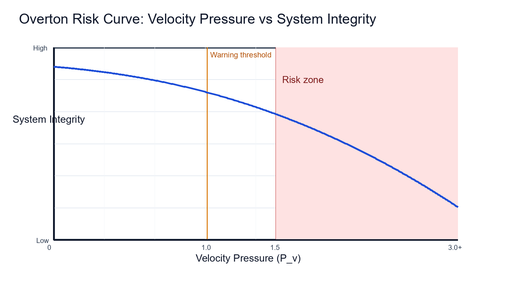

# Overton Framework v1.0

### Cognitive Interlocks for Integrity in AI-Assisted Software Development

**Author:** K Overton  
**Publisher:** CrisisCore-Systems  
**Version:** 1.0 Draft  
**Date:** March 2026  
**License:** CC-BY-4.0

---

# Abstract

Artificial intelligence is rapidly transforming the software development process.  
Modern development environments now incorporate large language models and other generative systems capable of producing functional code, configuration, tests, and documentation at unprecedented speeds.

While these tools offer substantial productivity gains, they also introduce a structural imbalance between generation throughput and verification capacity.

This mismatch creates a systemic risk: developers may accept plausible machine-generated outputs without sufficient validation. Over time, this dynamic leads to the gradual accumulation of latent defects, security vulnerabilities, and operational fragility.

This paper introduces the **Overton Framework**, an architectural model designed to maintain system integrity in high-velocity AI-assisted development environments.

The framework identifies a failure mechanism termed **the micro-coercion of speed**, in which developers operating under time pressure implicitly shift the burden of proof from machine output to human rebuttal.

To mitigate this risk, the Overton Framework proposes the concept of **cognitive interlocks** — structural controls embedded within development environments that enforce verification before integration into production systems.

A quantitative metric called **Velocity Pressure** is introduced to measure the relationship between AI generation throughput and human verification capacity.

The framework further defines:

- a taxonomy of protective controls
- operational implementation patterns
- governance models necessary to sustain software integrity under accelerated development conditions

---

# 1 Introduction

Software development has historically balanced two complementary activities:

- **creation**
- **verification**

Developers propose implementations through code, configuration, or architectural design.  
These proposals are subsequently validated through review, testing, and operational observation.

The emergence of **AI-assisted programming tools fundamentally alters this balance**.

Modern AI systems can generate large volumes of plausible code in seconds. These outputs frequently:

- compile
- integrate
- pass basic tests

This creates a strong **perception of correctness**.

However, correctness in software systems is rarely superficial.

Subtle issues such as:

- logic errors
- unsafe edge conditions
- performance regressions
- security vulnerabilities

may remain undetected until systems encounter unusual operational states.

Human review processes remain the primary defense against these failures.

Yet **human cognitive capacity is finite.**

As generation speed increases, verification capacity remains constrained by:

- human attention
- cognitive fatigue
- contextual complexity
- environmental time pressure

This mismatch produces a systemic condition where **generation outpaces verification**.

Under such conditions developers may begin accepting outputs without performing full validation.

This process rarely occurs deliberately.

Instead, it emerges gradually as developers adapt to a **high-velocity environment**.

This paper identifies this dynamic as **the micro-coercion of speed**.

The Overton Framework proposes that maintaining system integrity in AI-assisted environments requires **deliberate architectural constraints** that restore balance between generation and verification.

---

# 2 Background

## 2.1 Evolution of AI-Assisted Development

The integration of machine intelligence into software development has progressed through several stages.

Early tools focused on:

- automation
- static analysis
- optimization suggestions

More recent systems employ **generative models** capable of producing entire code segments from natural language prompts.

Examples of AI-assisted outputs include:

- implementation scaffolding
- database queries
- API integration code
- test generation
- documentation drafts

These tools significantly accelerate early-stage development tasks.

In many cases they reduce hours of manual effort to minutes.

However, the outputs produced by generative systems are **probabilistic rather than deterministic**.

A generated solution may appear syntactically correct and logically coherent while still containing subtle errors.

The reliability of generated code therefore depends heavily on **post-generation verification**.

---

## 2.2 Trust Boundaries in Software Systems

All complex systems rely on explicit or implicit **trust boundaries**.

In traditional development environments these boundaries exist between:

- developer intent and implementation
- implementation and testing
- testing and production deployment

AI-assisted generation introduces an **additional trust boundary** between:

**human intent → machine-generated output**

This boundary is unique because generated output often appears authoritative.

Developers frequently experience **cognitive bias toward trusting well-structured code**, particularly when it resembles familiar patterns.

Without deliberate verification practices, this bias can lead to the **silent propagation of incorrect logic**.

---

## 2.3 Human Cognitive Limits

Human cognitive capacity imposes strict limits on sustained analytical performance.

Empirical research in human factors and software engineering suggests that effective code review is constrained by:

- attention span
- working memory limitations
- contextual switching costs
- environmental distractions

Developers operating under time pressure may review code **superficially rather than semantically**.

As AI tools increase the volume of generated code, these cognitive constraints become increasingly significant.

---

# 3 The Micro-Coercion of Speed

The **micro-coercion of speed** describes a gradual shift in developer behavior when machine output arrives faster than it can be validated.

The term emphasizes that this process rarely occurs through explicit instruction.

Instead it emerges through subtle pressure gradients in the development environment.

Typical stages include:

1. AI tools produce outputs rapidly.
2. Developers review these outputs superficially.
3. Successful integrations reinforce trust in generated code.
4. Verification gradually becomes less rigorous.

Over time the workflow transitions from **verification-driven** to **generation-driven**.

This shift represents a **critical architectural risk**.

---

## 3.1 Burden-of-Proof Inversion

In safety-oriented engineering systems:

**output must earn trust through validation.**

However under high generation velocity this model may invert.

Instead:

**output is assumed correct until disproven.**

This inversion fundamentally changes system safety assumptions.

Verification stops acting as a gate and instead becomes a **reactive process triggered only after failure**.

---

## 3.2 Deferred Failure

The consequences of insufficient verification are rarely immediate.

Generated code may operate correctly under normal conditions while containing hidden vulnerabilities.

These defects often surface only when systems encounter:

- unexpected inputs
- scaling events
- concurrent workloads
- operational stress

As a result failures may occur **long after the original generation event**, complicating root-cause analysis.

---

# 4 Physical Safety Analogy

Engineering disciplines outside software have long recognized the limitations of human operators.

Industrial systems frequently incorporate **interlocks** that prevent unsafe operations regardless of operator intent.

Examples include:

- lockout/tagout systems
- pressure relief valves
- keyed electrical disconnects
- thermal shutdown systems

These mechanisms acknowledge that **humans are fallible**.

Rather than expecting perfect behavior, systems are designed to make unsafe actions **difficult or impossible**.

Software development historically relied more heavily on **human discipline** than structural safeguards.

The Overton Framework proposes applying **interlock principles** to development workflows.

---

# 5 Cognitive Interlocks

A **cognitive interlock** is a structural mechanism within a development environment that forces deliberate reasoning before risky actions occur.

Unlike traditional access controls, cognitive interlocks do not simply block operations.

Instead they introduce **friction that prompts reconsideration**.

Examples include:

- mandatory code review before integration
- warnings when modifying sensitive subsystems
- explicit confirmation prompts for destructive operations

In AI-assisted development environments, cognitive interlocks ensure generated outputs undergo **verification before production integration**.

These mechanisms restore balance between **generation and validation**.

---

# 6 Overton Framework Architecture

The framework models the interaction between **generation velocity and verification capacity**.

### Risk Pathway

```
Velocity Pressure
        ↓
AI Generation Speed
        ↓
Verification Gap
        ↓
System Risk
```

### Protective Pathway

```
Protective Computing
        ↓
Cognitive Interlocks
        ↓
Forced Verification
        ↓
System Integrity
```

Embedding cognitive interlocks interrupts the progression from **velocity pressure → system risk**.

---

# 7 Velocity Pressure

The framework introduces a quantitative metric called **Velocity Pressure**.

$$
P_v = \frac{R_g}{C_v}
$$

Where:

- **$P_v$** — Velocity Pressure
- **$R_g$** — Rate of AI-assisted generation
- **$C_v$** — Human verification capacity

This ratio indicates whether a development environment is operating within safe verification limits.

---

## 7.1 Interpretation

| Condition | Meaning |
| --------- | ---------------------------------------- |
| $P_v \le 1$ | Verification capacity matches generation |
| $P_v > 1$ | Verification backlog forming |
| $P_v \gg 1$ | High-risk micro-coercion conditions |

Sustained high velocity pressure indicates **structural development risk**.

---

# 8 Control Taxonomy

The Overton Framework defines four categories of protective controls with explicit transition semantics.

| Control Class | Normative Definition | Transition Behavior |
| --- | --- | --- |
| Hard Interlock | Rejects an unsafe state transition at the system boundary. | **Reject** until constraints are satisfied. |
| Soft Interlock | Pauses a risky transition pending explicit secondary authorization. | **Pause + explicit override** with accountable sign-off. |
| Verification Gate | Enforces completion of required verification procedures before progression. | **Hold** until verification criteria are met. |
| Observability Gate | Records high-risk operating conditions and tags flow state for downstream action. | **Allow + instrument** with traceable risk metadata. |

## 8.1 Hard Interlocks

Hard interlocks **prevent unsafe actions entirely**.

Examples:

- disallowing unparameterized SQL queries
- enforcing security policies at compile time
- rejecting unsafe configuration patterns

## 8.2 Soft Interlocks

Soft interlocks introduce friction but allow controlled override.

Examples:

- warnings when editing sensitive files
- highlighting AI-generated code
- confirmation prompts for critical actions

## 8.3 Verification Gates

Verification gates enforce **human approval checkpoints**.

Examples:

- protected branches requiring peer review
- security audits before deployment
- mandatory testing thresholds

## 8.4 Observability Gates

Observability gates ensure **traceability**.

Examples:

- logging generated code segments
- tracking verification metadata
- recording review decisions

These classes are intentionally orthogonal; a single workflow may apply multiple classes simultaneously.

---

# 9 Implementation Patterns

The Overton Framework can be implemented across the development stack.

---

## IDE Layer

Development environments may provide:

- AI-generated code highlighting
- real-time static analysis
- API usage warnings

---

## CI/CD Layer

Continuous integration systems can enforce:

- automated security scanning
- verification thresholds
- policy-based build failures

---

## Governance Layer

Organizational policies define:

- acceptable velocity pressure limits
- verification procedures
- escalation protocols

---

# 10 Measurement and Auditing

Organizations must monitor generation and verification metrics.

## 10.1 Core Measurement Model

Example:

AI generation rate:

```
1200 LOC/day
```

Human verification capacity:

```
600 LOC/day
```

Velocity Pressure:

$$
P_v = 2.0
$$

This indicates generation exceeds verification capacity **by a factor of two**.

Sustained conditions should trigger **protective interlocks**.

## 10.2 Hydrostatic Review Protocol (Synthetic Defect Injection)

To reduce estimation bias in $C_v$, teams should calibrate review capacity using controlled synthetic defects embedded into representative diffs.

Protocol objective: empirically determine effective Diff-Bounded Review throughput and defect-detection reliability under realistic operating conditions.

### 10.2.1 Protocol Steps

1. Select representative change bundles across risk classes (low, medium, high impact).
2. Inject known synthetic defects (logic, security, concurrency, data integrity) at controlled densities.
3. Run blinded review sessions using standard team workflows.
4. Record:
        - time to review completion
        - defects detected vs defects missed
        - false-positive findings
        - reviewer fatigue indicators (session duration, context-switch count)
5. Compute calibrated verification capacity in DBR units/day using only sessions meeting minimum detection reliability thresholds.

### 10.2.2 Calibration Outputs

Minimum output set:

- $C_v^{cal}$: calibrated verification capacity
- Defect Detection Rate (DDR): detected injected defects / total injected defects
- Miss Rate (MR): missed injected defects / total injected defects
- Override Frequency (OF): proportion of soft-interlock overrides in calibrated sessions

Teams should use $C_v^{cal}$ (not nominal review speed) in production $P_v$ monitoring.

### 10.2.3 Operational Triggering Guidance

- If DDR drops below the team reliability floor, reduce allowable generation throughput and activate stronger interlocks.
- If $P_v > 1.0$ persists across calibrated windows, require escalation to governance-defined critical response.
- If MR increases while throughput appears stable, treat apparent productivity gains as unsafe and re-baseline $C_v^{cal}$.

---

# 11 Visualization

Velocity Pressure can be visualized as an Overton Risk Curve mapping increasing $P_v$ against declining system integrity.



As velocity pressure increases, **system integrity declines** unless interlocks intervene.

---

# 12 Empirical Appendix: Velocity Pressure in Practice

This appendix demonstrates direct operational use of the Velocity Pressure metric.

## 12.1 Scenario

Team profile (single working day):

- AI-assisted generation output: 1,200 DBR units/day
- Human verification capacity: 600 DBR units/day

Where DBR (Diff-Bounded Review) units represent normalized reviewable change volume.

## 12.2 Calculation

Using the framework equation:

$$
P_v = \frac{R_g}{C_v}
$$

Substitution:

$$
P_v = \frac{1200}{600} = 2.0
$$

## 12.3 Interpretation

At $P_v = 2.0$, generation exceeds verification capacity by 100%.

This places the system in a **critical cognitive bypass regime** with a doubling verification backlog per cycle if controls do not intervene.

## 12.4 Required Control Response

Minimum response pattern:

1. Enable Soft Interlocks for all high-impact pathways.
2. Activate Hard Interlocks on known red-zone patterns (security, data integrity, irreversible operations).
3. Enforce Verification Gates on merge and deployment surfaces.
4. Emit Observability Gate telemetry for audit and trend monitoring.

Operational objective: reduce sustained $P_v$ toward $\leq 1.0$ through either reduced generation rate, increased verification capacity, or both.

---

# 13 Governance Model

Effective adoption requires governance structures defining acceptable development practices.

Key elements include:

- verification standards
- review policies
- risk escalation procedures
- compliance auditing

Organizations should periodically evaluate **velocity pressure metrics** and adjust controls accordingly.

---

# 14 Limitations

The framework assumes generation and verification activities can be measured reliably.

In practice, measuring **human verification capacity** is difficult due to:

- code complexity variation
- reviewer expertise differences
- contextual knowledge requirements

This limitation is partially mitigated by Hydrostatic Review Protocol calibration (Section 10.2), but cross-team comparability and long-horizon stability remain open empirical questions.

---

# 15 Future Work

Future research directions include:

- empirical validation of velocity pressure models
- automated verification systems
- adaptive cognitive interlock mechanisms
- large-scale observational studies of AI-assisted development environments

These investigations will help determine optimal control strategies.

---

# 16 Conclusion

AI-assisted development introduces unprecedented speed into software creation.

While this acceleration provides clear productivity benefits, it also introduces **structural risk** when generation velocity exceeds human verification capacity.

The Overton Framework provides a systematic approach for managing this risk.

By introducing **cognitive interlocks** and monitoring **velocity pressure**, organizations can preserve software integrity while benefiting from AI-assisted productivity gains.

---

# Suggested Citation

Overton, K. (2026).  
**The Overton Framework: Cognitive Interlocks for Integrity in AI-Assisted Development Systems.**  
CrisisCore-Systems. Zenodo.
