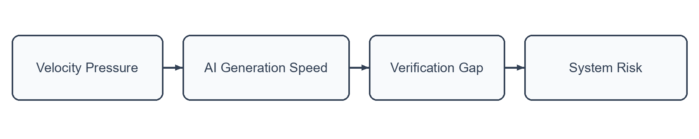
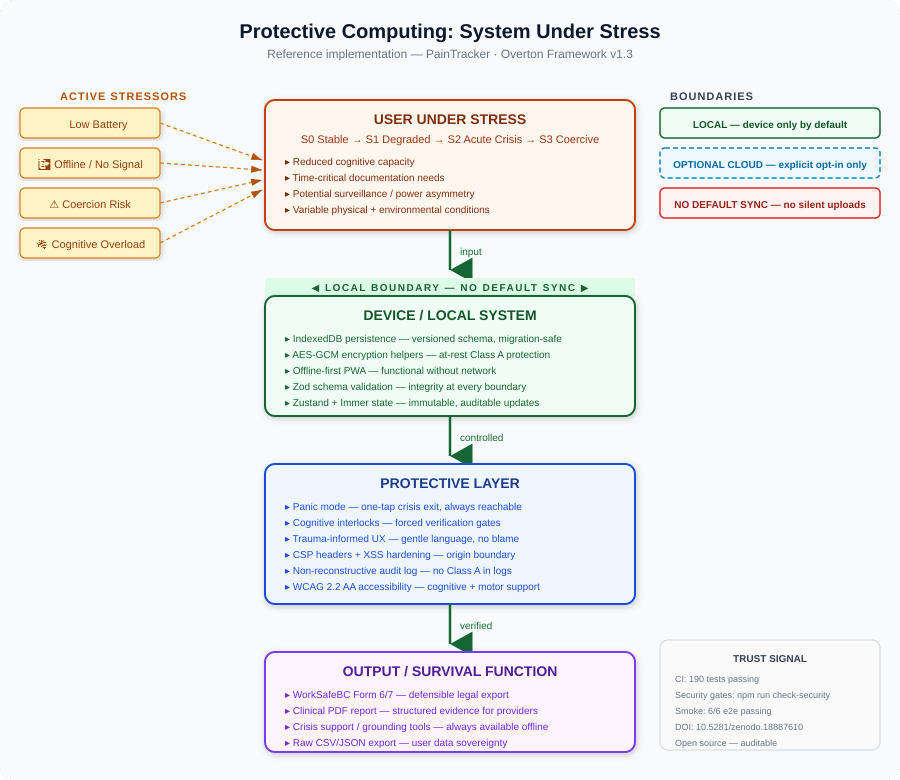
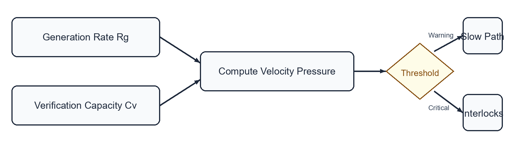

<!-- markdownlint-disable MD013 MD025 MD036 MD060 -->

## Why friction is an engineering prerequisite in AI-assisted development systems

**Author:** K Overton  
**Date:** March 2026  
**Version:** 0.1.0-preprint  
**License:** Creative Commons Attribution 4.0 International (CC-BY-4.0)

---

## Abstract

AI-assisted development environments compress generation time while leaving
verification cost largely unchanged. This asymmetry creates a recurrent
operational hazard: under velocity pressure, developers increasingly accept
plausible outputs without sufficient validation.

We define this effect as the **micro-coercion of speed**: a system-level
pressure gradient that shifts the burden-of-proof from tool output to human
rebuttal.

This paper proposes a control orientation for Protective Computing contexts:
the engineering of **cognitive interlocks** that force verification before
integration in high-impact paths.

Three implementation classes are defined:

- IDE boundary interlocks
- generation-verification separation
- cognitive slow paths

These controls restore system integrity by constraining the interaction between AI generation velocity and human verification limits.

---

## 1. Introduction and Problem Statement

AI coding systems optimize **generation throughput**.

Systemic integrity, however, depends on **verification throughput**.

When generation throughput exceeds verification capacity, latent defects accumulate behind an appearance of productivity.

The resulting failure pattern is not purely technical.

It is **cognitive and procedural**.

Current toolchains accelerate proposal creation disproportionately relative to correctness establishment.

---

## 1.1 Burden-of-Proof Inversion

Polished machine output is cognitively treated as **presumptively correct** under velocity pressure.

This inverts the architectural burden of proof.

**Expected baseline (Safe)**  
Output must earn trust through verifiable constraints.

**Observed baseline (Unsafe)**  
The reviewer must actively disprove the output.

This inversion dramatically increases the probability that defects pass into production.

---

## 1.2 Deferred Failure Behavior

Unverified velocity frequently appears successful until systems encounter stressors:

- unusual input
- system scale
- operational fatigue
- incident conditions

Failures emerge **downstream**, far from the original generation event.

---

## 2. Theoretical Framework: Physical vs Cognitive Interlocks

Safety-critical physical systems assume imperfect operators.

They embed **interlocks** that prevent hazardous shortcuts.

Examples include:

- OSHA lockout/tagout procedures
- pressure safety switches
- thermal cutoffs
- keyed disconnects

These mechanisms do not eliminate speed pressure.

They **bound it**.

---

## Transferable Design Pattern

The pattern translates directly to software architecture.

| Domain | Interlock Type | Effect |
| --- | --- | --- |
| Physical engineering | Mechanical interlock | Prevent unsafe states |
| Software systems | Cognitive interlock | Prevent unverified integration |

In both domains, **safety emerges from design constraints rather than operator perfection**.

---

## 3. Architectural Control Model

## 3.1 Risk Pathway

---

## 3.2 Protective Pathway

The Overton Framework introduces **cognitive interlocks** to interrupt this pipeline.

---

## 3.3 Control Classes

### 1. IDE Boundary Interlocks

Enforce safety boundaries at the authoring environment level.

Examples:

- mandatory query parameterization
- sensitive API call constraints
- build failures on unsafe patterns

These controls eliminate reliance on reviewer recall.

---

### 2. Generation-Verification Separation

Treat AI output as **draft state** rather than trusted logic.

Integration into protected paths requires explicit human checkpoints.

---

### 3. Cognitive Slow Paths

Introduce friction deliberately when high-impact logic is modified.

Examples include:

- generated-diff emphasis
- mandatory rationale fields
- sensitive-flow highlighting

These mechanisms shift the developer from **fast intuition to deliberate reasoning**.

---

## 4. Implementation Guidelines

## 4.1 Minimal Adoption Baseline

Systems implementing this model must:

1. Mark generated hunks in code review metadata
2. Require reviewer rationale for changes touching sensitive boundaries
3. Block merges when verification evidence is absent

---

## 4.2 Expected Outcomes

Adoption produces measurable effects:

- reduced silent acceptance of generated logic
- improved traceability for high-impact changes
- stronger operator ownership under deadline pressure

---

## 4.3 Trade-off Statement

These controls intentionally add **bounded friction**.

The objective is **not reduced development velocity**.

The objective is **reduced defect transfer from generation to production under cognitive load**.

---

## 5. Governance and Framework Integration

## 5.1 Status

- **Document class:** Companion Note (non-canonical guidance)
- **Intended role:** Bridge artifact from public narrative to formal architectural controls
- **Canon relationship:** Interprets but does not supersede Overton Framework Canon requirements

---

## 6. Velocity Pressure: Formal Metric

## 6.1 Definition

Velocity Pressure ($P_v$) quantifies the ratio between AI generation rate and human verification capacity.

$$
P_v = \frac{R_g}{C_v}
$$

Where:

- $P_v$ = Velocity Pressure
- $R_g$ = Rate of AI-assisted code generation
- $C_v$ = Human cognitive verification capacity

---

## 6.2 Interpretation

| Condition | Meaning |
| --- | --- |
| $P_v \le 1$ | Verification capacity keeps pace with generation |
| $P_v > 1$ | Verification gap forms |
| $P_v \gg 1$ | Micro-coercion conditions likely |

---

## 6.3 Measurement Methodology

### Rate of Generation ($R_g$)

Measured using:

- AI-assisted lines of code per hour
- logical blocks generated per hour
- scaffolding templates produced

---

### Verification Capacity ($C_v$)

Estimated using:

- human review throughput
- complexity-weighted code segments
- verification completion rates

---

## 6.4 Thresholds

| Threshold | Meaning | Action |
| --- | --- | --- |
| 0.8 | Warning | enable slow-path reviews |
| 1.0 | Critical | enforce interlocks |
| >1.0 sustained | Structural risk | audit modules |

---

## 6.5 Visualization

---

## Suggested Citation

Overton, K. (2026).  
*Overton Framework Companion Note v0.1: The Micro-Coercion of Speed*.  
CrisisCore-Systems. Zenodo.  
DOI: Pending (Zenodo will assign upon publication)
