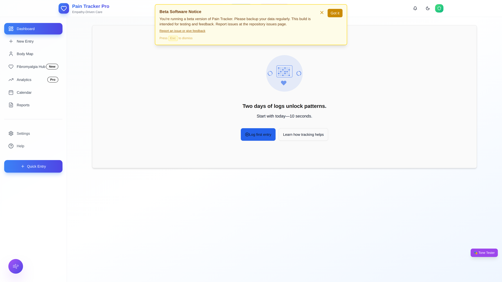
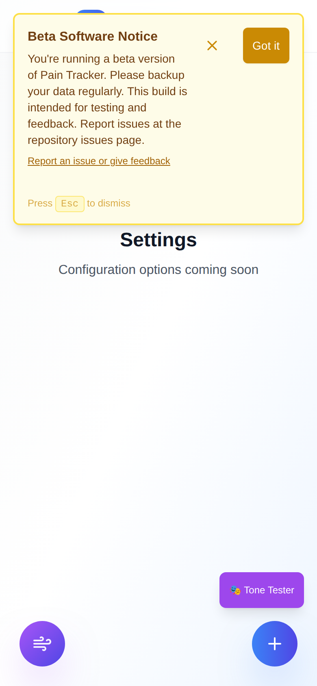
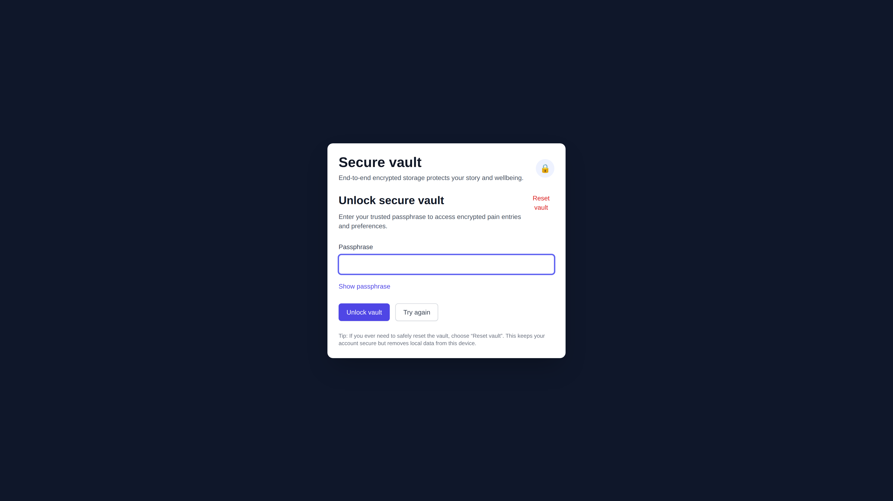
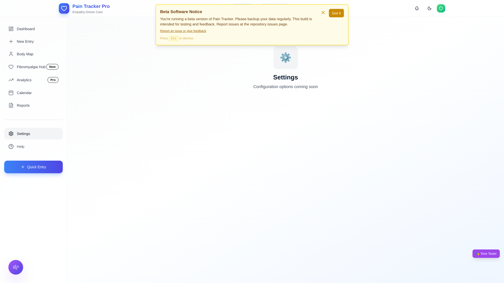
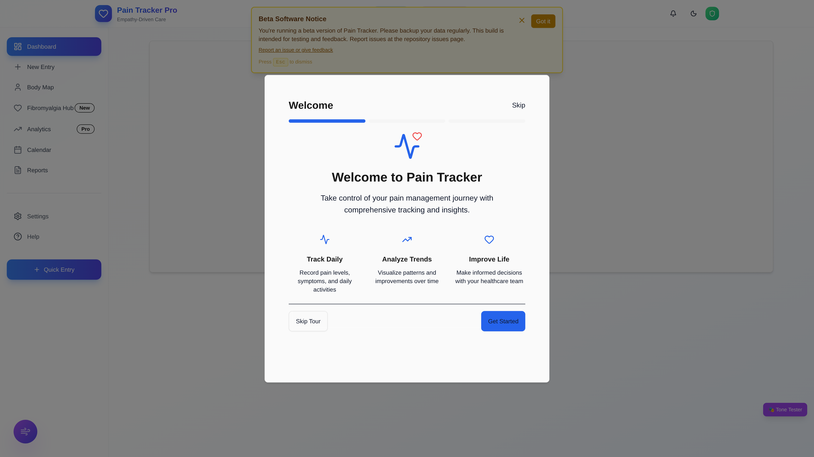

# Accessibility Screenshots

**Last Updated**: 2025-11-23
**Total Screenshots**: 14

This directory contains screenshots demonstrating the accessibility features of the Pain Tracker application, including:

- 📝 **Large text options** (14px to 20px)
- 🎨 **High contrast modes** (normal, high, extra-high)
- 🧭 **Simplified navigation** (full vs. essential features)
- 🧠 **Cognitive load indicators** (memory aids, progress tracking)

## Screenshots by Category

### Text Size

#### Small text size (14px) - Compact interface


**Settings**: {
  "fontSize": "small",
  "contrast": "normal",
  "simplifiedMode": false
}

---

#### Medium text size (16px) - Default interface


**Settings**: {
  "fontSize": "medium",
  "contrast": "normal",
  "simplifiedMode": false
}

---

#### Large text size (18px) - Enhanced readability


**Settings**: {
  "fontSize": "large",
  "contrast": "normal",
  "simplifiedMode": false
}

---

#### Extra large text size (20px) - Maximum readability



**Settings**: {
  "fontSize": "xl",
  "contrast": "normal",
  "simplifiedMode": false
}

---

#### Mobile view with large text and touch targets



**Settings**: {
  "fontSize": "large",
  "contrast": "normal",
  "simplifiedMode": true,
  "touchTargetSize": "extra-large"
}

---

### Contrast

#### Normal contrast - Standard interface colors


**Settings**: {
  "fontSize": "medium",
  "contrast": "normal",
  "simplifiedMode": false
}

---

#### High contrast - Enhanced visibility


**Settings**: {
  "fontSize": "medium",
  "contrast": "high",
  "simplifiedMode": false
}

---

#### Extra high contrast - Maximum visibility



**Settings**: {
  "fontSize": "medium",
  "contrast": "extra-high",
  "simplifiedMode": false
}

---

#### Mobile view with high contrast mode


**Settings**: {
  "fontSize": "medium",
  "contrast": "extra-high",
  "simplifiedMode": true
}

---

### Navigation

#### Full navigation - All features visible


**Settings**: {
  "fontSize": "medium",
  "contrast": "normal",
  "simplifiedMode": false,
  "showMemoryAids": true
}

---

#### Simplified navigation - Essential features only


**Settings**: {
  "fontSize": "medium",
  "contrast": "normal",
  "simplifiedMode": true,
  "showMemoryAids": true
}

---

#### Accessibility settings panel - Full customization options



**Settings**: {
  "fontSize": "medium",
  "contrast": "normal",
  "simplifiedMode": false
}

---

### Cognitive Support

#### Full cognitive support - All aids enabled


**Settings**: {
  "fontSize": "large",
  "contrast": "normal",
  "simplifiedMode": true,
  "showMemoryAids": true,
  "showProgress": true,
  "showCognitiveLoadIndicators": true,
  "autoSave": true
}

---

#### Cognitive load indicators - Visual feedback for mental effort



**Settings**: {
  "fontSize": "medium",
  "contrast": "normal",
  "simplifiedMode": true,
  "showCognitiveLoadIndicators": true,
  "adaptiveComplexity": true
}

---


## Diverse User Representations

The Pain Tracker application is designed with inclusivity in mind:

- **Age Diversity**: Interface scales for all age groups (teens to seniors)
- **Visual Diversity**: Multiple contrast modes for various visual needs
- **Cognitive Diversity**: Simplified modes and memory aids for different cognitive abilities
- **Motor Diversity**: Large touch targets and voice input support
- **Cultural Diversity**: Trauma-informed design respecting diverse backgrounds
- **Language Diversity**: i18n support with gentle, accessible language options

## Usage Guidelines

These screenshots can be used for:

1. **Documentation**: Demonstrating accessibility features to users
2. **Marketing**: Showcasing inclusive design principles
3. **Training**: Teaching accessibility best practices
4. **Testing**: Visual regression testing for accessibility features

## Regenerating Screenshots

To regenerate these screenshots:

```bash
npm run screenshots:accessibility
```

Or with specific categories:

```bash
node scripts/capture-accessibility-screenshots.js --category=text-size
node scripts/capture-accessibility-screenshots.js --category=contrast
node scripts/capture-accessibility-screenshots.js --category=navigation
node scripts/capture-accessibility-screenshots.js --category=cognitive-support
```

## Accessibility Standards Alignment

These screenshots demonstrate accessibility and trauma-informed UX features built toward common standards and guidelines (targets, not certifications):

- ✅ WCAG 2.2 AA target
- ✅ Section 508 considerations
- ✅ EN 301 549 considerations
- ✅ Trauma-informed design principles
